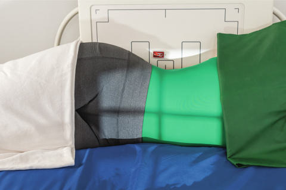
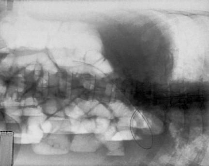

# Rx Abdomen în decubit lateral (incidență anteroposterioară)

  📷 Radiografie Convențională (Rx)
  <strong>Actualizat:</strong> 2026-09-15
  <strong>Autor:</strong> Departamentul de Radiologie / Referință Bontrager

---

-   __1. Rezumat Clinic & Indicații__

    ---

    === "Indicații Clinice"

        - Sunt evidențiate masele abdominale, nivelurile hidroaerice și posibilele acumulări de aer intraperitoneal.
        - Cantitățile mici de aer intraperitoneal liber sunt cel mai bine evidențiate prin tehnica de radiografiere a toracelui, pe o radiografie toracică PA în ortostatism. Important: pacientul trebuie să stea culcat pe o parte minimum 5 minute înainte de expunere (pentru a permite aerului să se ridice sau lichidelor anormale să se acumuleze); este preferabil un interval de 10 la 20 minute, dacă este posibil, pentru vizualizarea optimă a unor cantități potențial mici de aer intraperitoneal. Incidența în decubit lateral stâng permite cea mai bună vizualizare a aerului intraperitoneal liber în regiunea ficatului, în partea dreaptă a etajului abdominal superior, la distanță de bula gastrică.

    === "Ghid Național IRIS"

        !!! info "Referință Primară: Ghidul Național IRIS (Ordinul MS 1342/2012)"
            - **Capitol Ghid IRIS:** *Aparat digestiv & Abdomen*
            - **Grad de Recomandare:** **Grad B**
            - **Nivel de Iradiere Estimată:** `Clasa 2 (Foarte mică ~ 0.7 - 1.2 mSv)`

            [:octicons-search-16: Deschide Ghidul IRIS](../../iris.md){ .md-button .md-button--primary } [:material-open-in-new: Aplicația Oficială PWA](https://radiologie-pediatrica.ro/iris/){ .md-button target="_blank" rel="noopener" }

-   __2. Poziționare & Centrare Fascicul__

    ---

    - **Poziție Pacient:** Pacient: Decubit lateral pe un suport radiotransparent, lipit ferm de masă sau de stativul vertical Bucky (cu roțile căruciorului blocate pentru a nu se îndepărta de masa de examinare); pacientul pe o suprafață fermă, precum o placă pentru resuscitare cardiacă sau o placă spinală, poziționată sub cearșaf pentru a preveni afundarea și excluderea structurilor anatomice din imagine (Fig. 3.36); genunchii parțial flectați, unul peste celălalt, pentru stabilizarea pacientului; brațele ridicate lângă cap; se asigură o pernă curată; Regiune anatomică: Se ajustează poziția pacientului și a căruciorului/mesei astfel încât centrul receptorului de imagine și raza centrală să fie la aproximativ 2 țoli (5 cm) deasupra nivelului crestelor iliace (corespunzător L4-L5) (pentru a include cupolele diafragmatice). Marginea superioară a receptorului de imagine este aproximativ la nivelul axilei. Se asigură absența rotației anatomice a bazinului sau a umerilor: clavicule echidistante față de linia apofizelor spinoase. Se ajustează înălțimea receptorului de imagine pentru a centra planul mediosagital al pacientului pe centrul receptorului de imagine, asigurând totodată includerea părții abdomenului situate deasupra pe receptorul de imagine.
    - **Punct de Centrare Fascicul:** orizontal, orientat spre centrul receptorului de imagine, la aproximativ 2 țoli (5 cm) deasupra nivelului crestei iliace (corespunzător L4-L5); se utilizează un fascicul orizontal pentru a evidenția nivelurile hidroaerice și aerul intraperitoneal liber Abdomen SPECIAL PA Decubit ventral decubit lateral (AP) AP Ortostatism decubit dorsal (profil) profil
    - **Distanță Focar-Film (DFF / SID):** 100 cm
    - **Comandă Respiratorie:** Se efectuează expunerea la sfârșitul expirului. Absența rotației anatomice: clavicule echidistante față de linia apofizelor spinoase; aripile iliace apar simetrice, iar marginile externe ale coastelor sunt la aceeași distanță de coloana vertebrală. Fără înclinare: coloana vertebrală trebuie să fie dreaptă (cu excepția cazului în care sunt prezente scolioză / vicii de postură ale coloanei), aliniată cu centrul receptorului de imagine.

-   __3. Parametri Tehnici Expunere__

    ---

    | Parametru Tehnic | Valoare Configurare Generator / Tub |
    |:-----------------|:-------------------------------------|
    | **Tensiune Tub (kV)** | 70 kV |
    | **Sarcină / Produs Curent-Timp (mAs)** | DE CONFIGURAT PE APARAT |
    | **Distanță Focar-Film (DFF / SID)** | 100 cm |
    | **Grilă Antidifuzoare (Bucky)** | Cu grilă antidifuzoare Bucky |
    | **Dimensiune Focar** | Focar Mic (0.6 mm) |
    | **Camere de Ionizare AEC** | Camerele laterale (sau camera centrală, în funcție de regiune) |
    | **Colimare Fascicul** | la aria de interes diagnostic. Fără mișcare; coastele (grilajul costal) și toate contururile bulelor de gaz sunt nete. Expunerea optimă a receptorului de imagine pentru vizualizarea coloanei vertebrale, a coastelor (grilajului costal) și a părților moi, fără a supraexpune eventualul aer intraperitoneal din etajul abdominal superior. Fig. 3.37 Decubit lateral stâng (AP). (Modificat după McQuillen Martensen K: Analiza imaginii radiografice, ed. 4, St Louis, 2020, Saunders.) Fig. 3.36 Incidență în decubit lateral stâng (AP). Proces spinos Corp vertebral Pedicul Gaz intestinal Aripă iliacă Cupole diafragmatice Fig. 3.38 Decubit lateral stâng (AP). (După McQuillen Martensen K: Analiza imaginii radiografice, ed. 4, St Louis, 2020, Saunders.) |
    | **Filtrare Tub** | Totală ≥ 2.5 mm Al echivalent |

-   __4. Criterii de Calitate & Reușită Imagine__

    ---

    - Stomacul și ansele intestinale destinse cu aer și nivelurile hidroaerice, acolo unde sunt prezente.
    - trebuie să includă ambele cupole diafragmatice (Fig. 3.37 și 3.38). Poziție
    - Absența rotației anatomice: clavicule echidistante față de linia apofizelor spinoase; aripile iliace apar simetrice, iar marginile externe ale coastelor sunt la aceeași distanță de coloana vertebrală.
    - fără înclinare: coloana vertebrală trebuie să fie dreaptă (cu excepția cazului în care sunt prezente scolioză / vicii de postură ale coloanei), aliniată cu centrul receptorului de imagine.
    - Colimare la aria de interes diagnostic. Expunere
    - fără mișcare; contururile coastelor (grilajului costal) și ale tuturor bulelor de gaz sunt nete.
    - Expunere optimă a receptorului de imagine pentru vizualizarea coloanei vertebrale, a coastelor (grilajului costal) și a părților moi, fără a supraexpune eventualul aer intraperitoneal din etajul abdominal superior.

-   __5. Protecție Radiologică (ALARA)__

    ---

    - Ecranare gonadică și a organelor radiosensibile conform procedurilor locale de radioprotecție ALARA.
    - Colimare strictă la aria de interes pentru limitarea radiației difuze.
    - Verificarea posibilității unei sarcini la pacientele de vârstă fertilă înainte de expunere.

### 🖼️ Imagini

<figure class="protocol-image-card" markdown>

<figcaption><strong>Fig. 3.37 Decubit lateral stâng (AP). (Modificat după McQuillen</strong> — Poziționarea pacientului conform Ghidului Bontrager (Fig. 3.37 Decubit lateral stâng (AP). (Modificat după McQuillen)</figcaption>

</figure>

<figure class="protocol-image-card" markdown>

<figcaption><strong>Fig. 3.36 Incidență în decubit lateral stâng (AP).</strong> — Aspect radiografic de referință conform Ghidului Bontrager (Fig. 3.36 Poziție de decubit lateral stâng (AP).)</figcaption>

</figure>

<figure class="protocol-image-card" markdown>

<figcaption><strong>Fig. 3.38 Decubit lateral stâng (AP). (După McQuillen Martensen K:</strong> — Aspect radiografic de referință conform Ghidului Bontrager (Fig. 3.38 Decubit lateral stâng (AP). (După McQuillen Martensen K:)</figcaption>

</figure>

=== "Ghid Rapid de Execuție"

    1. **Identificarea și verificarea pacientului:** verificare identitate, zonă de examinat, consimțământ conform procedurii și evaluarea posibilității unei sarcini, când este relevantă.
    2. **Pregătire:** îndepărtarea oricăror obiecte radiopace (bijuterii, agrafe, fermoare, proteze, pansamente dense).
    3. **Poziționare precisă:** alinierea receptorului de imagine și a tubului la distanța prescrisă (100 cm).
    4. **Colimare strictă:** adaptarea fasciculului strict la regiunea de diagnostic pentru scăderea iradierii și reducerea radiației difuze.
    5. **Radioprotecție:** verificarea [politicii RX](../radioprotectie.md), cu măsuri distincte pentru pacient, personal și însoțitor.

## Surse de documentare

- [Bontrager's Textbook of Radiographic Positioning (Ed. 9/10), Pagina 131](https://www.elsevier.com/books/textbook-of-radiographic-positioning-and-related-anatomy/lampignano/978-0-323-65367-1)
