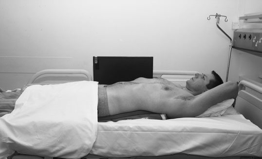
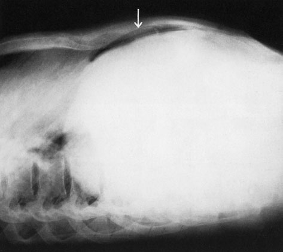
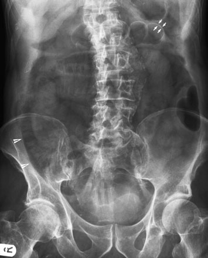

# Rx Abdomen Profil (Lateral) Decubit Dorsal - Decubit Dorsal

  📷 Radiografie Convențională (Rx)
  <strong>Actualizat:</strong> 2026-09-16
  <strong>Autor:</strong> Departamentul de Radiologie / Referință Clark (Ed. 12)

---

-   __1. Rezumat Clinic & Indicații__

    ---

    === "Indicații Clinice"

        - Evaluare radiografică regiunii Abdomen (Profil (lateral) dorsal decubit - Decubit dorsal).
        - Suspiciune de leziuni traumatice (fracturi, luxații sau diastazis articular).
        - Bilanț osteoarticular / visceral conform recomandării medicale de trimitere.

    === "Ghid Național IRIS"

        !!! info "Referință Primară: Ghidul Național IRIS (Ordinul MS 1342/2012)"
            - **Capitol Ghid IRIS:** *Ghidul Național IRIS*
            - **Grad de Recomandare:** **De verificat pe indicație; fără grad atribuit automat**
            - **Nivel de Iradiere Estimată:** `De verificat pentru examinarea și populația selectate`

            [:octicons-search-16: Deschide Ghidul IRIS](../../iris.md){ .md-button .md-button--primary } [:material-open-in-new: Aplicația Oficială PWA](https://radiologie-pediatrica.ro/iris/){ .md-button target="_blank" rel="noopener" }
-   __2. Poziționare & Centrare Fascicul__

    ---

    - **Poziție Pacient:** • mobile set este poziționat so ca la enable Fascicul Orizontal radiografie.
• pacientul este culcat Decubit dorsal și, if possible, este raised off bed pe la supporting foam pad.
• brațele sunt extins și sprijinit above capul.
• casetă cu grilă antidifuzoare este sprijinit vertically pe / sprijinit de Profil (lateral) aspect de abdomenul și ajustat paralel cu plan mediosagital.
• imagine trebuie să include dome de cupole diafragmatice, anterior abdominal perete și vertebral corpuri.
    - **Punct de Centrare Fascicul:** • Raza centrală orizontală este orientată perpendicular pe centrul casetei.
    - **Distanță Focar-Film (DFF / SID):** 100 cm
    - **Comandă Respiratorie:** Apnee pe durata expunerii (apnee în inspir pentru torace; expir pentru Abdomen/bazin).

-   __3. Parametri Tehnici Expunere__

    ---

    | Parametru Tehnic | Valoare Configurare Generator / Tub |
    |:-----------------|:-------------------------------------|
    | **Tensiune Tub (kV)** | DE CONFIGURAT PE APARAT |
    | **Sarcină / Produs Curent-Timp (mAs)** | Conform AEC / grosime anatomică |
    | **Distanță Focar-Film (DFF / SID)** | 100 cm |
    | **Grilă Antidifuzoare (Bucky)** | Conform grosimii anatomice (> 10-12 cm cu grilă) |
    | **Dimensiune Focar** | Focar Mic (0.6 mm) |
    | **Camere de Ionizare AEC** | DE CONFIGURAT PE APARAT |
    | **Colimare Fascicul** | Colimare strictă la aria anatomică de interes diagnostic |
    | **Filtrare Tub** | Totală ≥ 2.5 mm Al echivalent (conform Clark: 3.0 mm Al eq.) |

-   __4. Criterii de Calitate & Reușită Imagine__

    ---

    - Vizualizarea clară întregii arii anatomice (Abdomen).
    - Absența artefactelor de mișcare; trabeculație osoasă și contururi nete.
    - Densitate optică și contrast adecvate pentru diferențierea țesuturilor moi de structurile osoase.

-   __5. Protecție Radiologică (ALARA)__

    ---

    - A mobile radiation protection barrier should be positioned behind the cassette to confine the primary radiation field.
    - Ecranare gonadică cu șorț plumbat dacă gonadele sunt în apropierea fasciculului util (regula ALARA).
    - Colimare precisă la dimensiunea anatomică strict necesară pentru reducerea dozei și a radiației difuze.
    - Verificarea posibilității unei sarcini la pacientele de vârstă fertilă înainte de expunere.

!!! note "Observații Clinice & Tehnice"
    Pneumoperitoneu (aer liber în cavitatea peritoneală) poate sometimes fie evidențiat pe conventional Antero-posterior (AP) radiografie. în example opposite, pneumoperitoneu (aer liber subdiafragmatic) este evidențiat prin presence de double perete sign. în this imagine ambele inside și outside de bowel perete sunt seen, ca compared cu just lumen side normally, ca result de air ambele within lumen de bowel și liber în peritoneal cavity surrounding section de bowel.
360 Antero-posterior (AP) radiografie de Abdomen evidențiind extensive Pneumoperitoneu (aer liber în cavitatea peritoneală) (arrowheads) și double lumen effect evidențiat în stâng etajul abdominal superior (arrows) Profil (lateral) dorsal decubit imagine de abdomenul evidențiind Pneumoperitoneu (aer liber în cavitatea peritoneală) culcat adjacent la anterior abdominal perete

### 🖼️ Imagini

<figure class="protocol-image-card" markdown>

<figcaption><strong>evidențiază calcificări patologice de abdominal aorta. Abdominal</strong> — Poziționare pacient și centrare fascicul conform Clark (Ed. 12)</figcaption>

</figure>

<figure class="protocol-image-card" markdown>

<figcaption><strong>aortic calcificări patologice este variable, even în presence de an</strong> — Aspect radiografic / ghid de poziționare conform tratatului Clark (Ed. 12)</figcaption>

</figure>

<figure class="protocol-image-card" markdown>

<figcaption><strong>pe conventional Antero-posterior (AP) radiografie. în example</strong> — Aspect radiografic / ghid de poziționare conform tratatului Clark (Ed. 12)</figcaption>

</figure>

=== "Ghid Rapid de Execuție"

    1. **Identificarea și verificarea pacientului:** verificare identitate, zonă de examinat, consimțământ conform procedurii și evaluarea posibilității unei sarcini, când este relevantă.
    2. **Pregătire:** îndepărtarea oricăror obiecte radiopace (bijuterii, agrafe, fermoare, proteze, pansamente dense).
    3. **Poziționare precisă:** alinierea receptorului de imagine și a tubului la distanța prescrisă (100 cm).
    4. **Colimare strictă:** adaptarea fasciculului strict la regiunea de diagnostic pentru scăderea iradierii și reducerea radiației difuze.
    5. **Radioprotecție:** verificarea [politicii RX](../radioprotectie.md), cu măsuri distincte pentru pacient, personal și însoțitor.

## Surse de documentare

- [Clark's Positioning in Radiography (Ed. 12), Pagina 375](../../assets/protocols/sources/Clark___Positioning_in_Radiography__12th_edition.pdf#page=375)
