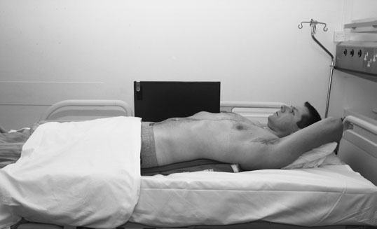
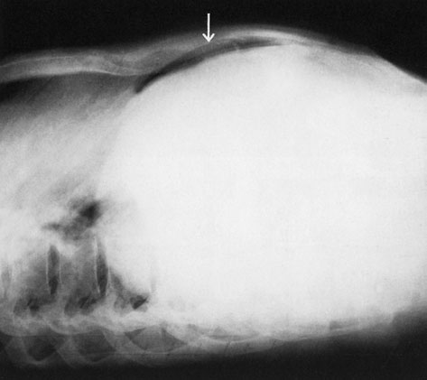
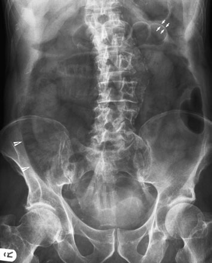

# Rx Abdomen de profil în decubit dorsal - decubit dorsal

  📷 Radiografie Convențională (Rx)
  <strong>Actualizat:</strong> 2026-09-16
  <strong>Autor:</strong> Departamentul de Radiologie / Referință Clark (Ed. 12)

---

-   __1. Rezumat Clinic & Indicații__

    ---

    === "Indicații Clinice"

        - Evaluarea radiografică a regiunii abdominale (incidență de profil în decubit dorsal - decubit dorsal).
        - Suspiciune de leziuni traumatice (fracturi, luxații sau diastazis articular).
        - Bilanț osteoarticular / visceral conform recomandării medicale de trimitere.

    === "Ghid Național IRIS"

        !!! info "Referință Primară: Ghidul Național IRIS (Ordinul MS 1342/2012)"
            - **Capitol Ghid IRIS:** *Ghidul Național IRIS*
            - **Grad de Recomandare:** **De verificat pe indicație; fără grad atribuit automat**
            - **Nivel de Iradiere Estimată:** `De verificat pentru examinarea și populația selectate`

            [:octicons-search-16: Deschide Ghidul IRIS](../../iris.md){ .md-button .md-button--primary } [:material-open-in-new: Aplicația Oficială PWA](https://radiologie-pediatrica.ro/iris/){ .md-button target="_blank" rel="noopener" }
-   __2. Poziționare & Centrare Fascicul__

    ---

    - **Poziție Pacient:** • Aparatul mobil este poziționat astfel încât să permită radiografia cu fascicul orizontal.
• Pacientul este culcat în decubit dorsal și, dacă este posibil, este ridicat de pe pat pe o pernă de susținere din spumă.
• Brațele sunt extinse și sprijinite deasupra capului.
• Caseta cu grilă antidifuzoare este sprijinită vertical pe fața laterală a abdomenului și ajustată paralel cu planul mediosagital.
• Imaginea trebuie să includă cupolele diafragmatice, peretele abdominal anterior și corpurile vertebrale.
    - **Punct de Centrare Fascicul:** • Raza centrală orizontală este orientată perpendicular pe centrul casetei.
    - **Distanță Focar-Film (DFF / SID):** 100 cm
    - **Comandă Respiratorie:** Apnee pe durata expunerii (apnee în inspir pentru torace; expir pentru Abdomen/bazin).

-   __3. Parametri Tehnici Expunere__

    ---

    | Parametru Tehnic | Valoare Configurare Generator / Tub |
    |:-----------------|:-------------------------------------|
    | **Tensiune Tub (kV)** | DE CONFIGURAT PE APARAT |
    | **Sarcină / Produs Curent-Timp (mAs)** | Conform AEC / grosimii anatomice |
    | **Distanță Focar-Film (DFF / SID)** | 100 cm |
    | **Grilă Antidifuzoare (Bucky)** | Conform grosimii anatomice (> 10-12 cm cu grilă) |
    | **Dimensiune Focar** | Focar Mic (0.6 mm) |
    | **Camere de Ionizare AEC** | DE CONFIGURAT PE APARAT |
    | **Colimare Fascicul** | Colimare strictă la aria anatomică de interes diagnostic |
    | **Filtrare Tub** | Totală ≥ 2.5 mm Al echivalent (conform Clark: 3.0 mm Al echivalent) |

-   __4. Criterii de Calitate & Reușită Imagine__

    ---

    - Vizualizarea clară a întregii arii anatomice (Abdomen).
    - Absența artefactelor de mișcare; trabeculație osoasă și contururi nete.
    - Densitate optică și contrast adecvate pentru diferențierea țesuturilor moi de structurile osoase.

-   __5. Protecție Radiologică (ALARA)__

    ---

    - Un paravan mobil de radioprotecție trebuie poziționat în spatele casetei pentru a limita câmpul radiației primare.
    - Ecranare gonadică cu șorț plumbat dacă gonadele sunt în apropierea fasciculului util (regula ALARA).
    - Colimare precisă la dimensiunea anatomică strict necesară pentru reducerea dozei și a radiației difuze.
    - Verificarea posibilității unei sarcini la pacientele de vârstă fertilă înainte de expunere.

!!! note "Observații Clinice & Tehnice"
    Pneumoperitoneul (aer liber în cavitatea peritoneală) poate fi uneori evidențiat pe radiografia anteroposterioară (AP) convențională. În exemplul alăturat, pneumoperitoneul (aer liber subdiafragmatic) este evidențiat prin prezența semnului peretelui dublu. În această imagine sunt vizibile atât suprafața internă, cât și cea externă a peretelui intestinal, comparativ cu doar suprafața luminală vizibilă în mod normal, ca urmare a prezenței aerului atât în lumenul intestinal, cât și liber în cavitatea peritoneală, în jurul segmentului intestinal.
360 Radiografie anteroposterioară (AP) a abdomenului care evidențiază pneumoperitoneu extins (aer liber în cavitatea peritoneală) (vârfuri de săgeată) și efectul de lumen dublu evidențiat în partea stângă a etajului abdominal superior (săgeți). Imagine de profil a abdomenului în decubit dorsal care evidențiază pneumoperitoneu (aer liber în cavitatea peritoneală) situat adiacent peretelui abdominal anterior

### 🖼️ Imagini

<figure class="protocol-image-card" markdown>

<figcaption><strong>evidențiază calcificări patologice ale aortei abdominale. Abdominal</strong> — Poziționarea pacientului și centrarea fasciculului conform Clark (Ed. 12)</figcaption>

</figure>

<figure class="protocol-image-card" markdown>

<figcaption><strong>Calcificările patologice ale aortei sunt variabile, chiar și în prezența unui</strong> — Aspect radiografic / ghid de poziționare conform tratatului Clark (Ed. 12)</figcaption>

</figure>

<figure class="protocol-image-card" markdown>

<figcaption><strong>pe radiografia anteroposterioară (AP) convențională. În exemplu</strong> — Aspect radiografic / ghid de poziționare conform tratatului Clark (Ed. 12)</figcaption>

</figure>

=== "Ghid Rapid de Execuție"

    1. **Identificarea și verificarea pacientului:** verificare identitate, zonă de examinat, consimțământ conform procedurii și evaluarea posibilității unei sarcini, când este relevantă.
    2. **Pregătire:** îndepărtarea oricăror obiecte radiopace (bijuterii, agrafe, fermoare, proteze, pansamente dense).
    3. **Poziționare precisă:** alinierea receptorului de imagine și a tubului la distanța prescrisă (100 cm).
    4. **Colimare strictă:** adaptarea fasciculului strict la regiunea de diagnostic pentru scăderea iradierii și reducerea radiației difuze.
    5. **Radioprotecție:** verificarea [politicii RX](../radioprotectie.md), cu măsuri distincte pentru pacient, personal și însoțitor.

## Surse de documentare

- [Clark's Positioning in Radiography (Ed. 12), Pagina 375](https://books.google.com/books/about/Clark_s_Positioning_in_Radiography.html?id=Xxu6MwEACAAJ)
