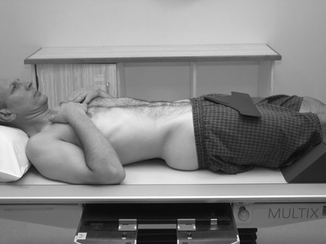
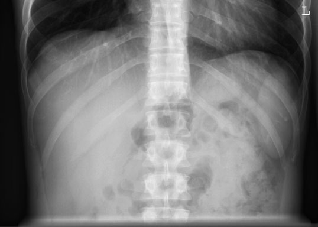
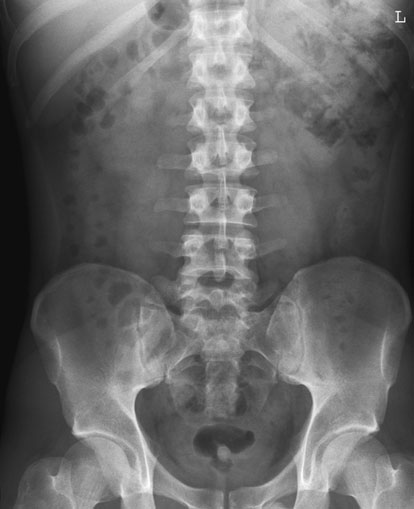
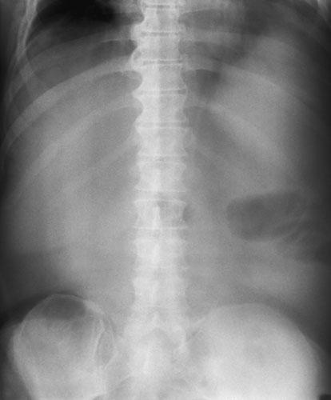
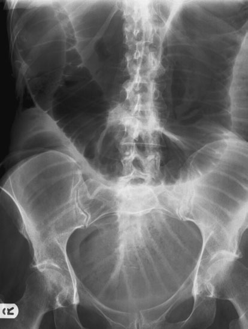

# Rx Abdomen și Cavitate Pelviană Antero-Posterior (AP) - Decubit Dorsal

  📷 Radiografie Convențională (Rx)
  <strong>Actualizat:</strong> 2026-09-16
  <strong>Autor:</strong> Departamentul de Radiologie / Referință Clark (Ed. 12)

---

-   __1. Rezumat Clinic & Indicații__

    ---

    === "Indicații Clinice"

        - orice cause de movement unsharpness poate render small sau even medium-sized renal și ureteric litiază urinară / Litiază urinară / calculi radio-opaci radiopaci invisible.
        - Some radiologists assert that Ortostatism Abdomen este rarely if ever needed la diagnose ocluzie intestinală (nivele hidroaerice), ca subtle signs will nearly always fie present pe Decubit dorsal imagine. în acute setting, however, Ortostatism imagine poate fie very valuable la surgical staff who do nu have immediate access la experienced radiologist.
        - Blunt trauma injury poate fie associated cu loss de psoas muscle outline și loss de renal outline due la tissue damage și haematoma.

    === "Ghid Național IRIS"

        !!! info "Referință Primară: Ghidul Național IRIS (Ordinul MS 1342/2012)"
            - **Capitol Ghid IRIS:** *Ghidul Național IRIS*
            - **Grad de Recomandare:** **De verificat pe indicație; fără grad atribuit automat**
            - **Nivel de Iradiere Estimată:** `De verificat pentru examinarea și populația selectate`

            [:octicons-search-16: Deschide Ghidul IRIS](../../iris.md){ .md-button .md-button--primary } [:material-open-in-new: Aplicația Oficială PWA](https://radiologie-pediatrica.ro/iris/){ .md-button target="_blank" rel="noopener" }
-   __2. Poziționare & Centrare Fascicul__

    ---

    - **Poziție Pacient:** • pacientul este culcat Decubit dorsal pe imaging table, cu planul mediosagital la drept-angles și coincident cu linia mediană mesei.
• Bazin (bazin (pelvis)) este ajustat astfel încât anterior superior iliac spines sunt echidistant față de tabletop.
• caseta este plasat longitudinally în caseta tray și poziționat astfel încât simfiză pubiană este included pe lower part de film radiologic, bearing în mind that Oblică rays will project simfiză pubiană downwards.
• centre de caseta will fie approximately la nivelul point located 1 cm below line joining crestele iliace.
This will ensure that simfiză pubiană este included pe imagine.
    - **Punct de Centrare Fascicul:** • raza centrală verticală centrală este orientat la centre de caseta.
• Using short expunere time, expunere este made pe arrested respirație.
    - **Distanță Focar-Film (DFF / SID):** 100 cm
    - **Comandă Respiratorie:** expunere este made pe

-   __3. Parametri Tehnici Expunere__

    ---

    | Parametru Tehnic | Valoare Configurare Generator / Tub |
    |:-----------------|:-------------------------------------|
    | **Tensiune Tub (kV)** | DE CONFIGURAT PE APARAT |
    | **Sarcină / Produs Curent-Timp (mAs)** | Conform AEC / grosime anatomică |
    | **Distanță Focar-Film (DFF / SID)** | 100 cm |
    | **Grilă Antidifuzoare (Bucky)** | Conform grosimii anatomice (> 10-12 cm cu grilă) |
    | **Dimensiune Focar** | Focar Mic (0.6 mm) |
    | **Camere de Ionizare AEC** | DE CONFIGURAT PE APARAT |
    | **Colimare Fascicul** | Colimare strictă adaptată pe receptor 35 x 43 cm |
    | **Filtrare Tub** | Totală ≥ 2.5 mm Al echivalent (conform Clark: 3.0 mm Al eq.) |

-   __4. Criterii de Calitate & Reușită Imagine__

    ---

    - bowel pattern trebuie să fie evidențiat cu minimal unsharpness. 338 Two radiografii used la give full coverage de abdomenul
    - Erori de evitat / remedii: Failure la include simfiză pubiană și cupole diafragmatice pe same imagine. This poate fie due la pacient size, în which case two imagini sunt acquired cu second across etajul abdominal superior using a 35  43-cm casetă oriented horizontally.
    - Erori de evitat / remedii: Failure la visualize Profil (lateral) extent de abdominal cavity poate fie due la pacient size sau poor positioning.
    - Erori de evitat / remedii: Respiratory movement unsharpness. Rehearsal de Tehnică de estompare prin respirație superficială (respirație technique) prior la expunere poate help la reduce this, together cu selection de shortest expunere time.

-   __5. Protecție Radiologică (ALARA)__

    ---

    - Strict application of the ‘pregnancy rule’ or the ‘ten-day rule’ is important in females of childbearing age.
    - For males, the correct size of gonad protection should be selected and applied carefully so the gonads are shielded and the pelvic region not obscured with lead. Antero-Posterior (AP) Decubit Dorsal radiograph of the Abdomen showing distal ileum obstruction Poor quality image showing movement unsharpness due to incorrect exposure factors
    - Ecranare gonadică cu șorț plumbat dacă gonadele sunt în apropierea fasciculului util (regula ALARA).
    - Colimare precisă la dimensiunea anatomică strict necesară pentru reducerea dozei și a radiației difuze.
    - Verificarea posibilității unei sarcini la pacientele de vârstă fertilă înainte de expunere.

!!! note "Observații Clinice & Tehnice"
    • în case de large Abdomen, imobilizare band poate fie applied la compress părți moi și reduce effects de scatter.
• fascicul este collimated la size de caseta selected și ajustat la ensure that it does nu extend beyond Profil (lateral) edges de abdomenul.
• Ensure that poziție și anatomical markeri sunt included pe casetă.
• When using automatic expunere control (AEC) device, central și drept chambers poate fie selected simultaneously la avoid risk de underexposure due la fascicul passing through regions containing mainly bowel gas.
• If pacientul este too ill la fie moved onto masa radiologică (e.g.
multiple trauma sau acute pain), imagine poate fie acquired using stationary grilă și casetă plasat în tray under pacientul transport trolley. Care trebuie să fie taken la use correct FFD și la centre la middle de caseta la avoid grilă cut off. piece de lead rubber este plasat under caseta la reduce ‘back scatter’ și improve imagine contrast.

### 🖼️ Imagini

<figure class="protocol-image-card" markdown>

<figcaption><strong>Two radiografii used la give full coverage de abdomenul</strong> — Poziționare pacient și centrare fascicul conform Clark (Ed. 12)</figcaption>

</figure>

<figure class="protocol-image-card" markdown>

<figcaption><strong>Figura 2: Aspect radiografic / Poziționare (Clark Ed. 12)</strong> — Aspect radiografic / ghid de poziționare conform tratatului Clark (Ed. 12)</figcaption>

</figure>

<figure class="protocol-image-card" markdown>

<figcaption><strong>Figura 3: Aspect radiografic / Poziționare (Clark Ed. 12)</strong> — Aspect radiografic / ghid de poziționare conform tratatului Clark (Ed. 12)</figcaption>

</figure>

<figure class="protocol-image-card" markdown>

<figcaption><strong>• grilă cut off, associated cu trolley sau ward radiografie poate</strong> — Aspect radiografic / ghid de poziționare conform tratatului Clark (Ed. 12)</figcaption>

</figure>

<figure class="protocol-image-card" markdown>

<figcaption><strong>Antero-posterior (AP) Decubit dorsal radiografie de abdomenul evidențiind distal ileum</strong> — Aspect radiografic / ghid de poziționare conform tratatului Clark (Ed. 12)</figcaption>

</figure>

=== "Ghid Rapid de Execuție"

    1. **Identificarea și verificarea pacientului:** verificare identitate, zonă de examinat, consimțământ conform procedurii și evaluarea posibilității unei sarcini, când este relevantă.
    2. **Pregătire:** îndepărtarea oricăror obiecte radiopace (bijuterii, agrafe, fermoare, proteze, pansamente dense).
    3. **Poziționare precisă:** alinierea receptorului de imagine și a tubului la distanța prescrisă (100 cm).
    4. **Colimare strictă:** adaptarea fasciculului strict la regiunea de diagnostic pentru scăderea iradierii și reducerea radiației difuze.
    5. **Radioprotecție:** verificarea [politicii RX](../radioprotectie.md), cu măsuri distincte pentru pacient, personal și însoțitor.

## Surse de documentare

- [Clark's Positioning in Radiography (Ed. 12), Pagina 353](../../assets/protocols/sources/Clark___Positioning_in_Radiography__12th_edition.pdf#page=353)
