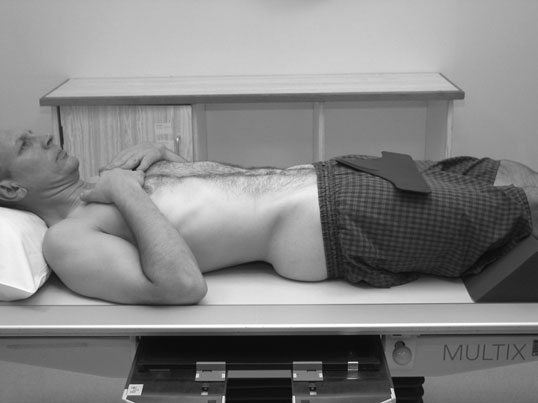
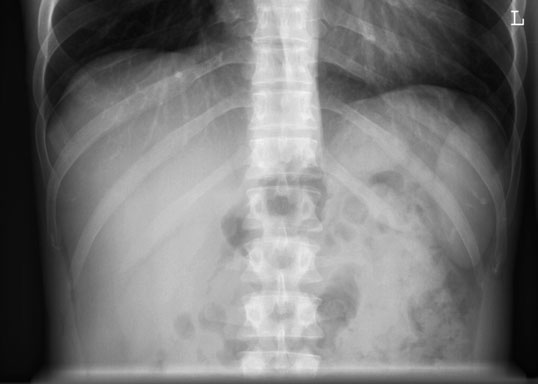
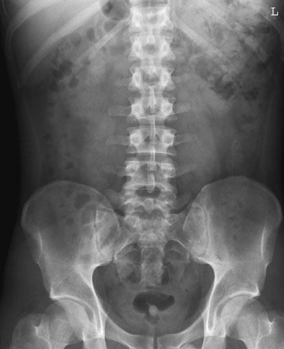
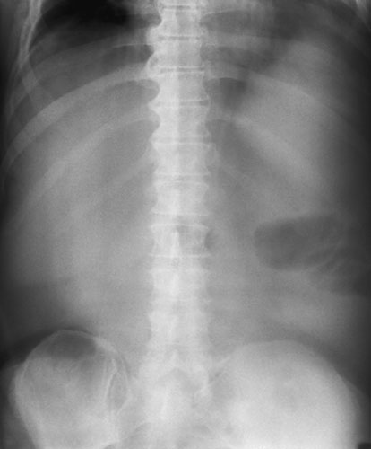
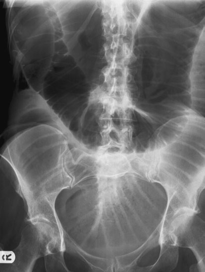

# Rx Abdomen și cavitate pelviană în incidență anteroposterioară (AP) - decubit dorsal

  📷 Radiografie Convențională (Rx)
  <strong>Actualizat:</strong> 2026-09-16
  <strong>Autor:</strong> Departamentul de Radiologie / Referință Clark (Ed. 12)

---

-   __1. Rezumat Clinic & Indicații__

    ---

    === "Indicații Clinice"

        - Orice cauză de neclaritate prin mișcare poate face invizibili calculii renali și ureterali radioopaci mici sau chiar de dimensiuni medii.
        - Unii radiologi afirmă că radiografia abdominală în ortostatism este rareori sau chiar niciodată necesară pentru diagnosticarea ocluziei intestinale (nivele hidroaerice), deoarece semne subtile vor fi aproape întotdeauna prezente pe imaginea în decubit dorsal. În situații acute, însă, imaginea în ortostatism poate fi foarte utilă personalului chirurgical care nu are acces imediat la un radiolog cu experiență.
        - Leziunile prin traumatism închis pot fi asociate cu dispariția conturului mușchiului psoas și a conturului renal din cauza leziunilor tisulare și a hematomului.

    === "Ghid Național IRIS"

        !!! info "Referință Primară: Ghidul Național IRIS (Ordinul MS 1342/2012)"
            - **Capitol Ghid IRIS:** *Aparat digestiv & Abdomen*
            - **Grad de Recomandare:** **Grad B**
            - **Nivel de Iradiere Estimată:** `Clasa 2 (Foarte mică ~ 0.7 - 1.2 mSv)`

            [:octicons-search-16: Deschide Ghidul IRIS](../../iris.md){ .md-button .md-button--primary } [:material-open-in-new: Aplicația Oficială PWA](https://radiologie-pediatrica.ro/iris/){ .md-button target="_blank" rel="noopener" }

-   __2. Poziționare & Centrare Fascicul__

    ---

    - **Poziție Pacient:**
        - Pacientul este culcat în decubit dorsal pe masa radiologică, cu planul mediosagital perpendicular pe masă și aliniat cu linia mediană a mesei.
        - Bazinul (pelvisul) este ajustat astfel încât spinele iliace anterosuperioare să fie echidistante față de suprafața mesei.
        - Caseta este plasată longitudinal în tava pentru casetă și poziționată astfel încât simfiza pubiană să fie inclusă în partea inferioară a filmului radiologic, ținând cont că razele oblice vor proiecta simfiza pubiană în jos.
        - Centrul casetei va fi aproximativ la nivelul unui punct situat la 1 cm sub linia care unește crestele iliace. Astfel se asigură includerea simfizei pubiene pe imagine.
    - **Punct de Centrare Fascicul:**
        - Raza centrală verticală este orientată spre centrul casetei.
        - Folosind un timp scurt de expunere, expunerea se efectuează în apnee.
    - **Distanță Focar-Film (DFF / SID):** 100 cm
    - **Comandă Respiratorie:** Expunerea se efectuează în

-   __3. Parametri Tehnici Expunere__

    ---

    | Parametru Tehnic | Valoare Configurare Generator / Tub |
    |:-----------------|:-------------------------------------|
    | **Tensiune Tub (kV)** | DE CONFIGURAT PE APARAT |
    | **Sarcină / Produs Curent-Timp (mAs)** | Conform AEC / grosimii anatomice |
    | **Distanță Focar-Film (DFF / SID)** | 100 cm |
    | **Grilă Antidifuzoare (Bucky)** | Conform grosimii anatomice (> 10-12 cm cu grilă) |
    | **Dimensiune Focar** | Focar Mic (0.6 mm) |
    | **Camere de Ionizare AEC** | DE CONFIGURAT PE APARAT |
    | **Colimare Fascicul** | Colimare strictă adaptată pe receptor 35 x 43 cm |
    | **Filtrare Tub** | Totală ≥ 2.5 mm Al echivalent (conform Clark: 3.0 mm Al echivalent) |

-   __4. Criterii de Calitate & Reușită Imagine__

    ---

    - Aspectul anselor intestinale trebuie evidențiat cu neclaritate minimă. 338 Două radiografii utilizate pentru a acoperi întregul abdomen
    - Erori de evitat / remedii: Neincluderea simfizei pubiene și a cupolelor diafragmatice pe aceeași imagine. Aceasta se poate datora dimensiunilor pacientului, caz în care se obțin două imagini, a doua cuprinzând transversal etajul abdominal superior, folosind o casetă de 35 × 43 cm orientată orizontal.
    - Erori de evitat / remedii: Nevizualizarea extinderii laterale a cavității abdominale se poate datora dimensiunilor pacientului sau poziționării incorecte.
    - Erori de evitat / remedii: Neclaritate prin mișcări respiratorii. Exersarea tehnicii de estompare prin respirație superficială (tehnică respiratorie) înainte de expunere poate contribui la reducerea acesteia, împreună cu selectarea celui mai scurt timp de expunere.

-   __5. Protecție Radiologică (ALARA)__

    ---

    - Aplicarea strictă a «regulii privind sarcina» sau a «regulii de zece zile» este importantă la femeile de vârstă fertilă.
    - La bărbați, trebuie selectată dimensiunea corectă a protecției gonadale, iar aceasta trebuie aplicată cu atenție, astfel încât gonadele să fie protejate și regiunea pelviană să nu fie mascată de plumb. Radiografie anteroposterioară (AP) a abdomenului în decubit dorsal care evidențiază ocluzia ileonului distal. Imagine de calitate slabă care evidențiază neclaritate prin mișcare din cauza parametrilor de expunere incorecți
    - Ecranare gonadică cu șorț plumbat dacă gonadele sunt în apropierea fasciculului util (regula ALARA).
    - Colimare precisă la dimensiunea anatomică strict necesară pentru reducerea dozei și a radiației difuze.
    - Verificarea posibilității unei sarcini la pacientele de vârstă fertilă înainte de expunere.

!!! note "Observații Clinice & Tehnice"
    - În cazul unui abdomen voluminos, poate fi aplicată o bandă de imobilizare pentru a comprima părțile moi și a reduce efectele radiației împrăștiate.
    - Fasciculul este colimat la dimensiunea casetei selectate și ajustat astfel încât să nu depășească marginile laterale ale abdomenului.
    - Asigurați-vă că marcajele de poziție și cele anatomice sunt incluse pe casetă.
    - La utilizarea unui dispozitiv de control automat al expunerii (AEC), camerele centrală și dreaptă pot fi selectate simultan pentru a evita riscul de subexpunere din cauza trecerii fasciculului prin regiuni care conțin în principal gaz intestinal.
    - Dacă starea pacientului este prea gravă pentru a fi transferat pe masa radiologică (de exemplu, traumatisme multiple sau durere acută), imaginea poate fi obținută folosind o grilă fixă și o casetă plasată în tava de sub targa de transport a pacientului. Trebuie avut grijă să se utilizeze FFD corectă și să se centreze pe mijlocul casetei pentru a evita tăierea fasciculului de către grilă. O bucată de cauciuc plumbat este plasată sub casetă pentru a reduce «radiația retroîmprăștiată» și a îmbunătăți contrastul imaginii.

### 🖼️ Imagini

<figure class="protocol-image-card" markdown>

<figcaption><strong>Două radiografii utilizate pentru a acoperi întregul abdomen</strong> — Poziționarea pacientului și centrarea fasciculului conform Clark (Ed. 12)</figcaption>

</figure>

<figure class="protocol-image-card" markdown>

<figcaption><strong>Figura 2: Aspect radiografic / Poziționare (Clark Ed. 12)</strong> — Aspect radiografic / ghid de poziționare conform tratatului Clark (Ed. 12)</figcaption>

</figure>

<figure class="protocol-image-card" markdown>

<figcaption><strong>Figura 3: Aspect radiografic / Poziționare (Clark Ed. 12)</strong> — Aspect radiografic / ghid de poziționare conform tratatului Clark (Ed. 12)</figcaption>

</figure>

<figure class="protocol-image-card" markdown>

<figcaption><strong>• Tăierea fasciculului de către grilă, asociată radiografiei pe targă sau în salon, poate</strong> — Aspect radiografic / ghid de poziționare conform tratatului Clark (Ed. 12)</figcaption>

</figure>

<figure class="protocol-image-card" markdown>

<figcaption><strong>Radiografie anteroposterioară (AP) a abdomenului în decubit dorsal care evidențiază ileonul distal</strong> — Aspect radiografic / ghid de poziționare conform tratatului Clark (Ed. 12)</figcaption>

</figure>

=== "Ghid Rapid de Execuție"

    1. **Identificarea și verificarea pacientului:** verificare identitate, zonă de examinat, consimțământ conform procedurii și evaluarea posibilității unei sarcini, când este relevantă.
    2. **Pregătire:** îndepărtarea oricăror obiecte radiopace (bijuterii, agrafe, fermoare, proteze, pansamente dense).
    3. **Poziționare precisă:** alinierea receptorului de imagine și a tubului la distanța prescrisă (100 cm).
    4. **Colimare strictă:** adaptarea fasciculului strict la regiunea de diagnostic pentru scăderea iradierii și reducerea radiației difuze.
    5. **Radioprotecție:** verificarea [politicii RX](../radioprotectie.md), cu măsuri distincte pentru pacient, personal și însoțitor.

## Surse de documentare

- [Clark's Positioning in Radiography (Ed. 12), Pagina 353](https://books.google.com/books/about/Clark_s_Positioning_in_Radiography.html?id=Xxu6MwEACAAJ)
