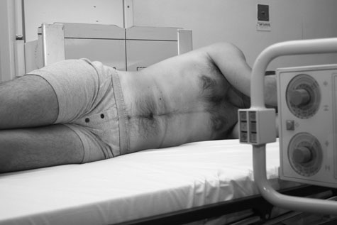
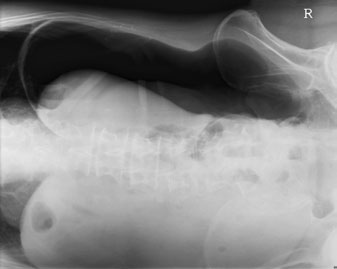
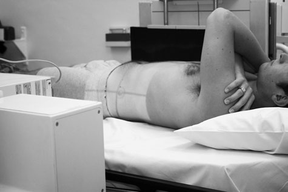
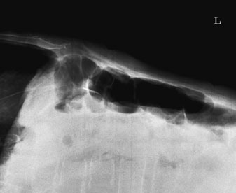

# Rx Abdomen și Cavitate Pelviană Antero-Posterior (AP) - left Profil (Lateral)

  📷 Radiografie Convențională (Rx)
  <strong>Actualizat:</strong> 2026-09-16
  <strong>Autor:</strong> Departamentul de Radiologie / Referință Clark (Ed. 12)

---

-   __1. Rezumat Clinic & Indicații__

    ---

    === "Indicații Clinice"

        - cu pacientul culcat pe stâng side, pneumoperitoneu (aer liber subdiafragmatic) will rise, la fie located între Profil (lateral) margin de ficat și drept Profil (lateral) abdominal perete. la allow time pentru gas la collect there, pacientul trebuie să remain culcat pe stâng side pentru 20 minutes before expunere este made.

    === "Ghid Național IRIS"

        !!! info "Referință Primară: Ghidul Național IRIS (Ordinul MS 1342/2012)"
            - **Capitol Ghid IRIS:** *Ghidul Național IRIS*
            - **Grad de Recomandare:** **De verificat pe indicație; fără grad atribuit automat**
            - **Nivel de Iradiere Estimată:** `De verificat pentru examinarea și populația selectate`

            [:octicons-search-16: Deschide Ghidul IRIS](../../iris.md){ .md-button .md-button--primary } [:material-open-in-new: Aplicația Oficială PWA](https://radiologie-pediatrica.ro/iris/){ .md-button target="_blank" rel="noopener" }
-   __2. Poziționare & Centrare Fascicul__

    ---

    - **Poziție Pacient:** • pacientul este culcat Decubit dorsal, cu brațele raised away de la abdomenul și Torace.
• casetă cu grilă antidifuzoare este sprijinit vertically pe / sprijinit de pacient’s side, pentru include Torace la level de mid-Stern și ca much de abdomenul ca possible. Care trebuie să fie taken that anterior perete de trunk este nu projected off film radiologic.
• Alternatively, when using trolley, pacientul poate fie poziționat against stativ vertical Bucky.
    - **Punct de Centrare Fascicul:** • raza centrală orizontală centrală este orientat la Profil (lateral) aspect de trunk so that it este la drept-angles la caseta și centred la it.
• Expunerea se efectuează în apnee la sfârșitul expirului complet.
342 Antero-posterior (AP) stâng Profil (lateral) decubit imagine de abdomenul evidențiind aer liber în abdominal cavity Profil (lateral) dorsal decubit (Decubit dorsal) imagine de abdomenul
    - **Distanță Focar-Film (DFF / SID):** 100 cm
    - **Comandă Respiratorie:** Expunerea se efectuează în apnee la sfârșitul expirului complet

-   __3. Parametri Tehnici Expunere__

    ---

    | Parametru Tehnic | Valoare Configurare Generator / Tub |
    |:-----------------|:-------------------------------------|
    | **Tensiune Tub (kV)** | DE CONFIGURAT PE APARAT |
    | **Sarcină / Produs Curent-Timp (mAs)** | Conform AEC / grosime anatomică |
    | **Distanță Focar-Film (DFF / SID)** | 100 cm |
    | **Grilă Antidifuzoare (Bucky)** | Cu grilă antidifuzoare Bucky |
    | **Dimensiune Focar** | Focar Mic (0.6 mm) |
    | **Camere de Ionizare AEC** | Camerele laterale (sau camera centrală funcție de regiune) |
    | **Colimare Fascicul** | Colimare strictă adaptată pe receptor 35 x 43 cm |
    | **Filtrare Tub** | Totală ≥ 2.5 mm Al echivalent (conform Clark: 3.0 mm Al eq.) |

-   __4. Criterii de Calitate & Reușită Imagine__

    ---

    - Vizualizarea clară întregii arii anatomice (Abdomen și Cavitate Pelviană).
    - Absența artefactelor de mișcare; trabeculație osoasă și contururi nete.
    - Densitate optică și contrast adecvate pentru diferențierea țesuturilor moi de structurile osoase.

-   __5. Protecție Radiologică (ALARA)__

    ---

    - Ecranare gonadică cu șorț plumbat dacă gonadele sunt în apropierea fasciculului util (regula ALARA).
    - Colimare precisă la dimensiunea anatomică strict necesară pentru reducerea dozei și a radiației difuze.
    - Verificarea posibilității unei sarcini la pacientele de vârstă fertilă înainte de expunere.

!!! note "Observații Clinice & Tehnice"
    Use de wedge filter will enable ambele Profil (lateral) abdominal perete și bowel la fie seen pentru same expunere.

### 🖼️ Imagini

<figure class="protocol-image-card" markdown>

<figcaption><strong>Antero-posterior (AP) stâng Profil (lateral) decubit imagine de abdomenul evidențiind aer liber</strong> — Poziționare pacient și centrare fascicul conform Clark (Ed. 12)</figcaption>

</figure>

<figure class="protocol-image-card" markdown>

<figcaption><strong>Figura 2: Aspect radiografic / Poziționare (Clark Ed. 12)</strong> — Aspect radiografic / ghid de poziționare conform tratatului Clark (Ed. 12)</figcaption>

</figure>

<figure class="protocol-image-card" markdown>

<figcaption><strong>Figura 3: Aspect radiografic / Poziționare (Clark Ed. 12)</strong> — Aspect radiografic / ghid de poziționare conform tratatului Clark (Ed. 12)</figcaption>

</figure>

<figure class="protocol-image-card" markdown>

<figcaption><strong>Figura 4: Aspect radiografic / Poziționare (Clark Ed. 12)</strong> — Aspect radiografic / ghid de poziționare conform tratatului Clark (Ed. 12)</figcaption>

</figure>

=== "Ghid Rapid de Execuție"

    1. **Identificarea și verificarea pacientului:** verificare identitate, zonă de examinat, consimțământ conform procedurii și evaluarea posibilității unei sarcini, când este relevantă.
    2. **Pregătire:** îndepărtarea oricăror obiecte radiopace (bijuterii, agrafe, fermoare, proteze, pansamente dense).
    3. **Poziționare precisă:** alinierea receptorului de imagine și a tubului la distanța prescrisă (100 cm).
    4. **Colimare strictă:** adaptarea fasciculului strict la regiunea de diagnostic pentru scăderea iradierii și reducerea radiației difuze.
    5. **Radioprotecție:** verificarea [politicii RX](../radioprotectie.md), cu măsuri distincte pentru pacient, personal și însoțitor.

## Surse de documentare

- [Clark's Positioning in Radiography (Ed. 12), Pagina 357](../../assets/protocols/sources/Clark___Positioning_in_Radiography__12th_edition.pdf#page=357)
