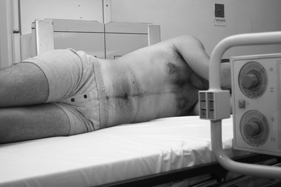
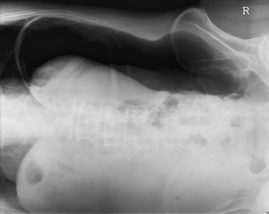
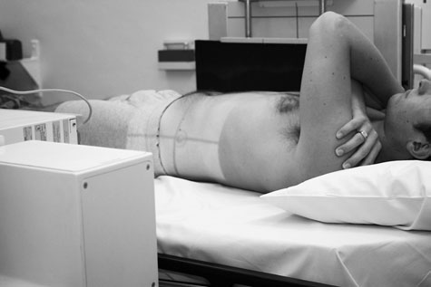
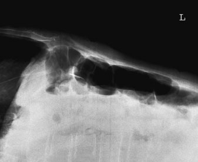

# Rx Abdomen și cavitate pelviană în incidență anteroposterioară (AP) - profil stâng

  📷 Radiografie Convențională (Rx)
  <strong>Actualizat:</strong> 2026-09-16
  <strong>Autor:</strong> Departamentul de Radiologie / Referință Clark (Ed. 12)

---

-   __1. Rezumat Clinic & Indicații__

    ---

    === "Indicații Clinice"

        - Cu pacientul culcat pe partea stângă, pneumoperitoneul (aer liber subdiafragmatic) se va ridica, situându-se între marginea laterală a ficatului și peretele abdominal lateral drept. Pentru a permite gazului să se acumuleze acolo, pacientul trebuie să rămână culcat pe partea stângă timp de 20 minute înainte de efectuarea expunerii.

    === "Ghid Național IRIS"

        !!! info "Referință Primară: Ghidul Național IRIS (Ordinul MS 1342/2012)"
            - **Capitol Ghid IRIS:** *Aparat digestiv & Abdomen*
            - **Grad de Recomandare:** **Grad B**
            - **Nivel de Iradiere Estimată:** `Clasa 2 (Foarte mică ~ 0.7 - 1.2 mSv)`

            [:octicons-search-16: Deschide Ghidul IRIS](../../iris.md){ .md-button .md-button--primary } [:material-open-in-new: Aplicația Oficială PWA](https://radiologie-pediatrica.ro/iris/){ .md-button target="_blank" rel="noopener" }

-   __2. Poziționare & Centrare Fascicul__

    ---

    - **Poziție Pacient:**
        - Pacientul este culcat în decubit dorsal, cu brațele ridicate departe de abdomen și torace.
        - Caseta cu grilă antidifuzoare este sprijinită vertical pe partea laterală a pacientului, pentru a include toracele până la nivelul mijlocului sternului și cât mai mult din abdomen. Trebuie avut grijă ca peretele anterior al trunchiului să nu fie proiectat în afara filmului radiologic.
        - Alternativ, când se utilizează o targă, pacientul poate fi poziționat lângă stativul vertical Bucky, în contact cu acesta.
    - **Punct de Centrare Fascicul:**
        - Raza centrală orizontală este orientată spre fața laterală a trunchiului, astfel încât să fie perpendiculară pe casetă și centrată pe aceasta.
        - Expunerea se efectuează în apnee la sfârșitul expirului complet. 342 Imagine anteroposterioară (AP) a abdomenului în decubit lateral stâng care evidențiază aer liber în cavitatea abdominală. Imagine de profil a abdomenului în decubit dorsal (decubit dorsal)
    - **Distanță Focar-Film (DFF / SID):** 100 cm
    - **Comandă Respiratorie:** Expunerea se efectuează în apnee la sfârșitul expirului complet

-   __3. Parametri Tehnici Expunere__

    ---

    | Parametru Tehnic | Valoare Configurare Generator / Tub |
    |:-----------------|:-------------------------------------|
    | **Tensiune Tub (kV)** | DE CONFIGURAT PE APARAT |
    | **Sarcină / Produs Curent-Timp (mAs)** | Conform AEC / grosimii anatomice |
    | **Distanță Focar-Film (DFF / SID)** | 100 cm |
    | **Grilă Antidifuzoare (Bucky)** | Cu grilă antidifuzoare Bucky |
    | **Dimensiune Focar** | Focar Mic (0.6 mm) |
    | **Camere de Ionizare AEC** | Camerele laterale (sau camera centrală, în funcție de regiune) |
    | **Colimare Fascicul** | Colimare strictă adaptată pe receptor 35 x 43 cm |
    | **Filtrare Tub** | Totală ≥ 2.5 mm Al echivalent (conform Clark: 3.0 mm Al echivalent) |

-   __4. Criterii de Calitate & Reușită Imagine__

    ---

    - Vizualizarea clară a întregii arii anatomice (abdomen și cavitate pelviană).
    - Absența artefactelor de mișcare; trabeculație osoasă și contururi nete.
    - Densitate optică și contrast adecvate pentru diferențierea țesuturilor moi de structurile osoase.

-   __5. Protecție Radiologică (ALARA)__

    ---

    - Ecranare gonadică cu șorț plumbat dacă gonadele sunt în apropierea fasciculului util (regula ALARA).
    - Colimare precisă la dimensiunea anatomică strict necesară pentru reducerea dozei și a radiației difuze.
    - Verificarea posibilității unei sarcini la pacientele de vârstă fertilă înainte de expunere.

!!! note "Observații Clinice & Tehnice"
    Utilizarea unui filtru în pană va permite vizualizarea atât a peretelui abdominal lateral, cât și a intestinului la aceeași expunere.

### 🖼️ Imagini

<figure class="protocol-image-card" markdown>

<figcaption><strong>Imagine anteroposterioară (AP) a abdomenului în decubit lateral stâng care evidențiază aer liber</strong> — Poziționarea pacientului și centrarea fasciculului conform Clark (Ed. 12)</figcaption>

</figure>

<figure class="protocol-image-card" markdown>

<figcaption><strong>Figura 2: Aspect radiografic / Poziționare (Clark Ed. 12)</strong> — Aspect radiografic / ghid de poziționare conform tratatului Clark (Ed. 12)</figcaption>

</figure>

<figure class="protocol-image-card" markdown>

<figcaption><strong>Figura 3: Aspect radiografic / Poziționare (Clark Ed. 12)</strong> — Aspect radiografic / ghid de poziționare conform tratatului Clark (Ed. 12)</figcaption>

</figure>

<figure class="protocol-image-card" markdown>

<figcaption><strong>Figura 4: Aspect radiografic / Poziționare (Clark Ed. 12)</strong> — Aspect radiografic / ghid de poziționare conform tratatului Clark (Ed. 12)</figcaption>

</figure>

=== "Ghid Rapid de Execuție"

    1. **Identificarea și verificarea pacientului:** verificare identitate, zonă de examinat, consimțământ conform procedurii și evaluarea posibilității unei sarcini, când este relevantă.
    2. **Pregătire:** îndepărtarea oricăror obiecte radiopace (bijuterii, agrafe, fermoare, proteze, pansamente dense).
    3. **Poziționare precisă:** alinierea receptorului de imagine și a tubului la distanța prescrisă (100 cm).
    4. **Colimare strictă:** adaptarea fasciculului strict la regiunea de diagnostic pentru scăderea iradierii și reducerea radiației difuze.
    5. **Radioprotecție:** verificarea [politicii RX](../radioprotectie.md), cu măsuri distincte pentru pacient, personal și însoțitor.

## Surse de documentare

- [Clark's Positioning in Radiography (Ed. 12), Pagina 357](https://books.google.com/books/about/Clark_s_Positioning_in_Radiography.html?id=Xxu6MwEACAAJ)
