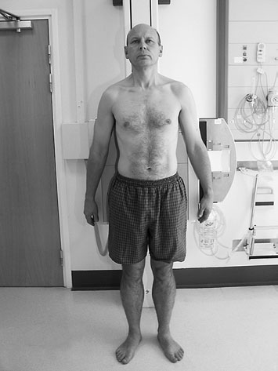
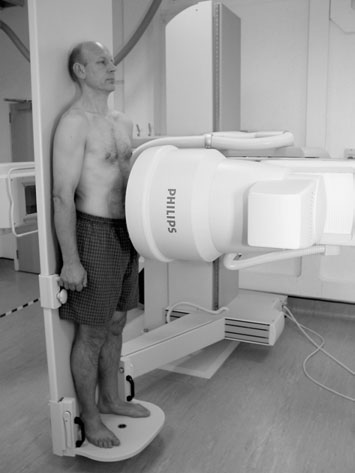
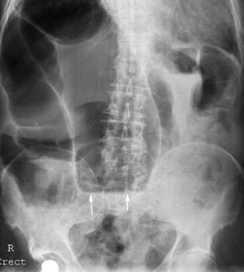
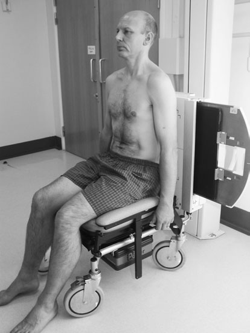
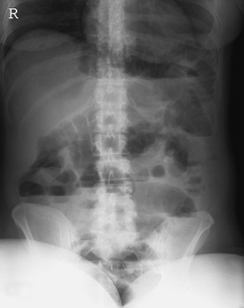

# Rx Abdomen și Cavitate Pelviană Antero-Posterior (AP) - Ortostatism

  📷 Radiografie Convențională (Rx)
  <strong>Actualizat:</strong> 2026-09-16
  <strong>Autor:</strong> Departamentul de Radiologie / Referință Clark (Ed. 12)

---

-   __1. Rezumat Clinic & Indicații__

    ---

    === "Indicații Clinice"

        - nivele hidroaerice pe Ortostatism film radiologic do nu necessarily indicate obstruction, ca variety de other conditions poate produce nivele hidroaerice, e.g. severe gastroenteritis, jejunal diverticulosis.
        - Suspected ocluzie intestinală (nivele hidroaerice) este usual indication pentru this request, but it poate also fie useful pentru confirming presence de gas-containing abscess. Ortostatism Antero-posterior (AP) Ortostatism radiografie de abdomenul în Poziție Șezândă poziție evidențiind postoperative Ocluzie intestinală pe intestinul subțire (nivele hidroaerice centrale) (note lower abdominal clips pe transverse incision). NB: If picioarele sunt nu în abducție details de Bazin (bazin (pelvis)) sunt obscured, ca în this example

    === "Ghid Național IRIS"

        !!! info "Referință Primară: Ghidul Național IRIS (Ordinul MS 1342/2012)"
            - **Capitol Ghid IRIS:** *Ghidul Național IRIS*
            - **Grad de Recomandare:** **De verificat pe indicație; fără grad atribuit automat**
            - **Nivel de Iradiere Estimată:** `De verificat pentru examinarea și populația selectate`

            [:octicons-search-16: Deschide Ghidul IRIS](../../iris.md){ .md-button .md-button--primary } [:material-open-in-new: Aplicația Oficială PWA](https://radiologie-pediatrica.ro/iris/){ .md-button target="_blank" rel="noopener" }
-   __2. Poziționare & Centrare Fascicul__

    ---

    - **Poziție Pacient:** (tilting table) This poate fie undertaken using tilting table cu C-braț assembly cu large imagine intensifier și X-ray tube în over-couch poziție. It este used when undertaking barium examinations de alimentary tract și other studies requiring Ortostatism imagine, e.g. IVU, la show site de obstruction.
• pacientul este culcat Decubit dorsal pe tilting table, cu picioarele firmly pe / sprijinit de step. masa de examinare este moved slowly spre vertical poziție until pacientul este Ortostatism.
• If necessary, imobilizare bands sunt tightened across genunchii și chest la prevent pacientul de la collapsing when masa de examinare este moved spre vertical poziție. However, it este nu recommended that this procedure trebuie să fie undertaken if pacientul este unwell și unable la stand unaided.
• upper edge de imagine intensifier este ajustat so that it este la nivelul middle de corp de Stern în order pentru include cupole diafragmatice.
• X-ray tube/C-braț assembly este poziționat astfel încât raza centrală este orizontal.
• expunere este made ca soon ca table movement este stopped.
This este preferably when masa de examinare este vertical, but how near vertical will depend pe condition de pacientul.
• ca soon ca expunere has been made, X-ray tube este moved away și masa de examinare moved back into orizontal poziție.
340 Antero-posterior (AP) Ortostatism radiografie de abdomenul evidențiind dilated bowel cu small nivele hidroaerice (arrows)

• Having set parametri de expunere și poziționat X-ray tube so that orizontal raza centrală will fie approximately la correct height, pacientul, already Ortostatism, este turned through 90 grade so that they sunt facing X-ray tube.
• Care trebuie să fie exercised la abduct picioarele la avoid superimposing părți moi de thighs over pelvic cavity.
• planul mediosagital este ajustat la drept-angles și coincident cu linia mediană stativ vertical Bucky sau casetă cu grilă antidifuzoare.
• pacientul este sprijinit în this poziție cu a 35  43-cm casetă în Bucky sau casetă cu grilă antidifuzoare sprijinit vertically pe / sprijinit de pacient’s back, cu its upper edge nu lower than mid-Stern.
• Alternatively, depending pe pacientul’s condition, pacientul poate sit pe stool sau wheelchair cu back removed și cu their back against stativ vertical Bucky. If necessary, pacientul poate also fie examined cu backrest de trolley raised la vertical poziție.
    - **Punct de Centrare Fascicul:** • orizontal ray este orientat so that it este coincident cu centre de caseta în linia mediană.
• expunere este taken pe normal expir profund complet.

• Final adjustment este made la poziție de X-ray tube astfel încât orizontal raza centrală will fie orientat la anterior aspect de pacientul la centre de caseta la correct focus-la-film radiologic distance (FFD).
• Expunerea se efectuează în apnee la sfârșitul expirului complet, after which pacientul este returned la Decubit dorsal poziție.
    - **Distanță Focar-Film (DFF / SID):** 100 cm
    - **Comandă Respiratorie:** expunere este made ca soon ca table movement este stopped

-   __3. Parametri Tehnici Expunere__

    ---

    | Parametru Tehnic | Valoare Configurare Generator / Tub |
    |:-----------------|:-------------------------------------|
    | **Tensiune Tub (kV)** | 7-10 kV |
    | **Sarcină / Produs Curent-Timp (mAs)** | Conform AEC / grosime anatomică |
    | **Distanță Focar-Film (DFF / SID)** | 100 cm |
    | **Grilă Antidifuzoare (Bucky)** | Cu grilă antidifuzoare Bucky |
    | **Dimensiune Focar** | Focar Mic (0.6 mm) |
    | **Camere de Ionizare AEC** | Camerele laterale (sau camera centrală funcție de regiune) |
    | **Colimare Fascicul** | Colimare strictă adaptată pe receptor 35 x 43 cm |
    | **Filtrare Tub** | Totală ≥ 2.5 mm Al echivalent (conform Clark: 3.0 mm Al eq.) |

-   __4. Criterii de Calitate & Reușită Imagine__

    ---

    - acquired imagine trebuie să include ambele domes de cupole diafragmatice la ensure that orice Pneumoperitoneu (aer liber în cavitatea peritoneală) este evidențiat.

-   __5. Protecție Radiologică (ALARA)__

    ---

    - Ecranare gonadică cu șorț plumbat dacă gonadele sunt în apropierea fasciculului util (regula ALARA).
    - Colimare precisă la dimensiunea anatomică strict necesară pentru reducerea dozei și a radiației difuze.
    - Verificarea posibilității unei sarcini la pacientele de vârstă fertilă înainte de expunere.

!!! note "Observații Clinice & Tehnice"
    • parametri de expunere sunt set using high mA și short expunere time și increase de 7–10 kVp over that required cu pacientul Decubit dorsal.
• în case de suspected perforation, pacientul trebuie să fie kept Ortostatism, ideally pentru 20 minutes prior la expunere, la allow orice pneumoperitoneu (aer liber subdiafragmatic) la rise. appropriate imagine în this situation would fie Ortostatism chest, sau Antero-posterior (AP) stâng Profil (lateral) decubit Abdomen, sau ca last resort Profil (lateral) dorsal decubit.

### 🖼️ Imagini

<figure class="protocol-image-card" markdown>

<figcaption><strong>• expunere este taken pe normal expir profund complet.</strong> — Poziționare pacient și centrare fascicul conform Clark (Ed. 12)</figcaption>

</figure>

<figure class="protocol-image-card" markdown>

<figcaption><strong>Antero-posterior (AP) Ortostatism radiografie de abdomenul evidențiind dilated bowel</strong> — Aspect radiografic / ghid de poziționare conform tratatului Clark (Ed. 12)</figcaption>

</figure>

<figure class="protocol-image-card" markdown>

<figcaption><strong>Figura 3: Aspect radiografic / Poziționare (Clark Ed. 12)</strong> — Aspect radiografic / ghid de poziționare conform tratatului Clark (Ed. 12)</figcaption>

</figure>

<figure class="protocol-image-card" markdown>

<figcaption><strong>Antero-posterior (AP) Ortostatism radiografie de abdomenul în Poziție Șezândă poziție evidențiind</strong> — Aspect radiografic / ghid de poziționare conform tratatului Clark (Ed. 12)</figcaption>

</figure>

<figure class="protocol-image-card" markdown>

<figcaption><strong>Figura 5: Aspect radiografic / Poziționare (Clark Ed. 12)</strong> — Aspect radiografic / ghid de poziționare conform tratatului Clark (Ed. 12)</figcaption>

</figure>

=== "Ghid Rapid de Execuție"

    1. **Identificarea și verificarea pacientului:** verificare identitate, zonă de examinat, consimțământ conform procedurii și evaluarea posibilității unei sarcini, când este relevantă.
    2. **Pregătire:** îndepărtarea oricăror obiecte radiopace (bijuterii, agrafe, fermoare, proteze, pansamente dense).
    3. **Poziționare precisă:** alinierea receptorului de imagine și a tubului la distanța prescrisă (100 cm).
    4. **Colimare strictă:** adaptarea fasciculului strict la regiunea de diagnostic pentru scăderea iradierii și reducerea radiației difuze.
    5. **Radioprotecție:** verificarea [politicii RX](../radioprotectie.md), cu măsuri distincte pentru pacient, personal și însoțitor.

## Surse de documentare

- [Clark's Positioning in Radiography (Ed. 12), Pagina 355](../../assets/protocols/sources/Clark___Positioning_in_Radiography__12th_edition.pdf#page=355)
