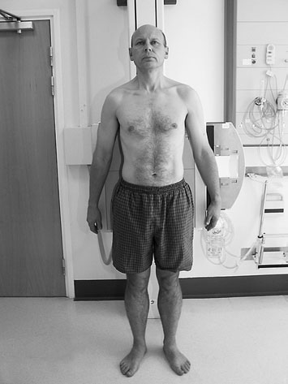
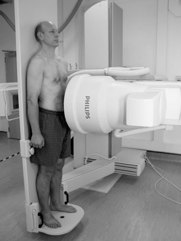
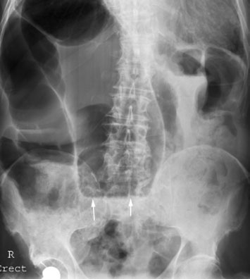
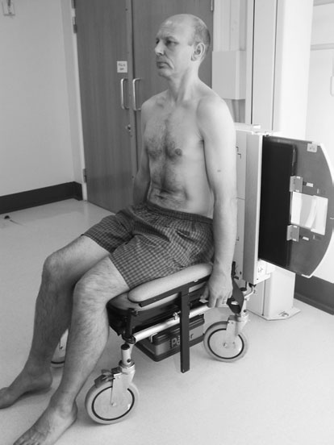
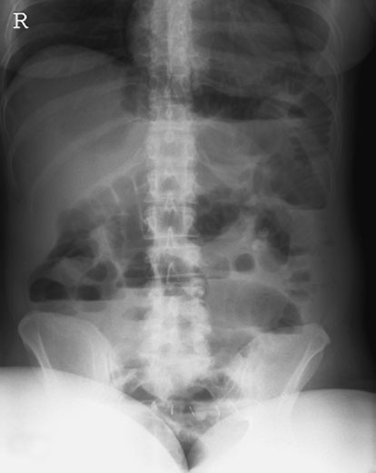

# Rx Abdomen și cavitate pelviană în incidență anteroposterioară (AP) - ortostatism

  📷 Radiografie Convențională (Rx)
  <strong>Actualizat:</strong> 2026-09-16
  <strong>Autor:</strong> Departamentul de Radiologie / Referință Clark (Ed. 12)

---

-   __1. Rezumat Clinic & Indicații__

    ---

    === "Indicații Clinice"

        - Nivelele hidroaerice de pe filmul radiologic în ortostatism nu indică neapărat o ocluzie, deoarece diverse alte afecțiuni pot produce nivele hidroaerice, de exemplu gastroenterita severă, diverticuloza jejunală.
        - Suspiciunea de ocluzie intestinală (nivele hidroaerice) este indicația obișnuită pentru această solicitare, dar examinarea poate fi utilă și pentru confirmarea prezenței unui abces care conține gaz. Ortostatism. Radiografie anteroposterioară (AP) a abdomenului în ortostatism, în poziție șezândă, care evidențiază ocluzie intestinală postoperatorie la nivelul intestinului subțire (nivele hidroaerice centrale) (observați clipurile din abdomenul inferior de-a lungul inciziei transversale). NB: Dacă picioarele nu sunt în abducție, detaliile bazinului (pelvisului) sunt mascate, ca în acest exemplu

    === "Ghid Național IRIS"

        !!! info "Referință Primară: Ghidul Național IRIS (Ordinul MS 1342/2012)"
            - **Capitol Ghid IRIS:** *Aparat digestiv & Abdomen*
            - **Grad de Recomandare:** **Grad B**
            - **Nivel de Iradiere Estimată:** `Clasa 2 (Foarte mică ~ 0.7 - 1.2 mSv)`

            [:octicons-search-16: Deschide Ghidul IRIS](../../iris.md){ .md-button .md-button--primary } [:material-open-in-new: Aplicația Oficială PWA](https://radiologie-pediatrica.ro/iris/){ .md-button target="_blank" rel="noopener" }

-   __2. Poziționare & Centrare Fascicul__

    ---

    - **Poziție Pacient:**
        (masă basculantă) Această examinare poate fi efectuată folosind o masă basculantă cu un ansamblu cu braț în C, cu un intensificator de imagine mare și tubul de raze X poziționat deasupra mesei. Se utilizează la efectuarea examinărilor cu bariu ale tubului digestiv și a altor investigații care necesită o imagine în ortostatism, de exemplu IVU, pentru a evidenția sediul obstrucției.

        - Pacientul este culcat în decubit dorsal pe masa basculantă, cu picioarele sprijinite ferm pe treaptă. Masa de examinare este deplasată lent spre poziția verticală până când pacientul ajunge în ortostatism.
        - Dacă este necesar, benzile de imobilizare sunt strânse peste genunchi și torace pentru a preveni prăbușirea pacientului când masa de examinare este deplasată spre poziția verticală. Totuși, nu se recomandă efectuarea acestei proceduri dacă pacientul are o stare generală alterată și nu poate sta în picioare fără ajutor.
        - Marginea superioară a intensificatorului de imagine este ajustată astfel încât să fie la nivelul mijlocului corpului sternului, pentru a include cupolele diafragmatice.
        - Ansamblul tub de raze X/braț în C este poziționat astfel încât raza centrală să fie orizontală.
        - Expunerea se efectuează imediat ce mișcarea mesei s-a oprit. De preferat, aceasta se efectuează când masa de examinare este verticală, dar apropierea de poziția verticală va depinde de starea pacientului.
        - Imediat după efectuarea expunerii, tubul de raze X este îndepărtat și masa de examinare este readusă în poziție orizontală. 340 Radiografie anteroposterioară (AP) a abdomenului în ortostatism care evidențiază anse intestinale dilatate cu nivele hidroaerice mici (săgeți)
        - După setarea parametrilor de expunere și poziționarea tubului de raze X astfel încât raza centrală orizontală să fie aproximativ la înălțimea corectă, pacientul, aflat deja în ortostatism, este rotit cu 90 grade astfel încât să fie cu fața spre tubul de raze X.
        - Trebuie avut grijă să se efectueze abducția picioarelor pentru a evita suprapunerea părților moi ale coapselor peste cavitatea pelviană.
        - Planul mediosagital este ajustat perpendicular pe stativul vertical Bucky sau pe caseta cu grilă antidifuzoare și aliniat cu linia mediană a acestora.
        - Pacientul este susținut în această poziție, cu o casetă de 35 × 43-cm în Bucky sau cu o casetă cu grilă antidifuzoare sprijinită vertical pe spatele pacientului, cu marginea superioară nu mai jos de mijlocul sternului.
        - Alternativ, în funcție de starea sa, pacientul poate sta pe un taburet sau într-un scaun cu rotile cu spătarul îndepărtat, cu spatele lipit de stativul vertical Bucky. Dacă este necesar, pacientul poate fi examinat și cu spătarul tărgii ridicat în poziție verticală.
    - **Punct de Centrare Fascicul:**
        - Raza orizontală este orientată astfel încât să coincidă cu centrul casetei pe linia mediană.
        - Expunerea se efectuează la un expir normal, profund și complet.
        - Se efectuează ajustarea finală a poziției tubului de raze X astfel încât raza centrală orizontală să fie orientată spre fața anterioară a pacientului, la centrul casetei, la distanța focar-film radiologic (FFD) corectă.
        - Expunerea se efectuează în apnee la sfârșitul expirului complet, după care pacientul este readus în decubit dorsal.
    - **Distanță Focar-Film (DFF / SID):** 100 cm
    - **Comandă Respiratorie:** Expunerea se efectuează imediat ce mișcarea mesei s-a oprit

-   __3. Parametri Tehnici Expunere__

    ---

    | Parametru Tehnic | Valoare Configurare Generator / Tub |
    |:-----------------|:-------------------------------------|
    | **Tensiune Tub (kV)** | 7-10 kV |
    | **Sarcină / Produs Curent-Timp (mAs)** | Conform AEC / grosimii anatomice |
    | **Distanță Focar-Film (DFF / SID)** | 100 cm |
    | **Grilă Antidifuzoare (Bucky)** | Cu grilă antidifuzoare Bucky |
    | **Dimensiune Focar** | Focar Mic (0.6 mm) |
    | **Camere de Ionizare AEC** | Camerele laterale (sau camera centrală, în funcție de regiune) |
    | **Colimare Fascicul** | Colimare strictă adaptată pe receptor 35 x 43 cm |
    | **Filtrare Tub** | Totală ≥ 2.5 mm Al echivalent (conform Clark: 3.0 mm Al echivalent) |

-   __4. Criterii de Calitate & Reușită Imagine__

    ---

    - Imaginea obținută trebuie să includă ambele cupole diafragmatice pentru a asigura evidențierea oricărui pneumoperitoneu (aer liber în cavitatea peritoneală).

-   __5. Protecție Radiologică (ALARA)__

    ---

    - Ecranare gonadică cu șorț plumbat dacă gonadele sunt în apropierea fasciculului util (regula ALARA).
    - Colimare precisă la dimensiunea anatomică strict necesară pentru reducerea dozei și a radiației difuze.
    - Verificarea posibilității unei sarcini la pacientele de vârstă fertilă înainte de expunere.

!!! note "Observații Clinice & Tehnice"
    - Parametrii de expunere sunt setați folosind mA mari și un timp scurt de expunere, cu o creștere de 7–10 kVp față de valoarea necesară cu pacientul în decubit dorsal.
    - În cazul unei suspiciuni de perforație, pacientul trebuie menținut în ortostatism, ideal timp de 20 minute înainte de expunere, pentru a permite oricărui pneumoperitoneu (aer liber subdiafragmatic) să se ridice. Imaginea adecvată în această situație ar fi o radiografie toracică în ortostatism sau o radiografie anteroposterioară (AP) a abdomenului în decubit lateral stâng ori, ca ultimă opțiune, o radiografie de profil în decubit dorsal.

### 🖼️ Imagini

<figure class="protocol-image-card" markdown>

<figcaption><strong>• Expunerea se efectuează la un expir normal, profund și complet.</strong> — Poziționarea pacientului și centrarea fasciculului conform Clark (Ed. 12)</figcaption>

</figure>

<figure class="protocol-image-card" markdown>

<figcaption><strong>Radiografie anteroposterioară (AP) a abdomenului în ortostatism care evidențiază anse intestinale dilatate</strong> — Aspect radiografic / ghid de poziționare conform tratatului Clark (Ed. 12)</figcaption>

</figure>

<figure class="protocol-image-card" markdown>

<figcaption><strong>Figura 3: Aspect radiografic / Poziționare (Clark Ed. 12)</strong> — Aspect radiografic / ghid de poziționare conform tratatului Clark (Ed. 12)</figcaption>

</figure>

<figure class="protocol-image-card" markdown>

<figcaption><strong>Radiografie anteroposterioară (AP) a abdomenului în ortostatism, în poziție șezândă, care evidențiază</strong> — Aspect radiografic / ghid de poziționare conform tratatului Clark (Ed. 12)</figcaption>

</figure>

<figure class="protocol-image-card" markdown>

<figcaption><strong>Figura 5: Aspect radiografic / Poziționare (Clark Ed. 12)</strong> — Aspect radiografic / ghid de poziționare conform tratatului Clark (Ed. 12)</figcaption>

</figure>

=== "Ghid Rapid de Execuție"

    1. **Identificarea și verificarea pacientului:** verificare identitate, zonă de examinat, consimțământ conform procedurii și evaluarea posibilității unei sarcini, când este relevantă.
    2. **Pregătire:** îndepărtarea oricăror obiecte radiopace (bijuterii, agrafe, fermoare, proteze, pansamente dense).
    3. **Poziționare precisă:** alinierea receptorului de imagine și a tubului la distanța prescrisă (100 cm).
    4. **Colimare strictă:** adaptarea fasciculului strict la regiunea de diagnostic pentru scăderea iradierii și reducerea radiației difuze.
    5. **Radioprotecție:** verificarea [politicii RX](../radioprotectie.md), cu măsuri distincte pentru pacient, personal și însoțitor.

## Surse de documentare

- [Clark's Positioning in Radiography (Ed. 12), Pagina 355](https://books.google.com/books/about/Clark_s_Positioning_in_Radiography.html?id=Xxu6MwEACAAJ)
