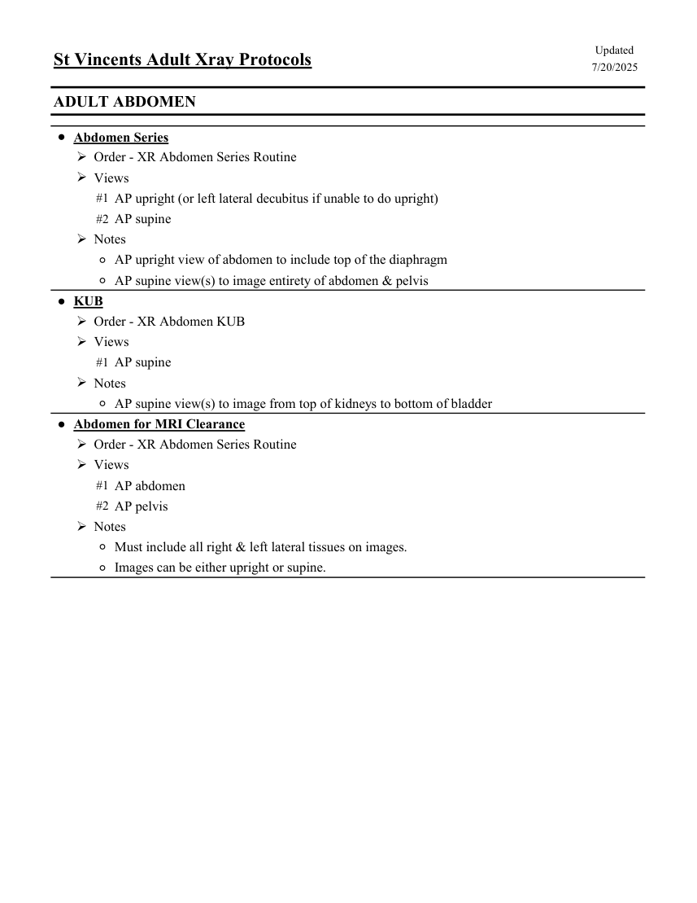

# RX — Adult: abdomen (MCB)

## Documentul original MCB — Adult: abdomen

**Colecție de protocoale · 1 pagini · consultat la 2026-09-27.**

[Descarcă PDF-ul integral](../../assets/mcb-modalities/rx-adult-abdomen-mcb/document.pdf) · [Sursa MCB](https://ref.mcbradiology.com/Protocols,%20Policies,%20Worksheets%20&%20Forms/Xray/Adult%20Protocols/3%20Adult%20Abdomen.pdf) · [Catalogul MCB pentru această modalitate](../mcb/index.md)

Instrucțiunile, valorile și ilustrațiile din documentul original sunt păstrate în **engleză**. Titlul și navigarea sunt în română.

### Pagina 1

{ loading=lazy }

## Textul documentului original

??? abstract "Pagina 1 — text în engleză"

    
Updated
    St Vincents Adult Xray Protocols
    7/20/2025
    ADULT ABDOMEN
    ●Abdomen Series
    Order - XR Abdomen Series Routine
    Views
    #1 AP upright (or left lateral decubitus if unable to do upright)
    #2 AP supine
    Notes
    ◦AP upright view of abdomen to include top of the diaphragm
    ◦AP supine view(s) to image entirety of abdomen &amp; pelvis
    ●KUB
    Order - XR Abdomen KUB
    Views
    #1 AP supine
    Notes
    ◦AP supine view(s) to image from top of kidneys to bottom of bladder
    ●Abdomen for MRI Clearance
    Order - XR Abdomen Series Routine
    Views
    #1 AP abdomen
    #2 AP pelvis
    Notes
    ◦Must include all right &amp; left lateral tissues on images.
    ◦Images can be either upright or supine.
    

