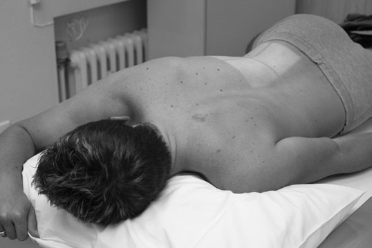
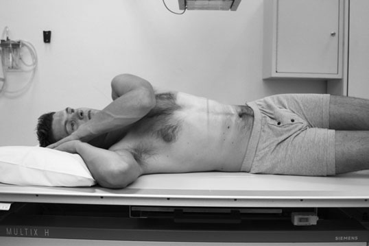
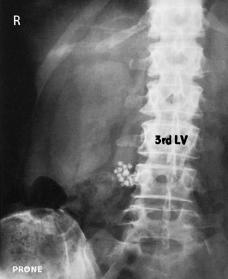
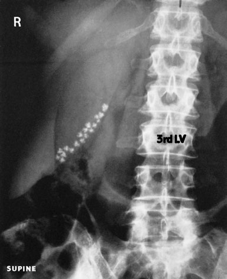
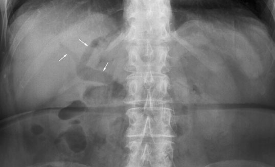

# Rx Aparat Biliar Left Oblică Anterioară

  📷 Radiografie Convențională (Rx)
  <strong>Actualizat:</strong> 2026-09-16
  <strong>Autor:</strong> Departamentul de Radiologie / Referință Clark (Ed. 12)

---

-   __1. Rezumat Clinic & Indicații__

    ---

    === "Indicații Clinice"

        - nu toate gallstones sunt radio-opaque. pattern de calcificări patologice este variable, de la amorphous solid appearance la concentric laminar structure.
        - Calcified stones tend la gather în most dependent part de gallbladder, which will usually fie fundus în Decubit ventral poziție. Cholesterol stones în particular sunt lighter than bile și tend la float, but they sunt nu usually radio-opaque.
        - Air în biliary tree poate fie seen after instrumentation (e.g. sphincterotomy), after passage de litiază urinară / Litiază urinară / calculi radio-opaci radiopaci, sau în normal elderly person cu patulous sphincter de Oddi. imagini above evidențiază change în poziție de stone-filled gallbladder when pacientul este moved de la Decubit ventral (b) la Decubit dorsal poziție (c) Antero-posterior (AP) Decubit dorsal imagine de etajul abdominal superior evidențiind air în biliary tree

    === "Ghid Național IRIS"

        !!! info "Referință Primară: Ghidul Național IRIS (Ordinul MS 1342/2012)"
            - **Capitol Ghid IRIS:** *Ghidul Național IRIS*
            - **Grad de Recomandare:** **De verificat pe indicație; fără grad atribuit automat**
            - **Nivel de Iradiere Estimată:** `De verificat pentru examinarea și populația selectate`

            [:octicons-search-16: Deschide Ghidul IRIS](../../iris.md){ .md-button .md-button--primary } [:material-open-in-new: Aplicația Oficială PWA](https://radiologie-pediatrica.ro/iris/){ .md-button target="_blank" rel="noopener" }
-   __2. Poziționare & Centrare Fascicul__

    ---

    - **Poziție Pacient:** • Pacientul este așezat în decubit ventral pe masa radiologică. drept side este raised, rotating planul mediosagital through angle de 20 grade; plan coronal este now la un unghi de 20 grade la masa de examinare.
• braț pe raised side este flectat astfel încât drept Mână rests near pacientul’s cap, while stâng braț lies alongside și behind trunk.
• pacientul este moved across masa de examinare until raised drept side este over centre de masa de examinare, și compression band este applied.
• A 24  30-cm casetă este plasat longitudinally în tăvița Bucky cu its centre 2.5 cm above lower costal margin pentru include top de crestele iliace.

• Pacientul este așezat în decubit dorsal pe masa radiologică. stâng side este raised, rotating planul mediosagital through 20 grade; plan coronal este now la un unghi de 20 grade la masa de examinare și trunk este sprijinit în this poziție using nonopaque pad.
• pacientul este moved across masa de examinare astfel încât drept side de abdomenul este over centre de masa de examinare. coate și umeri sunt flectat astfel încât pacient poate rest mâinile behind capul.
• imobilizare band helps la compress abdomenul.
• A 24  30-cm casetă este plasat longitudinally în tăvița Bucky, cu its centre 2.5 cm above lower costal margin.
    - **Punct de Centrare Fascicul:** • raza centrală verticală centrală este orientat la point 7.5 cm la drept de procese spinoase și 2.5 cm above lower costal margin și la centre de caseta.
• expunere este made pe Apnee la sfârșitul expirului complet (diafragm ridicat).

• raza centrală verticală centrală este orientat la point midway între midline și drept abdominal perete 2.5 cm above lower costal margin, și la centre de caseta.
• expunere este made pe Apnee la sfârșitul expirului complet (diafragm ridicat).
    - **Distanță Focar-Film (DFF / SID):** 100 cm
    - **Comandă Respiratorie:** expunere este made pe arrested respirație after full

-   __3. Parametri Tehnici Expunere__

    ---

    | Parametru Tehnic | Valoare Configurare Generator / Tub |
    |:-----------------|:-------------------------------------|
    | **Tensiune Tub (kV)** | 70 kV |
    | **Sarcină / Produs Curent-Timp (mAs)** | Conform AEC / grosime anatomică |
    | **Distanță Focar-Film (DFF / SID)** | 100 cm |
    | **Grilă Antidifuzoare (Bucky)** | Cu grilă antidifuzoare Bucky |
    | **Dimensiune Focar** | Focar Mic (0.6 mm) |
    | **Camere de Ionizare AEC** | Camerele laterale (sau camera centrală funcție de regiune) |
    | **Colimare Fascicul** | Colimare strictă adaptată pe receptor 24 x 30 cm |
    | **Filtrare Tub** | Totală ≥ 2.5 mm Al echivalent (conform Clark: 3.0 mm Al eq.) |

-   __4. Criterii de Calitate & Reușită Imagine__

    ---

    - Vizualizarea clară întregii arii anatomice (Aparat Biliar).
    - Absența artefactelor de mișcare; trabeculație osoasă și contururi nete.
    - Densitate optică și contrast adecvate pentru diferențierea țesuturilor moi de structurile osoase.

-   __5. Protecție Radiologică (ALARA)__

    ---

    - Ecranare gonadică cu șorț plumbat dacă gonadele sunt în apropierea fasciculului util (regula ALARA).
    - Colimare precisă la dimensiunea anatomică strict necesară pentru reducerea dozei și a radiației difuze.
    - Verificarea posibilității unei sarcini la pacientele de vârstă fertilă înainte de expunere.

!!! note "Observații Clinice & Tehnice"
    additional imagine poate fie taken pe arrested respirație after inspir profund complet la show relative movement de gallbladder și overlying calcificări patologice that sunt suspected la fie outside gallbladder, e.g. within costal cartilages.
348 a' b b' b b c c c c' Varying poziție de X-ray tube according la type de subject rinichi cupole diafragmatice casetă casetă a'b'c' show varying shape de projected gallbladder according la type de subject casete sunt vizualizat la various levels în order la differentiate între three poziții 12th TV 10th rib 3rd LV 5th LV

### 🖼️ Imagini

<figure class="protocol-image-card" markdown>

<figcaption><strong>Ultrasound imaging este normally undertaken la evidențiază the</strong> — Poziționare pacient și centrare fascicul conform Clark (Ed. 12)</figcaption>

</figure>

<figure class="protocol-image-card" markdown>

<figcaption><strong>tion este variable, de la amorphous solid appearance la a</strong> — Aspect radiografic / ghid de poziționare conform tratatului Clark (Ed. 12)</figcaption>

</figure>

<figure class="protocol-image-card" markdown>

<figcaption><strong>(e.g. sphincterotomy), after passage de litiază urinară / Litiază urinară / calculi radio-opaci radiopaci, sau în normal</strong> — Aspect radiografic / ghid de poziționare conform tratatului Clark (Ed. 12)</figcaption>

</figure>

<figure class="protocol-image-card" markdown>

<figcaption><strong>Antero-posterior (AP) Decubit dorsal imagine de etajul abdominal superior evidențiind air în the</strong> — Aspect radiografic / ghid de poziționare conform tratatului Clark (Ed. 12)</figcaption>

</figure>

<figure class="protocol-image-card" markdown>

<figcaption><strong>Figura 5: Aspect radiografic / Poziționare (Clark Ed. 12)</strong> — Aspect radiografic / ghid de poziționare conform tratatului Clark (Ed. 12)</figcaption>

</figure>

=== "Ghid Rapid de Execuție"

    1. **Identificarea și verificarea pacientului:** verificare identitate, zonă de examinat, consimțământ conform procedurii și evaluarea posibilității unei sarcini, când este relevantă.
    2. **Pregătire:** îndepărtarea oricăror obiecte radiopace (bijuterii, agrafe, fermoare, proteze, pansamente dense).
    3. **Poziționare precisă:** alinierea receptorului de imagine și a tubului la distanța prescrisă (100 cm).
    4. **Colimare strictă:** adaptarea fasciculului strict la regiunea de diagnostic pentru scăderea iradierii și reducerea radiației difuze.
    5. **Radioprotecție:** verificarea [politicii RX](../radioprotectie.md), cu măsuri distincte pentru pacient, personal și însoțitor.

## Surse de documentare

- [Clark's Positioning in Radiography (Ed. 12), Pagina 363](../../assets/protocols/sources/Clark___Positioning_in_Radiography__12th_edition.pdf#page=363)
