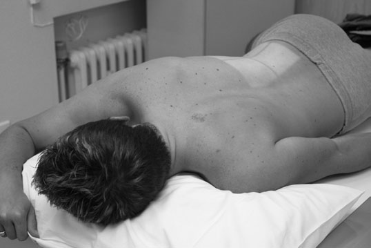
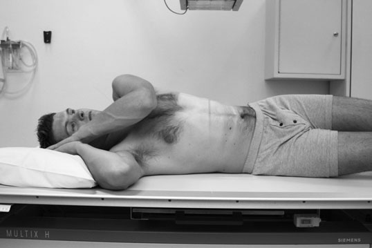
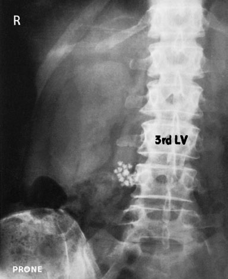
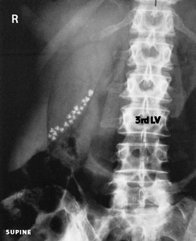
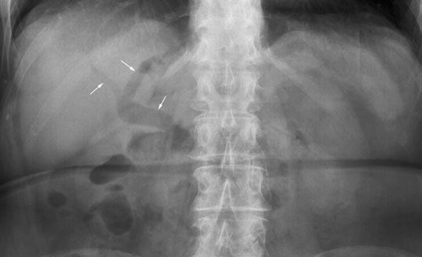

# Rx Aparat biliar în incidență oblică anterioară stângă

  📷 Radiografie Convențională (Rx)
  <strong>Actualizat:</strong> 2026-09-16
  <strong>Autor:</strong> Departamentul de Radiologie / Referință Clark (Ed. 12)

---

-   __1. Rezumat Clinic & Indicații__

    ---

    === "Indicații Clinice"

        - Nu toți calculii biliari sunt radioopaci. Aspectul calcificărilor patologice este variabil, de la un aspect solid amorf la o structură lamelară concentrică.
        - Calculii calcificați tind să se adune în porțiunea cea mai declivă a vezicii biliare, care este de obicei fundul vezicii biliare în decubit ventral. Calculii de colesterol, în special, sunt mai ușori decât bila și tind să plutească, dar de obicei nu sunt radioopaci.
        - Aerul din arborele biliar poate fi vizibil după manevre instrumentale (de exemplu, sfincterotomie), după trecerea calculilor radioopaci sau la o persoană vârstnică sănătoasă cu sfincterul Oddi beant. Imaginile de mai sus evidențiază schimbarea poziției vezicii biliare pline cu calculi când pacientul este trecut din decubit ventral (b) în decubit dorsal (c). Imagine anteroposterioară (AP) a etajului abdominal superior în decubit dorsal care evidențiază aer în arborele biliar

    === "Ghid Național IRIS"

        !!! info "Referință Primară: Ghidul Național IRIS (Ordinul MS 1342/2012)"
            - **Capitol Ghid IRIS:** *Aparat digestiv & Abdomen*
            - **Grad de Recomandare:** **Grad B**
            - **Nivel de Iradiere Estimată:** `Clasa 2 (Foarte mică ~ 0.7 - 1.2 mSv)`

            [:octicons-search-16: Deschide Ghidul IRIS](../../iris.md){ .md-button .md-button--primary } [:material-open-in-new: Aplicația Oficială PWA](https://radiologie-pediatrica.ro/iris/){ .md-button target="_blank" rel="noopener" }

-   __2. Poziționare & Centrare Fascicul__

    ---

    - **Poziție Pacient:**
        - Pacientul este așezat în decubit ventral pe masa radiologică. Partea dreaptă este ridicată, rotind planul mediosagital cu un unghi de 20 grade; planul coronal formează acum un unghi de 20 grade cu masa de examinare.
        - Brațul de pe partea ridicată este flectat astfel încât mâna dreaptă să se sprijine lângă capul pacientului, în timp ce brațul stâng este așezat de-a lungul și în spatele trunchiului.
        - Pacientul este deplasat transversal pe masa de examinare până când partea dreaptă ridicată se află deasupra centrului mesei de examinare și se aplică o bandă de compresie.
        - O casetă de 24 × 30-cm este plasată longitudinal în tăvița Bucky, cu centrul la 2.5 cm deasupra rebordului costal inferior, pentru a include partea superioară a crestelor iliace.
        - Pacientul este așezat în decubit dorsal pe masa radiologică. Partea stângă este ridicată, rotind planul mediosagital cu 20 grade; planul coronal formează acum un unghi de 20 grade cu masa de examinare, iar trunchiul este susținut în această poziție folosind o pernă radiotransparentă.
        - Pacientul este deplasat transversal pe masa de examinare astfel încât partea dreaptă a abdomenului să se afle deasupra centrului mesei de examinare. Coatele și umerii sunt flectați astfel încât pacientul să își poată sprijini mâinile în spatele capului.
        - Banda de imobilizare ajută la comprimarea abdomenului.
        - O casetă de 24 × 30-cm este plasată longitudinal în tăvița Bucky, cu centrul la 2.5 cm deasupra rebordului costal inferior.
    - **Punct de Centrare Fascicul:**
        - Raza centrală verticală este orientată spre un punct situat la 7.5 cm la dreapta proceselor spinoase și la 2.5 cm deasupra rebordului costal inferior și spre centrul casetei.
        - Expunerea se efectuează în apnee la sfârșitul expirului complet (diafragm ridicat).
        - Raza centrală verticală este orientată spre un punct situat la jumătatea distanței dintre linia mediană și peretele abdominal drept, la 2.5 cm deasupra rebordului costal inferior, și spre centrul casetei.
        - Expunerea se efectuează în apnee la sfârșitul expirului complet (diafragm ridicat).
    - **Distanță Focar-Film (DFF / SID):** 100 cm
    - **Comandă Respiratorie:** Expunerea se efectuează în apnee după complet

-   __3. Parametri Tehnici Expunere__

    ---

    | Parametru Tehnic | Valoare Configurare Generator / Tub |
    |:-----------------|:-------------------------------------|
    | **Tensiune Tub (kV)** | 70 kV |
    | **Sarcină / Produs Curent-Timp (mAs)** | Conform AEC / grosimii anatomice |
    | **Distanță Focar-Film (DFF / SID)** | 100 cm |
    | **Grilă Antidifuzoare (Bucky)** | Cu grilă antidifuzoare Bucky |
    | **Dimensiune Focar** | Focar Mic (0.6 mm) |
    | **Camere de Ionizare AEC** | Camerele laterale (sau camera centrală, în funcție de regiune) |
    | **Colimare Fascicul** | Colimare strictă adaptată pe receptor 24 x 30 cm |
    | **Filtrare Tub** | Totală ≥ 2.5 mm Al echivalent (conform Clark: 3.0 mm Al echivalent) |

-   __4. Criterii de Calitate & Reușită Imagine__

    ---

    - Vizualizarea clară a întregii arii anatomice (aparat biliar).
    - Absența artefactelor de mișcare; trabeculație osoasă și contururi nete.
    - Densitate optică și contrast adecvate pentru diferențierea țesuturilor moi de structurile osoase.

-   __5. Protecție Radiologică (ALARA)__

    ---

    - Ecranare gonadică cu șorț plumbat dacă gonadele sunt în apropierea fasciculului util (regula ALARA).
    - Colimare precisă la dimensiunea anatomică strict necesară pentru reducerea dozei și a radiației difuze.
    - Verificarea posibilității unei sarcini la pacientele de vârstă fertilă înainte de expunere.

!!! note "Observații Clinice & Tehnice"
    O imagine suplimentară poate fi obținută în apnee după un inspir profund complet pentru a evidenția mișcarea relativă a vezicii biliare și a calcificărilor patologice suprapuse, suspectate a fi situate în afara vezicii biliare, de exemplu în cartilajele costale. 348 a' b b' b b c c c c' Poziția variabilă a tubului de raze X în funcție de tipul constituțional al subiectului Rinichi Cupole diafragmatice Casetă Casetă a'b'c' arată forma variabilă a proiecției vezicii biliare în funcție de tipul constituțional al subiectului Casetele sunt reprezentate la niveluri diferite pentru a diferenția cele trei poziții Vertebra toracică 12 Coasta 10 Vertebra lombară 3 Vertebra lombară 5

### 🖼️ Imagini

<figure class="protocol-image-card" markdown>

<figcaption><strong>Examinarea ecografică se efectuează în mod obișnuit pentru a evidenția</strong> — Poziționarea pacientului și centrarea fasciculului conform Clark (Ed. 12)</figcaption>

</figure>

<figure class="protocol-image-card" markdown>

<figcaption><strong>este variabil, de la un aspect solid amorf până la</strong> — Aspect radiografic / ghid de poziționare conform tratatului Clark (Ed. 12)</figcaption>

</figure>

<figure class="protocol-image-card" markdown>

<figcaption><strong>(de exemplu, sfincterotomie), după trecerea calculilor urinari radiopaci sau în condiții normale</strong> — Aspect radiografic / ghid de poziționare conform tratatului Clark (Ed. 12)</figcaption>

</figure>

<figure class="protocol-image-card" markdown>

<figcaption><strong>Imagine antero-posterioară (AP) în decubit dorsal a etajului abdominal superior, care evidențiază aer în</strong> — Aspect radiografic / ghid de poziționare conform tratatului Clark (Ed. 12)</figcaption>

</figure>

<figure class="protocol-image-card" markdown>

<figcaption><strong>Figura 5: Aspect radiografic / Poziționare (Clark Ed. 12)</strong> — Aspect radiografic / ghid de poziționare conform tratatului Clark (Ed. 12)</figcaption>

</figure>

=== "Ghid Rapid de Execuție"

    1. **Identificarea și verificarea pacientului:** verificare identitate, zonă de examinat, consimțământ conform procedurii și evaluarea posibilității unei sarcini, când este relevantă.
    2. **Pregătire:** îndepărtarea oricăror obiecte radiopace (bijuterii, agrafe, fermoare, proteze, pansamente dense).
    3. **Poziționare precisă:** alinierea receptorului de imagine și a tubului la distanța prescrisă (100 cm).
    4. **Colimare strictă:** adaptarea fasciculului strict la regiunea de diagnostic pentru scăderea iradierii și reducerea radiației difuze.
    5. **Radioprotecție:** verificarea [politicii RX](../radioprotectie.md), cu măsuri distincte pentru pacient, personal și însoțitor.

## Surse de documentare

- [Clark's Positioning in Radiography (Ed. 12), Pagina 363](https://books.google.com/books/about/Clark_s_Positioning_in_Radiography.html?id=Xxu6MwEACAAJ)
