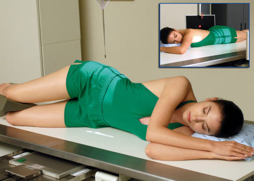
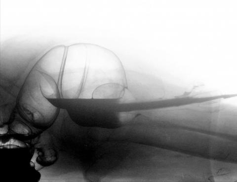
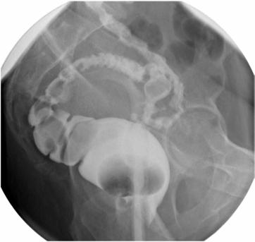

# Rx BARIUM LATERAL RECTUM Poziționare OR VENTRAL DECUBITUS LATERAL (ENEMA)

  📷 Radiografie Convențională (Rx)
  <strong>Actualizat:</strong> 2026-09-15
  <strong>Autor:</strong> Departamentul de Radiologie / Referință Bontrager

---

-   __1. Rezumat Clinic & Indicații__

    ---

    === "Indicații Clinice"

        - Incidență de Profil (lateral) pentru evidențiind polyps, strictures, și fistulas între rectum și bladder/uterus
        - Incidență Decubit ventral este best pentru doublecontrast study.

    === "Ghid Național IRIS"

        !!! info "Referință Primară: Ghidul Național IRIS (Ordinul MS 1342/2012)"
            - **Capitol Ghid IRIS:** *Ghidul Național IRIS*
            - **Grad de Recomandare:** **De verificat pe indicație; fără grad atribuit automat**
            - **Nivel de Iradiere Estimată:** `De verificat pentru examinarea și populația selectate`

            [:octicons-search-16: Deschide Ghidul IRIS](../../iris.md){ .md-button .md-button--primary } [:material-open-in-new: Aplicația Oficială PWA](https://radiologie-pediatrica.ro/iris/){ .md-button target="_blank" rel="noopener" }
-   __2. Poziționare & Centrare Fascicul__

    ---

    - **Poziție Pacient:** Pacient: pacient poziție este lateral Decubit, cu support pentru capul.; Regiune anatomică: (Incidență de Profil (lateral)) Align midaxillary plane la linia mediană mesei sau receptorul de imagine. Flex și superimpose genunchi; place brațe up în front de capul (Fig. 13.73). Ensure that Absența rotației anatomice: clavicule echidistante față de linia apofizelor spinoase occurs; superimpose umeri și hips.
    - **Punct de Centrare Fascicul:** este perpendicular pe receptorul de imagine (raza centrală este orizontal pentru ventral decubit). Center raza centrală la level de spină iliacă antero-superioară (SIAS) (spină iliacă antero-superioară (SIAS)) și plan mediocoronal (midway între spină iliacă antero-superioară (SIAS) și posterior Sacru). Se centrează receptorul de imagine pe raza centrală. Alternative ventral decubit lateral orizontal fascicul poziții sunt beneficial pentru doublecontrast studies. Centering pentru ventral decubit este similar la lateral rectum poziție (Fig. 13.74).
    - **Distanță Focar-Film (DFF / SID):** 100 cm
    - **Comandă Respiratorie:** Apnee la sfârșitul expirului pe durata expunerii. Fig. 13.75 stâng lateral rectum. Irigografie (Clismă Baritată) ROUTINE PA sau AP RAO LAO LPO sau RPO lateral rectum

-   __3. Parametri Tehnici Expunere__

    ---

    | Parametru Tehnic | Valoare Configurare Generator / Tub |
    |:-----------------|:-------------------------------------|
    | **Tensiune Tub (kV)** | 110 -125 kV |
    | **Sarcină / Produs Curent-Timp (mAs)** | DE CONFIGURAT PE APARAT |
    | **Distanță Focar-Film (DFF / SID)** | 100 cm |
    | **Grilă Antidifuzoare (Bucky)** | Cu grilă antidifuzoare Bucky |
    | **Dimensiune Focar** | Focar Mare (1.0 - 1.2 mm) |
    | **Camere de Ionizare AEC** | Camerele laterale (sau camera centrală funcție de regiune) |
    | **Colimare Fascicul** | Field Size Collimate pe four sides la anatomy de interest. |
    | **Filtrare Tub** | Totală ≥ 2.5 mm Al echivalent |

-   __4. Criterii de Calitate & Reușită Imagine__

    ---

    - Contrastfilled rectosigmoid region este evidențiat (Fig. 13.75). poziție:
    - Absența rotației anatomice: clavicule echidistante față de linia apofizelor spinoase este evident; femoral heads sunt superimposed.
    - corect collimation field size este applied. expunere:
    - optim receptorul de imagine expunere și contrast la visualize ambele contrastfilled rectum și sigmoid regions, cu adecvat penetration la evidențiază these areas through superimposed Bazin (bazin (pelvis)) și hips.
    - net structural margins indicate fără mișcare. Fig. 13.73 stâng lateral rectum. Inset, ventral decubit (doublecontrast study). Rectum Sigmoid intestin gros (colon) Fig. 13.74 ventral decubit—lateral rectum.

-   __5. Protecție Radiologică (ALARA)__

    ---

    - Ecranare gonadică și a organelor radiosensibile conform procedurilor locale de radioprotecție ALARA.
    - Colimare strictă la aria de interes pentru limitarea radiației difuze.
    - Verificarea posibilității unei sarcini la pacientele de vârstă fertilă înainte de expunere.

### 🖼️ Imagini

<figure class="protocol-image-card" markdown>

<figcaption><strong>Fig. 13.75 stâng lateral rectum.</strong> — Poziționare pacient conform Ghidului Bontrager (Fig. 13.75 stâng lateral rectum.)</figcaption>

</figure>

<figure class="protocol-image-card" markdown>

<figcaption><strong>Fig. 13.73 stâng lateral rectum. Inset, ventral decubit (double-</strong> — Aspect radiografic de referință conform Ghidului Bontrager (Fig. 13.73 stâng lateral rectum. Inset, ventral decubit (double-)</figcaption>

</figure>

<figure class="protocol-image-card" markdown>

<figcaption><strong>Fig. 13.74 ventral decubit—lateral rectum.</strong> — Aspect radiografic de referință conform Ghidului Bontrager (Fig. 13.74 ventral decubit—lateral rectum.)</figcaption>

</figure>

=== "Ghid Rapid de Execuție"

    1. **Identificarea și verificarea pacientului:** verificare identitate, zonă de examinat, consimțământ conform procedurii și evaluarea posibilității unei sarcini, când este relevantă.
    2. **Pregătire:** îndepărtarea oricăror obiecte radiopace (bijuterii, agrafe, fermoare, proteze, pansamente dense).
    3. **Poziționare precisă:** alinierea receptorului de imagine și a tubului la distanța prescrisă (100 cm).
    4. **Colimare strictă:** adaptarea fasciculului strict la regiunea de diagnostic pentru scăderea iradierii și reducerea radiației difuze.
    5. **Radioprotecție:** verificarea [politicii RX](../radioprotectie.md), cu măsuri distincte pentru pacient, personal și însoțitor.

## Surse de documentare

- [Bontrager's Textbook of Radiographic Positioning (Ed. 9/10), Pagina 545](https://www.elsevier.com/books/textbook-of-radiographic-positioning-and-related-anatomy/lampignano/978-0-323-65367-1)
