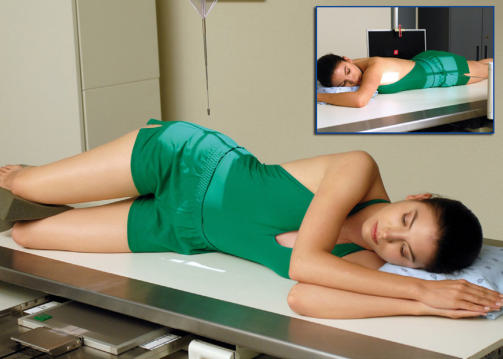
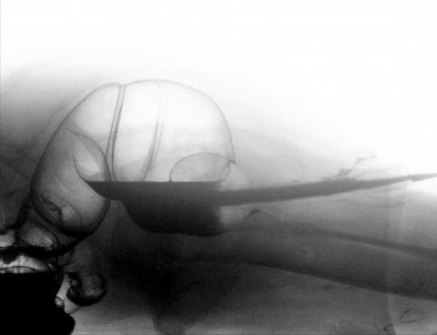
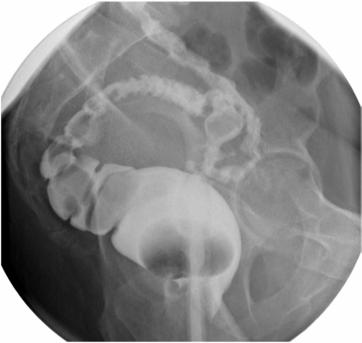

# Rx RECT CU BARIU ÎN INCIDENȚĂ DE PROFIL: Poziționare SAU INCIDENȚĂ DE PROFIL ÎN DECUBIT VENTRAL (CLISMĂ)

  📷 Radiografie Convențională (Rx)
  <strong>Actualizat:</strong> 2026-09-15
  <strong>Autor:</strong> Departamentul de Radiologie / Referință Bontrager

---

-   __1. Rezumat Clinic & Indicații__

    ---

    === "Indicații Clinice"

        - Incidență de profil pentru evidențierea polipilor, stricturilor și fistulelor dintre rect și vezica urinară/uter
        - Incidența în decubit ventral este cea mai potrivită pentru examinarea cu dublu contrast.

    === "Ghid Național IRIS"

        !!! info "Referință Primară: Ghidul Național IRIS (Ordinul MS 1342/2012)"
            - **Capitol Ghid IRIS:** *Ghidul Național IRIS*
            - **Grad de Recomandare:** **De verificat pe indicație; fără grad atribuit automat**
            - **Nivel de Iradiere Estimată:** `De verificat pentru examinarea și populația selectate`

            [:octicons-search-16: Deschide Ghidul IRIS](../../iris.md){ .md-button .md-button--primary } [:material-open-in-new: Aplicația Oficială PWA](https://radiologie-pediatrica.ro/iris/){ .md-button target="_blank" rel="noopener" }
-   __2. Poziționare & Centrare Fascicul__

    ---

    - **Poziție Pacient:** Pacient: pacientul este poziționat în decubit lateral, cu suport pentru cap.; Regiune anatomică: (Incidență de profil) Se aliniază planul medioaxilar cu linia mediană a mesei sau a receptorului de imagine. Se flectează și se suprapun genunchii; brațele se așază ridicate în fața capului (Fig. 13.73). Se asigură absența rotației anatomice: claviculele sunt echidistante față de linia apofizelor spinoase; se suprapun umerii și șoldurile.
    - **Punct de Centrare Fascicul:** Este perpendiculară pe receptorul de imagine (raza centrală este orizontală în decubit ventral). Se centrează raza centrală la nivelul spinei iliace antero-superioare (SIAS) și al planului mediocoronal (la jumătatea distanței dintre spina iliacă antero-superioară (SIAS) și fața posterioară a sacrului). Se centrează receptorul de imagine pe raza centrală. Poziționările alternative în decubit ventral pentru incidența de profil cu fascicul orizontal sunt utile pentru examinările cu dublu contrast. Centrarea în decubit ventral este similară celei pentru rect în incidență de profil (Fig. 13.74).
    - **Distanță Focar-Film (DFF / SID):** 100 cm
    - **Comandă Respiratorie:** Apnee la sfârșitul expirului pe durata expunerii. Fig. 13.75 Rect în incidență de profil stâng. Irigografie (Clismă Baritată) EXAMINARE DE RUTINĂ PA sau AP RAO LAO LPO sau RPO Rect în incidență de profil

-   __3. Parametri Tehnici Expunere__

    ---

    | Parametru Tehnic | Valoare Configurare Generator / Tub |
    |:-----------------|:-------------------------------------|
    | **Tensiune Tub (kV)** | 110 -125 kV |
    | **Sarcină / Produs Curent-Timp (mAs)** | DE CONFIGURAT PE APARAT |
    | **Distanță Focar-Film (DFF / SID)** | 100 cm |
    | **Grilă Antidifuzoare (Bucky)** | Cu grilă antidifuzoare Bucky |
    | **Dimensiune Focar** | Focar Mare (1.0 - 1.2 mm) |
    | **Camere de Ionizare AEC** | Camerele laterale (sau camera centrală, în funcție de regiune) |
    | **Colimare Fascicul** | Dimensiunea câmpului Colimați pe cele patru laturi la regiunea anatomică de interes. |
    | **Filtrare Tub** | Totală ≥ 2.5 mm Al echivalent |

-   __4. Criterii de Calitate & Reușită Imagine__

    ---

    - Regiunea rectosigmoidiană umplută cu substanță de contrast este evidențiată (Fig. 13.75). Poziție:
    - Absența rotației anatomice este evidentă: claviculele sunt echidistante față de linia apofizelor spinoase; capetele femurale sunt suprapuse.
    - Se aplică o colimare corectă a dimensiunilor câmpului. Expunere:
    - Expunere optimă a receptorului de imagine și contrast optim pentru vizualizarea atât a rectului, cât și a sigmoidului umplute cu substanță de contrast, cu penetrare adecvată pentru evidențierea acestor regiuni prin bazinul (pelvisul) și șoldurile suprapuse.
    - Marginile nete ale structurilor indică absența mișcării. Fig. 13.73 Rect în incidență de profil stâng. În medalion, decubit ventral (examinare cu dublu contrast). Rect Colon sigmoid Fig. 13.74 Decubit ventral—rect în incidență de profil.

-   __5. Protecție Radiologică (ALARA)__

    ---

    - Ecranare gonadică și a organelor radiosensibile conform procedurilor locale de radioprotecție ALARA.
    - Colimare strictă la aria de interes pentru limitarea radiației difuze.
    - Verificarea posibilității unei sarcini la pacientele de vârstă fertilă înainte de expunere.

### 🖼️ Imagini

<figure class="protocol-image-card" markdown>

<figcaption><strong>Fig. 13.75 Rect în incidență de profil stâng.</strong> — Poziționarea pacientului conform Ghidului Bontrager (Fig. 13.75 Rect în incidență de profil stâng.)</figcaption>

</figure>

<figure class="protocol-image-card" markdown>

<figcaption><strong>Fig. 13.73 Rect în incidență de profil stâng. În medalion, decubit ventral (dublu-</strong> — Aspect radiografic de referință conform Ghidului Bontrager (Fig. 13.73 Rect în incidență de profil stâng. În medalion, decubit ventral (dublu-)</figcaption>

</figure>

<figure class="protocol-image-card" markdown>

<figcaption><strong>Fig. 13.74 Decubit ventral—rect în incidență de profil.</strong> — Aspect radiografic de referință conform Ghidului Bontrager (Fig. 13.74 Decubit ventral—rect în incidență de profil.)</figcaption>

</figure>

=== "Ghid Rapid de Execuție"

    1. **Identificarea și verificarea pacientului:** verificare identitate, zonă de examinat, consimțământ conform procedurii și evaluarea posibilității unei sarcini, când este relevantă.
    2. **Pregătire:** îndepărtarea oricăror obiecte radiopace (bijuterii, agrafe, fermoare, proteze, pansamente dense).
    3. **Poziționare precisă:** alinierea receptorului de imagine și a tubului la distanța prescrisă (100 cm).
    4. **Colimare strictă:** adaptarea fasciculului strict la regiunea de diagnostic pentru scăderea iradierii și reducerea radiației difuze.
    5. **Radioprotecție:** verificarea [politicii RX](../radioprotectie.md), cu măsuri distincte pentru pacient, personal și însoțitor.

## Surse de documentare

- [Bontrager's Textbook of Radiographic Positioning (Ed. 9/10), Pagina 545](https://www.elsevier.com/books/textbook-of-radiographic-positioning-and-related-anatomy/lampignano/978-0-323-65367-1)
