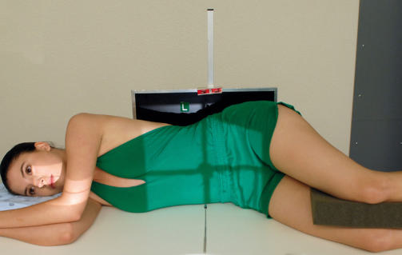
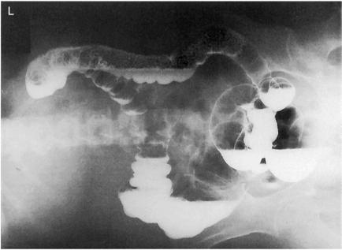
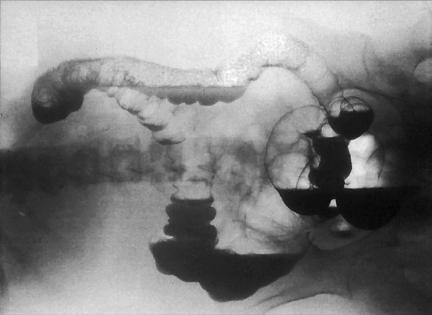

# Rx BARIUM RIGHT Incidență Decubit Lateral (AP OR PA (Postero-Anterior)) (ENEMA - DOUBLE CONTRAST)

  📷 Radiografie Convențională (Rx)
  <strong>Actualizat:</strong> 2026-09-15
  <strong>Autor:</strong> Departamentul de Radiologie / Referință Bontrager

---

-   __1. Rezumat Clinic & Indicații__

    ---

    === "Indicații Clinice"

        - Demonstrating polyps of the left side or airfilled portions of the large intestine Both right and left decubitus positions generally are taken with the doublecontrast study.

    === "Ghid Național IRIS"

        !!! info "Referință Primară: Ghidul Național IRIS (Ordinul MS 1342/2012)"
            - **Capitol Ghid IRIS:** *Ghidul Național IRIS*
            - **Grad de Recomandare:** **De verificat pe indicație; fără grad atribuit automat**
            - **Nivel de Iradiere Estimată:** `De verificat pentru examinarea și populația selectate`

            [:octicons-search-16: Deschide Ghidul IRIS](../../iris.md){ .md-button .md-button--primary } [:material-open-in-new: Aplicația Oficială PWA](https://radiologie-pediatrica.ro/iris/){ .md-button target="_blank" rel="noopener" }
-   __2. Poziționare & Centrare Fascicul__

    ---

    - **Poziție Pacient:** Pacient: Patient is in lateral Decubit position, with a support for the head and lying on the right side on a radiolucent pad, with a portable grid placed behind the patient’s back for an Incidență Antero-Posterioară (AP). The patient also can be facing the portable grid or the vertical table for a Incidență Postero-Anterioară (PA). (If patient is on a cart, lock wheels or secure cart to prevent patient from falling.); Regiune anatomică: Position patient or IR so that creasta iliacă (corespunzător L4-L5) is placed to center of IR and CR. Place arms up, with knees flexed (Fig. 13.76). Ensure that Absența rotației anatomice: clavicule echidistante față de linia apofizelor spinoase occurs; superimpose shoulders and hips from above.
    - **Punct de Centrare Fascicul:** Direct CR horizontal, perpendicular to IR. Center CR to level of creasta iliacă (corespunzător L4-L5) and MSP.
    - **Distanță Focar-Film (DFF / SID):** 100 cm
    - **Comandă Respiratorie:** Suspend respiration and expose on expiration.

-   __3. Parametri Tehnici Expunere__

    ---

    | Parametru Tehnic | Valoare Configurare Generator / Tub |
    |:-----------------|:-------------------------------------|
    | **Tensiune Tub (kV)** | 90-100 kV |
    | **Sarcină / Produs Curent-Timp (mAs)** | DE CONFIGURAT PE APARAT |
    | **Distanță Focar-Film (DFF / SID)** | 100 cm |
    | **Grilă Antidifuzoare (Bucky)** | Cu grilă antidifuzoare Bucky |
    | **Dimensiune Focar** | Focar Mare (1.0 - 1.2 mm) |
    | **Camere de Ionizare AEC** | Camerele laterale (sau camera centrală funcție de regiune) |
    | **Colimare Fascicul** | Strictă pe regiunea de interes anatomic |
    | **Filtrare Tub** | Totală ≥ 2.5 mm Al echivalent |

-   __4. Criterii de Calitate & Reușită Imagine__

    ---

    - Entire large intestine is demonstrated to include airfilled left colic flexure and descending colon (Figs. 13.77 and 13.78). Position:
    - Absența rotației anatomice: clavicule echidistante față de linia apofizelor spinoase is evident by symmetric appearance of Bazin (Pelvis) and ribcage.
    - Proper collimation field size is applied. Exposure:
    - Optimal image receptor exposure and contrast to visualize the borders of the entire large intestine, including bariumfilled portions, but to avoid overpenetration of the airfilled portion of the large intestine.
    - Mucosal patterns of airfilled colon should be clearly visible.
    - If the airfilled portion of the large intestine is overpenetrated consistently, a compensating filter should be considered.
    - Sharp structural margins indicate no motion. Fig. 13.77 Right lateral decubitus. Air-barium levels Left colic flexure L Transverse colon Right colic flexure Descending colon Sigmoid colon Ascending colon Rectum Fig. 13.78 Right lateral decubitus.

-   __5. Protecție Radiologică (ALARA)__

    ---

    - Ecranare gonadică și a organelor radiosensibile conform procedurilor locale de radioprotecție ALARA.
    - Colimare strictă la aria de interes pentru limitarea radiației difuze.
    - Verificarea posibilității unei sarcini la pacientele de vârstă fertilă înainte de expunere.

!!! note "Observații Clinice & Tehnice"
    S: Proceed as rapidly as possible. For hypersthenic patients, use two 14 × 17inch (35 × 43cm) IRs placed landscape to include all of the large intestine. Irigografie (Clismă Baritată) ROUTINE PA or AP RAO LAO LPO or RPO Lateral rectum R and L lateral decubitus (doublecontrast study) Fig. 13.76 Right lateral decubitus—AP (with portable grid).

### 🖼️ Imagini

<figure class="protocol-image-card" markdown>

<figcaption><strong>Fig. 13.76 Right lateral decubitus—AP (with portable grid).</strong> — Poziționare pacient conform Ghidului Bontrager (Fig. 13.76 Right lateral decubitus—AP (with portable grid).)</figcaption>

</figure>

<figure class="protocol-image-card" markdown>

<figcaption><strong>Fig. 13.77 Right lateral decubitus.</strong> — Aspect radiografic de referință conform Ghidului Bontrager (Fig. 13.77 Right lateral decubitus.)</figcaption>

</figure>

<figure class="protocol-image-card" markdown>

<figcaption><strong>Fig. 13.78 Right lateral decubitus.</strong> — Aspect radiografic de referință conform Ghidului Bontrager (Fig. 13.78 Right lateral decubitus.)</figcaption>

</figure>

=== "Ghid Rapid de Execuție"

    1. **Identificarea și verificarea pacientului:** verificare identitate, zonă de examinat, consimțământ conform procedurii și evaluarea posibilității unei sarcini, când este relevantă.
    2. **Pregătire:** îndepărtarea oricăror obiecte radiopace (bijuterii, agrafe, fermoare, proteze, pansamente dense).
    3. **Poziționare precisă:** alinierea receptorului de imagine și a tubului la distanța prescrisă (100 cm).
    4. **Colimare strictă:** adaptarea fasciculului strict la regiunea de diagnostic pentru scăderea iradierii și reducerea radiației difuze.
    5. **Radioprotecție:** verificarea [politicii RX](../radioprotectie.md), cu măsuri distincte pentru pacient, personal și însoțitor.

## Surse de documentare

- [Bontrager's Textbook of Radiographic Positioning (Ed. 9/10), Pagina 546](https://www.elsevier.com/books/textbook-of-radiographic-positioning-and-related-anatomy/lampignano/978-0-323-65367-1)
