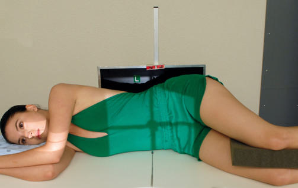
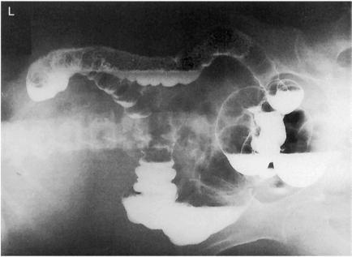
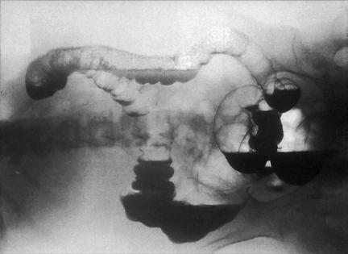

# Rx CU BARIU ÎN DECUBIT LATERAL DREPT (AP SAU PA (Postero-Anterior)) (CLISMĂ - DUBLU CONTRAST)

  📷 Radiografie Convențională (Rx)
  <strong>Actualizat:</strong> 2026-09-15
  <strong>Autor:</strong> Departamentul de Radiologie / Referință Bontrager

---

-   __1. Rezumat Clinic & Indicații__

    ---

    === "Indicații Clinice"

        - Evidențiind polipii din partea stângă sau din porțiunile cu conținut aeric ale intestinului gros (colonului). În general, examinarea cu dublu contrast se realizează în ambele poziții de decubit, drept și stâng.

    === "Ghid Național IRIS"

        !!! info "Referință Primară: Ghidul Național IRIS (Ordinul MS 1342/2012)"
            - **Capitol Ghid IRIS:** *Aparat digestiv & Abdomen*
            - **Grad de Recomandare:** **Grad B**
            - **Nivel de Iradiere Estimată:** `Clasa 2 (Foarte mică ~ 0.7 - 1.2 mSv)`

            [:octicons-search-16: Deschide Ghidul IRIS](../../iris.md){ .md-button .md-button--primary } [:material-open-in-new: Aplicația Oficială PWA](https://radiologie-pediatrica.ro/iris/){ .md-button target="_blank" rel="noopener" }

-   __2. Poziționare & Centrare Fascicul__

    ---

    - **Poziție Pacient:** Pacient: pacientul este în decubit lateral drept, cu un suport pentru cap, culcat pe o pernă radiotransparentă, cu grila portabilă plasată în spatele pacientului pentru incidența antero-posterioară (AP). Pacientul poate fi, de asemenea, orientat cu fața spre grila portabilă sau spre masa verticală pentru incidența postero-anterioară (PA). (Dacă pacientul se află pe targă, blocați roțile sau imobilizați targa pentru a preveni căderea pacientului.); Regiune anatomică: poziționați pacientul sau receptorul de imagine astfel încât creasta iliacă (corespunzător L4-L5) să se afle în centrul receptorului de imagine și la nivelul razei centrale. Poziționați brațele în sus și genunchii flectați (Fig. 13.76). Asigurați absența rotației anatomice: clavicule echidistante față de linia apofizelor spinoase; suprapuneți umerii și șoldurile, privind de sus.
    - **Punct de Centrare Fascicul:** Orientați raza centrală orizontal, perpendicular pe receptorul de imagine. Centrați raza centrală la nivelul crestei iliace (corespunzător L4-L5) și al MSP.
    - **Distanță Focar-Film (DFF / SID):** 100 cm
    - **Comandă Respiratorie:** Apnee la sfârșitul expirului pe durata expunerii.

-   __3. Parametri Tehnici Expunere__

    ---

    | Parametru Tehnic | Valoare Configurare Generator / Tub |
    |:-----------------|:-------------------------------------|
    | **Tensiune Tub (kV)** | 90-100 kV |
    | **Sarcină / Produs Curent-Timp (mAs)** | DE CONFIGURAT PE APARAT |
    | **Distanță Focar-Film (DFF / SID)** | 100 cm |
    | **Grilă Antidifuzoare (Bucky)** | Cu grilă antidifuzoare Bucky |
    | **Dimensiune Focar** | Focar Mare (1.0 - 1.2 mm) |
    | **Camere de Ionizare AEC** | Camerele laterale (sau camera centrală, în funcție de regiune) |
    | **Colimare Fascicul** | Colimare strictă pe regiunea anatomică de interes diagnostic |
    | **Filtrare Tub** | Totală ≥ 2.5 mm Al echivalent |

-   __4. Criterii de Calitate & Reușită Imagine__

    ---

    - Este evidențiat întregul intestin gros (colon), incluzând flexura colică stângă și colonul descendent cu conținut aeric (Fig. 13.77 și 13.78). Poziție:
    - Absența rotației anatomice, cu clavicule echidistante față de linia apofizelor spinoase, este evidentă prin aspectul simetric al bazinului (pelvisului) și al cutiei toracice.
    - Se aplică o colimare corectă a dimensiunilor câmpului. Expunere:
    - Expunere optimă a receptorului de imagine și contrast optim pentru vizualizarea contururilor întregului intestin gros (colon), inclusiv a porțiunilor umplute cu bariu, dar cu evitarea penetrării excesive a porțiunii cu conținut aeric a intestinului gros (colonului).
    - Relieful mucoasei intestinului gros (colonului) cu conținut aeric trebuie să fie clar vizibil.
    - Dacă porțiunea cu conținut aeric a intestinului gros (colonului) este penetrată excesiv în mod constant, trebuie luată în considerare utilizarea unui filtru compensator.
    - Marginile nete ale structurilor indică absența mișcării. Fig. 13.77 Decubit lateral drept. Nivele aer-bariu Flexura colică stângă L Colon transvers Flexura colică dreaptă Colon descendent Colon sigmoid Colon ascendent Rect Fig. 13.78 Decubit lateral drept.

-   __5. Protecție Radiologică (ALARA)__

    ---

    - Ecranare gonadică și a organelor radiosensibile conform procedurilor locale de radioprotecție ALARA.
    - Colimare strictă la aria de interes pentru limitarea radiației difuze.
    - Verificarea posibilității unei sarcini la pacientele de vârstă fertilă înainte de expunere.

!!! note "Observații Clinice & Tehnice"
    S: Procedați cât mai rapid posibil. Pentru pacienții hiperstenici, utilizați două IR de 14 × 17 inchi (35 × 43 cm), orientate transversal, pentru a include întregul intestin gros (colon). Irigografie (Clismă Baritată) DE RUTINĂ PA sau AP RAO LAO LPO sau RPO Rect în incidență de profil Decubit lateral R și L (examinare cu dublu contrast) Fig. 13.76 Decubit lateral drept—AP (cu grilă portabilă).

### 🖼️ Imagini

<figure class="protocol-image-card" markdown>

<figcaption><strong>Fig. 13.76 Decubit lateral drept—AP (cu grilă portabilă).</strong> — Poziționarea pacientului conform Ghidului Bontrager (Fig. 13.76 Decubit lateral drept—AP (cu grilă portabilă).)</figcaption>

</figure>

<figure class="protocol-image-card" markdown>

<figcaption><strong>Fig. 13.77 Decubit lateral drept.</strong> — Aspect radiografic de referință conform Ghidului Bontrager (Fig. 13.77 Decubit lateral drept.)</figcaption>

</figure>

<figure class="protocol-image-card" markdown>

<figcaption><strong>Fig. 13.78 Decubit lateral drept.</strong> — Aspect radiografic de referință conform Ghidului Bontrager (Fig. 13.78 Decubit lateral drept.)</figcaption>

</figure>

=== "Ghid Rapid de Execuție"

    1. **Identificarea și verificarea pacientului:** verificare identitate, zonă de examinat, consimțământ conform procedurii și evaluarea posibilității unei sarcini, când este relevantă.
    2. **Pregătire:** îndepărtarea oricăror obiecte radiopace (bijuterii, agrafe, fermoare, proteze, pansamente dense).
    3. **Poziționare precisă:** alinierea receptorului de imagine și a tubului la distanța prescrisă (100 cm).
    4. **Colimare strictă:** adaptarea fasciculului strict la regiunea de diagnostic pentru scăderea iradierii și reducerea radiației difuze.
    5. **Radioprotecție:** verificarea [politicii RX](../radioprotectie.md), cu măsuri distincte pentru pacient, personal și însoțitor.

## Surse de documentare

- [Bontrager's Textbook of Radiographic Positioning (Ed. 9/10), Pagina 546](https://www.elsevier.com/books/textbook-of-radiographic-positioning-and-related-anatomy/lampignano/978-0-323-65367-1)
