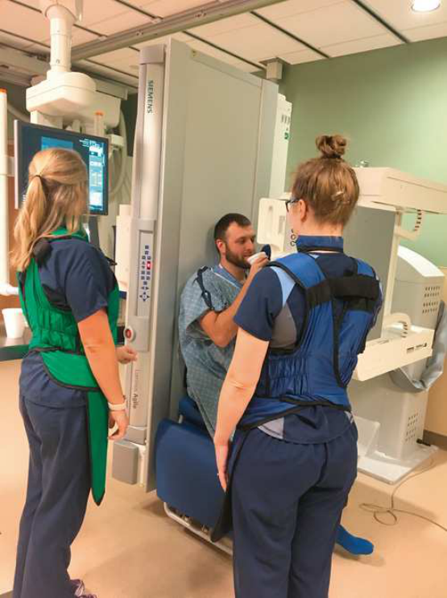

# Rx ▪ Closely superimposed mandibular shadows — Incidență Antero-Posterioară (AP) — during lateral imaging. (Merrill)

  📷 Radiografie Convențională (Rx)
  <strong>Actualizat:</strong> 2026-09-16
  <strong>Autor:</strong> Referință Merrill

---

-   __1. Rezumat Clinic & Indicații__

    ---

    === "Indicații Clinice"

        - Conform reperelor anatomice standard din tratat

    === "Ghid Național IRIS"

        !!! info "Referință Primară: Ghidul Național IRIS (Ordinul MS 1342/2012)"
            - **Capitol Ghid IRIS:** *Ghidul Național IRIS*
            - **Grad de Recomandare:** **De verificat pe indicație; fără grad atribuit automat**
            - **Nivel de Iradiere Estimată:** `De verificat pentru examinarea și populația selectate`

            [:octicons-search-16: Deschide Ghidul IRIS](../../iris.md){ .md-button .md-button--primary } [:material-open-in-new: Aplicația Oficială PWA](https://radiologie-pediatrica.ro/iris/){ .md-button target="_blank" rel="noopener" }
-   __2. Poziționare & Centrare Fascicul__

    ---

    - **Poziție Pacient:** ortostatism, Poziție Șezândă în procedure chair sau în ortostatism pe footboard de în ortostatism table. If în ortostatism poziție este used, Se instruiește pacientul să greutatea corpului este distribuită egal pe ambele picioare.; se centrează MSP de corp la linia mediană stativ vertical Bucky. se ajustează pacient’s umeri la lie în same plan orizontal la prevent rotație de capul și neck și resultant obliquity de throat structures. se centrează receptorul de imagine la nivelul sau just below laryngeal prominence. Assist speech therapist în specific cap poziție needed la evaluate deglutition (Fig. 15.35). se efectuează ecranarea gonadelor cu șorț plumbat.
    - **Punct de Centrare Fascicul:** perpendicular pe laryngeal prominence.
    - **Distanță Focar-Film (DFF / SID):** Nespecificat în fragmentul extras; de verificat în sursă
    - **Comandă Respiratorie:** Conform reperelor anatomice standard din tratat

-   __3. Parametri Tehnici Expunere__

    ---

    | Parametru Tehnic | Valoare Configurare Generator / Tub |
    |:-----------------|:-------------------------------------|
    | **Tensiune Tub (kV)** | DE CONFIGURAT PE APARAT |
    | **Sarcină / Produs Curent-Timp (mAs)** | DE CONFIGURAT PE APARAT |
    | **Distanță Focar-Film (DFF / SID)** | Nespecificat în fragmentul extras; de verificat în sursă |
    | **Grilă Antidifuzoare (Bucky)** | DE CONFIGURAT PE APARAT |
    | **Dimensiune Focar** | DE CONFIGURAT PE APARAT |
    | **Camere de Ionizare AEC** | DE CONFIGURAT PE APARAT |
    | **Colimare Fascicul** | se ajustează câmp de iradiere la level de conduct auditiv extern (CAE) la incizură jugulară (furculiță sternală) și 1 inch (2.5 cm) beyond skin edges pe sides. Se plasează markerul de lateralitate în câmpul colimat. |
    | **Filtrare Tub** | DE CONFIGURAT PE APARAT |

-   __4. Criterii de Calitate & Reușită Imagine__

    ---

    - Conform reperelor anatomice standard din tratat

-   __5. Protecție Radiologică (ALARA)__

    ---

    - Nespecificat în fragmentul extras; de verificat în sursă

!!! note "Observații Clinice & Tehnice"
    Conform reperelor anatomice standard din tratat

### 🖼️ Imagini

<figure class="protocol-image-card" markdown>

<figcaption><strong>Merrill — pagina PDF 1084, imaginea 1</strong> — Imagine din fragmentul sursă; asocierea necesită revizie.</figcaption>

</figure>

=== "Ghid Rapid de Execuție"

    1. **Identificarea și verificarea pacientului:** verificare identitate, zonă de examinat, consimțământ conform procedurii și evaluarea posibilității unei sarcini, când este relevantă.
    2. **Pregătire:** îndepărtarea oricăror obiecte radiopace (bijuterii, agrafe, fermoare, proteze, pansamente dense).
    3. **Poziționare precisă:** alinierea receptorului de imagine și a tubului la distanța prescrisă (Nespecificat în fragmentul extras; de verificat în sursă).
    4. **Colimare strictă:** adaptarea fasciculului strict la regiunea de diagnostic pentru scăderea iradierii și reducerea radiației difuze.
    5. **Radioprotecție:** verificarea [politicii RX](../radioprotectie.md), cu măsuri distincte pentru pacient, personal și însoțitor.

## Surse de documentare

- [Merrill’s Atlas, 15. Digestive System: Salivary Glands, Alimentary Canal, And Biliary System, pagini PDF 1083–1084](../../assets/protocols/sources/a56d45c16829_Merrills_Atlas_of_Radiographic_Positioning__Procedures_3Vol_Set.pdf#page=1083)

## Fragmente sursă traduse (referință tehnică)

### anatomy

### collimation

• se ajustează câmp de iradiere la level de conduct auditiv extern (CAE) la incizură jugulară (furculiță sternală) și 1 inch (2.5 cm) beyond skin edges pe sides. Place side
marker în collimated expunere field.

### cr

• perpendicular pe laryngeal prominence.

### part_pos

• se centrează MSP de corp la linia mediană stativ vertical Bucky.
• se ajustează pacient’s umeri la lie în same plan orizontal la prevent rotație de capul și neck și resultant obliquity de
throat structures.
• se centrează receptorul de imagine la nivelul sau just below laryngeal prominence.
• Assist speech therapist în specific cap poziție needed la evaluate deglutition (Fig. 15.35).
• se efectuează ecranarea gonadelor cu șorț plumbat.

### patient_pos

• ortostatism, așezat pe scaun în procedure chair sau în ortostatism pe footboard de în ortostatism table.
• If în ortostatism poziție este used, Se instruiește pacientul să greutatea corpului este distribuită egal pe ambele picioare.

