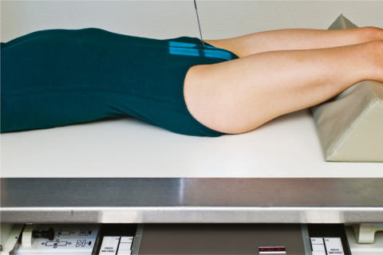
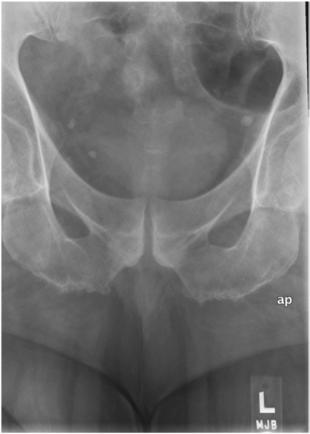

# Rx Coccis AP Axială

  📷 Radiografie Convențională (Rx)
  <strong>Actualizat:</strong> 2026-09-15
  <strong>Autor:</strong> Departamentul de Radiologie / Referință Bontrager

---

-   __1. Rezumat Clinic & Indicații__

    ---

    === "Indicații Clinice"

        - Pathology of the Coccis including suspiciune de fractură

    === "Ghid Național IRIS"

        !!! info "Referință Primară: Ghidul Național IRIS (Ordinul MS 1342/2012)"
            - **Capitol Ghid IRIS:** *Ghidul Național IRIS*
            - **Grad de Recomandare:** **De verificat pe indicație; fără grad atribuit automat**
            - **Nivel de Iradiere Estimată:** `De verificat pentru examinarea și populația selectate`

            [:octicons-search-16: Deschide Ghidul IRIS](../../iris.md){ .md-button .md-button--primary } [:material-open-in-new: Aplicația Oficială PWA](https://radiologie-pediatrica.ro/iris/){ .md-button target="_blank" rel="noopener" }
-   __2. Poziționare & Centrare Fascicul__

    ---

    - **Poziție Pacient:** Pacient: Decubit Dorsal Position Position patient Decubit Dorsal with arms at side and head on pillow and legs extended with support under knees for comfort.; Regiune anatomică: Align midsagittal plane to midline of table and/or IR (Fig. 9.67). Ensure that Absența rotației anatomice: clavicule echidistante față de linia apofizelor spinoase of the Bazin (Pelvis) exists.
    - **Punct de Centrare Fascicul:** Angle CR 10° caudad. Direct CR 2 inches (5 cm) superior to simfiza pubiană. Center IR to CR.
    - **Distanță Focar-Film (DFF / SID):** 100 cm
    - **Comandă Respiratorie:** Suspend respiration to limit patient motion.

-   __3. Parametri Tehnici Expunere__

    ---

    | Parametru Tehnic | Valoare Configurare Generator / Tub |
    |:-----------------|:-------------------------------------|
    | **Tensiune Tub (kV)** | 75-85 kV |
    | **Sarcină / Produs Curent-Timp (mAs)** | DE CONFIGURAT PE APARAT |
    | **Distanță Focar-Film (DFF / SID)** | 100 cm |
    | **Grilă Antidifuzoare (Bucky)** | Cu grilă antidifuzoare Bucky |
    | **Dimensiune Focar** | Focar Mic (0.6 mm) |
    | **Camere de Ionizare AEC** | Camerele laterale (sau camera centrală funcție de regiune) |
    | **Colimare Fascicul** | Field Size Collimate on four sides to anatomy of interest. |
    | **Filtrare Tub** | Totală ≥ 2.5 mm Al echivalent |

-   __4. Criterii de Calitate & Reușită Imagine__

    ---

    - Coccis (Fig. 9.68) Position
    - Correct Coccis and CR alignment demonstrates Coccis free of superimposition and projected superior to pubis.
    - Coccygeal segments should appear open. If not, they may be fused or CR angle may have to be increased (greater curvature of the Coccis requires greater CR angle).
    - Coccis should appear equidistant from the lateral walls of the pelvic opening, indicating no patient rotation.
    - Collimation field size to area of interest. Exposure
    - Optimal image receptor exposure and contrast. Clear demonstration of bony margins and trabecular markings of Coccis.
    - No motion. 18 24 R Fig. 9.68 AP axial Coccis—10° caudad. Fig. 9.67 AP axial Coccis—10° caudad.

-   __5. Protecție Radiologică (ALARA)__

    ---

    - Ecranare gonadică și a organelor radiosensibile conform procedurilor locale de radioprotecție ALARA.
    - Colimare strictă la aria de interes pentru limitarea radiației difuze.
    - Verificarea posibilității unei sarcini la pacientele de vârstă fertilă înainte de expunere.

!!! note "Observații Clinice & Tehnice"
    S: Technologist may have to increase CR angle to 15° caudad with a greater anterior curvature of the Coccis if apparent by palpation or as evidenced on the lateral. This projection also may be performed Decubit Ventral (angle 10° cephalad) if necessary for patient’s condition, with CR centered to the Coccis, which can be localized using the marele trohanter. Sacru și Coccis ROUTINE AP axial Sacru AP axial Coccis Lateral

### 🖼️ Imagini

<figure class="protocol-image-card" markdown>

<figcaption><strong>Fig. 9.68 AP axial Coccis—10° caudad.</strong> — Poziționare pacient conform Ghidului Bontrager (Fig. 9.68 AP axial coccyx—10° caudad.)</figcaption>

</figure>

<figure class="protocol-image-card" markdown>

<figcaption><strong>Fig. 9.67 AP axial Coccis—10° caudad.</strong> — Aspect radiografic de referință conform Ghidului Bontrager (Fig. 9.67 AP axial coccyx—10° caudad.)</figcaption>

</figure>

=== "Ghid Rapid de Execuție"

    1. **Identificarea și verificarea pacientului:** verificare identitate, zonă de examinat, consimțământ conform procedurii și evaluarea posibilității unei sarcini, când este relevantă.
    2. **Pregătire:** îndepărtarea oricăror obiecte radiopace (bijuterii, agrafe, fermoare, proteze, pansamente dense).
    3. **Poziționare precisă:** alinierea receptorului de imagine și a tubului la distanța prescrisă (100 cm).
    4. **Colimare strictă:** adaptarea fasciculului strict la regiunea de diagnostic pentru scăderea iradierii și reducerea radiației difuze.
    5. **Radioprotecție:** verificarea [politicii RX](../radioprotectie.md), cu măsuri distincte pentru pacient, personal și însoțitor.

## Surse de documentare

- [Bontrager's Textbook of Radiographic Positioning (Ed. 9/10), Pagina 373](https://www.elsevier.com/books/textbook-of-radiographic-positioning-and-related-anatomy/lampignano/978-0-323-65367-1)
