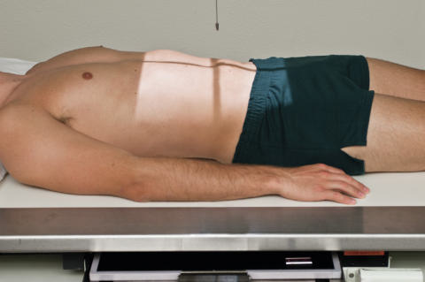
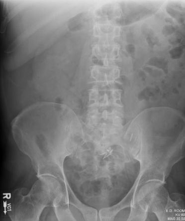
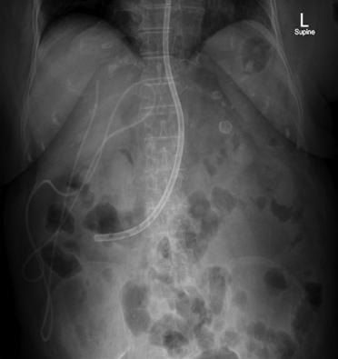

# Rx Decubit Dorsal Poziționare AP (Antero-Posterior) (Abdomen)

  📷 Radiografie Convențională (Rx)
  <strong>Actualizat:</strong> 2026-09-15
  <strong>Autor:</strong> Departamentul de Radiologie / Referință Bontrager

---

-   __1. Rezumat Clinic & Indicații__

    ---

    === "Indicații Clinice"

        - Pathology de abdomenul, including ocluzie intestinală (nivele hidroaerice), proces proliferativ tumorals, calcifications, ascites, și scout imagine pentru contrast media studies de abdomenul Fig. 3.29 AP (lower) Abdomen—portrait. (de la Grajo JR, et al: Abdominal imaging: core requisites, Philadelphia, 2022, Elsevier.) Fig. 3.30 AP (upper) Abdomen—landscape. (de la Abdulhassan Al Kaisy M: lost, coiled tube în abdominal cavity. Visual Journal de Emergency Medicine 22, 2021.)

    === "Ghid Național IRIS"

        !!! info "Referință Primară: Ghidul Național IRIS (Ordinul MS 1342/2012)"
            - **Capitol Ghid IRIS:** *Ghidul Național IRIS*
            - **Grad de Recomandare:** **De verificat pe indicație; fără grad atribuit automat**
            - **Nivel de Iradiere Estimată:** `De verificat pentru examinarea și populația selectate`

            [:octicons-search-16: Deschide Ghidul IRIS](../../iris.md){ .md-button .md-button--primary } [:material-open-in-new: Aplicația Oficială PWA](https://radiologie-pediatrica.ro/iris/){ .md-button target="_blank" rel="noopener" }
-   __2. Poziționare & Centrare Fascicul__

    ---

    - **Poziție Pacient:** Pacient: Decubit dorsal cu plan mediosagital centrat pe linia mediană mesei sau receptorul de imagine brațe plasat la pacient’s sides, away de la corp membre inferioare bent cu support under genunchi (la lessen lordotic lumbar curvature); Regiune anatomică: Center de receptorul de imagine la level de creasta iliacă (corespunzător L4-L5)s, cu bottom margin la simfiza pubiană (Fig. 3.28) (see NOTES) Absența rotației anatomice: clavicule echidistante față de linia apofizelor spinoase de Bazin (bazin (pelvis)) sau umeri (check that ambele spină iliacă antero-superioară (SIAS) sunt same distance de la tabletop)
    - **Punct de Centrare Fascicul:** perpendicular la și orientat la center de receptorul de imagine (la level de creasta iliacă (corespunzător L4-L5))
    - **Distanță Focar-Film (DFF / SID):** 100 cm
    - **Comandă Respiratorie:** Apnee la sfârșitul expirului complet (diafragmul ridicat) (allow about 1second delay after expiration la allow voluntary mișcare la cease).

-   __3. Parametri Tehnici Expunere__

    ---

    | Parametru Tehnic | Valoare Configurare Generator / Tub |
    |:-----------------|:-------------------------------------|
    | **Tensiune Tub (kV)** | 70 kV |
    | **Sarcină / Produs Curent-Timp (mAs)** | DE CONFIGURAT PE APARAT |
    | **Distanță Focar-Film (DFF / SID)** | 100 cm |
    | **Grilă Antidifuzoare (Bucky)** | Cu grilă antidifuzoare Bucky |
    | **Dimensiune Focar** | Focar Mic (0.6 mm) |
    | **Camere de Ionizare AEC** | Camerele laterale (sau camera centrală funcție de regiune) |
    | **Colimare Fascicul** | 14 × 17 inches (35 × 43 cm), field de incidență sau collimate pe four sides la anatomy de interest |
    | **Filtrare Tub** | Totală ≥ 2.5 mm Al echivalent |

-   __4. Criterii de Calitate & Reușită Imagine__

    ---

    - Vizualizarea completă regiunii anatomice explorate
    - Absența artefactelor de mișcare sau suprapunerilor neadecvate
    - Contrast și penetrare optime pentru decelarea structurilor osoase și părților moi

-   __5. Protecție Radiologică (ALARA)__

    ---

    - Ecranare gonadică și a organelor radiosensibile conform procedurilor locale de radioprotecție ALARA.
    - Colimare strictă la aria de interes pentru limitarea radiației difuze.
    - Verificarea posibilității unei sarcini la pacientele de vârstă fertilă înainte de expunere.

!!! note "Observații Clinice & Tehnice"
    S: tall hyposthenic sau asthenic pacient poate require two imagini plasat portrait (Fig. 3.29)—one centrat lower pentru include simfiza pubiană (bottom margin de first receptorul de imagine la simfiză) și second centrat higher pentru include etajul abdominal superior și cupole diafragmatice (top margin de second receptorul de imagine la xiphoid). broad hypersthenic pacient poate require two 14 × 17inch (35 × 43cm) IRs plasat landscape, one centrat lower pentru include simfiza pubiană și second pentru etajul abdominal superior, cu minimum de 1 la 2 inches (3 la 5 cm) overlap (Fig. 3.30).

### 🖼️ Imagini

<figure class="protocol-image-card" markdown>

<figcaption><strong>Fig. 3.28 AP Abdomen (KUB).</strong> — Poziționare pacient conform Ghidului Bontrager (Fig. 3.28 AP abdomen (KUB).)</figcaption>

</figure>

<figure class="protocol-image-card" markdown>

<figcaption><strong>Fig. 3.29 AP (lower) Abdomen—portrait. (de la Grajo JR, et al:</strong> — Aspect radiografic de referință conform Ghidului Bontrager (Fig. 3.29 AP (lower) abdomen—portrait. (de la Grajo JR, et al:)</figcaption>

</figure>

<figure class="protocol-image-card" markdown>

<figcaption><strong>Fig. 3.30 AP (upper) Abdomen—landscape. (de la Abdulhassan Al</strong> — Aspect radiografic de referință conform Ghidului Bontrager (Fig. 3.30 AP (upper) abdomen—landscape. (de la Abdulhassan Al)</figcaption>

</figure>

=== "Ghid Rapid de Execuție"

    1. **Identificarea și verificarea pacientului:** verificare identitate, zonă de examinat, consimțământ conform procedurii și evaluarea posibilității unei sarcini, când este relevantă.
    2. **Pregătire:** îndepărtarea oricăror obiecte radiopace (bijuterii, agrafe, fermoare, proteze, pansamente dense).
    3. **Poziționare precisă:** alinierea receptorului de imagine și a tubului la distanța prescrisă (100 cm).
    4. **Colimare strictă:** adaptarea fasciculului strict la regiunea de diagnostic pentru scăderea iradierii și reducerea radiației difuze.
    5. **Radioprotecție:** verificarea [politicii RX](../radioprotectie.md), cu măsuri distincte pentru pacient, personal și însoțitor.

## Surse de documentare

- [Bontrager's Textbook of Radiographic Positioning (Ed. 9/10), Pagina 128](https://www.elsevier.com/books/textbook-of-radiographic-positioning-and-related-anatomy/lampignano/978-0-323-65367-1)
