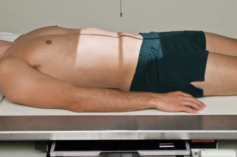
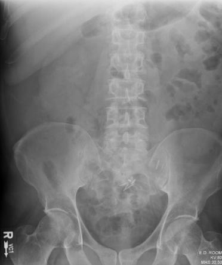
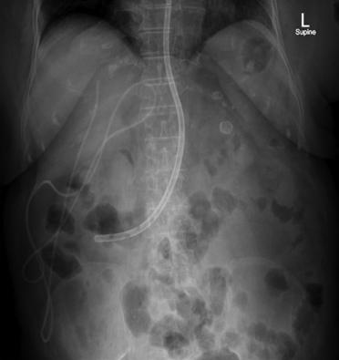

# Rx abdomen în decubit dorsal, poziționare AP (antero-posterioară)

  📷 Radiografie Convențională (Rx)
  <strong>Actualizat:</strong> 2026-09-15
  <strong>Autor:</strong> Departamentul de Radiologie / Referință Bontrager

---

-   __1. Rezumat Clinic & Indicații__

    ---

    === "Indicații Clinice"

        - Patologia abdomenului, inclusiv ocluzie intestinală (nivele hidroaerice), procese proliferative tumorale, calcificări, ascită și imagine preliminară pentru examinările abdomenului cu substanță de contrast. Fig. 3.29 Abdomen inferior AP—orientare verticală. (Din Grajo JR și colab.: Imagistica abdominală: cerințe de bază, Philadelphia, 2022, Elsevier.) Fig. 3.30 Abdomen superior AP—orientare orizontală. (Din Abdulhassan Al Kaisy M: Tub pierdut, încolăcit în cavitatea abdominală. Revista vizuală de medicină de urgență 22, 2021.)

    === "Ghid Național IRIS"

        !!! info "Referință Primară: Ghidul Național IRIS (Ordinul MS 1342/2012)"
            - **Capitol Ghid IRIS:** *Ghidul Național IRIS*
            - **Grad de Recomandare:** **De verificat pe indicație; fără grad atribuit automat**
            - **Nivel de Iradiere Estimată:** `De verificat pentru examinarea și populația selectate`

            [:octicons-search-16: Deschide Ghidul IRIS](../../iris.md){ .md-button .md-button--primary } [:material-open-in-new: Aplicația Oficială PWA](https://radiologie-pediatrica.ro/iris/){ .md-button target="_blank" rel="noopener" }
-   __2. Poziționare & Centrare Fascicul__

    ---

    - **Poziție Pacient:** Pacient: Decubit dorsal, cu planul mediosagital centrat pe linia mediană a mesei sau a receptorului de imagine, brațele de-a lungul corpului, depărtate de acesta, membrele inferioare flectate, cu suport sub genunchi (pentru reducerea lordozei lombare); Regiune anatomică: Centrul receptorului de imagine la nivelul crestelor iliace (corespunzător L4-L5), cu marginea inferioară la nivelul simfizei pubiene (Fig. 3.28) (vezi NOTELE). Absența rotației anatomice a bazinului sau a umerilor: clavicule echidistante față de linia apofizelor spinoase (verificați ca ambele spine iliace antero-superioare (SIAS) să se afle la aceeași distanță de suprafața mesei).
    - **Punct de Centrare Fascicul:** Perpendicular pe receptorul de imagine și orientat spre centrul acestuia (la nivelul crestei iliace (corespunzător L4-L5))
    - **Distanță Focar-Film (DFF / SID):** 100 cm
    - **Comandă Respiratorie:** Apnee la sfârșitul expirului complet (diafragmul ridicat) (se așteaptă aproximativ 1 secundă după expir pentru încetarea mișcărilor voluntare).

-   __3. Parametri Tehnici Expunere__

    ---

    | Parametru Tehnic | Valoare Configurare Generator / Tub |
    |:-----------------|:-------------------------------------|
    | **Tensiune Tub (kV)** | 70 kV |
    | **Sarcină / Produs Curent-Timp (mAs)** | DE CONFIGURAT PE APARAT |
    | **Distanță Focar-Film (DFF / SID)** | 100 cm |
    | **Grilă Antidifuzoare (Bucky)** | Cu grilă antidifuzoare Bucky |
    | **Dimensiune Focar** | Focar Mic (0.6 mm) |
    | **Camere de Ionizare AEC** | Camerele laterale (sau camera centrală, în funcție de regiune) |
    | **Colimare Fascicul** | 14 × 17 țoli (35 × 43 cm), câmp de incidență sau colimare pe cele patru laturi la regiunea anatomică de interes |
    | **Filtrare Tub** | Totală ≥ 2.5 mm Al echivalent |

-   __4. Criterii de Calitate & Reușită Imagine__

    ---

    - Vizualizarea completă a regiunii anatomice explorate
    - Absența artefactelor de mișcare sau a suprapunerilor neadecvate
    - Contrast și penetrare optime pentru decelarea structurilor osoase și a părților moi

-   __5. Protecție Radiologică (ALARA)__

    ---

    - Ecranare gonadică și a organelor radiosensibile conform procedurilor locale de radioprotecție ALARA.
    - Colimare strictă la aria de interes pentru limitarea radiației difuze.
    - Verificarea posibilității unei sarcini la pacientele de vârstă fertilă înainte de expunere.

!!! note "Observații Clinice & Tehnice"
    S: Un pacient înalt, hipostenic sau astenic, poate necesita două imagini cu orientare verticală (Fig. 3.29)—una centrată mai jos pentru a include simfiza pubiană (marginea inferioară a primului receptor de imagine la nivelul simfizei) și a doua centrată mai sus pentru a include etajul abdominal superior și cupolele diafragmatice (marginea superioară a celui de-al doilea receptor de imagine la nivelul apendicelui xifoid). Un pacient hiperstenic, lat, poate necesita două IR de 14 × 17 țoli (35 × 43 cm), cu orientare orizontală, unul centrat mai jos pentru a include simfiza pubiană și al doilea pentru etajul abdominal superior, cu o suprapunere de minimum 1 la 2 țoli (3 la 5 cm) (Fig. 3.30).

### 🖼️ Imagini

<figure class="protocol-image-card" markdown>

<figcaption><strong>Fig. 3.28 Abdomen AP (KUB).</strong> — Poziționarea pacientului conform Ghidului Bontrager (Fig. 3.28 Abdomen AP (KUB).)</figcaption>

</figure>

<figure class="protocol-image-card" markdown>

<figcaption><strong>Fig. 3.29 Abdomen inferior AP—orientare verticală. (Din Grajo JR și colab.:</strong> — Aspect radiografic de referință conform Ghidului Bontrager (Fig. 3.29 Abdomen inferior AP—orientare verticală. (Din Grajo JR și colab.:)</figcaption>

</figure>

<figure class="protocol-image-card" markdown>

<figcaption><strong>Fig. 3.30 Abdomen superior AP—orientare orizontală. (Din Abdulhassan Al</strong> — Aspect radiografic de referință conform Ghidului Bontrager (Fig. 3.30 Abdomen superior AP—orientare orizontală. (Din Abdulhassan Al)</figcaption>

</figure>

=== "Ghid Rapid de Execuție"

    1. **Identificarea și verificarea pacientului:** verificare identitate, zonă de examinat, consimțământ conform procedurii și evaluarea posibilității unei sarcini, când este relevantă.
    2. **Pregătire:** îndepărtarea oricăror obiecte radiopace (bijuterii, agrafe, fermoare, proteze, pansamente dense).
    3. **Poziționare precisă:** alinierea receptorului de imagine și a tubului la distanța prescrisă (100 cm).
    4. **Colimare strictă:** adaptarea fasciculului strict la regiunea de diagnostic pentru scăderea iradierii și reducerea radiației difuze.
    5. **Radioprotecție:** verificarea [politicii RX](../radioprotectie.md), cu măsuri distincte pentru pacient, personal și însoțitor.

## Surse de documentare

- [Bontrager's Textbook of Radiographic Positioning (Ed. 9/10), Pagina 128](https://www.elsevier.com/books/textbook-of-radiographic-positioning-and-related-anatomy/lampignano/978-0-323-65367-1)
