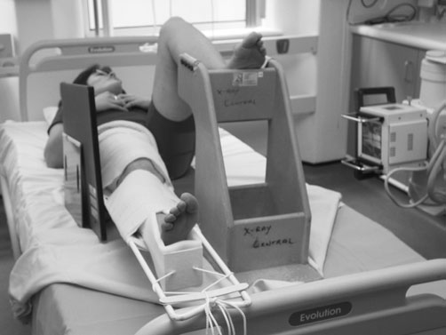
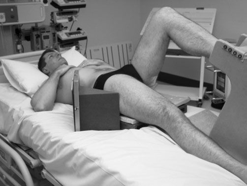
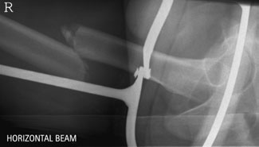
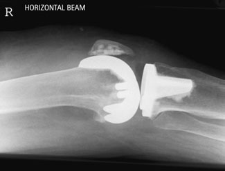

# Rx Fractură Femur Profil (Lateral)

  📷 Radiografie Convențională (Rx)
  <strong>Actualizat:</strong> 2026-09-16
  <strong>Autor:</strong> Departamentul de Radiologie / Referință Clark (Ed. 12)

---

-   __1. Rezumat Clinic & Indicații__

    ---

    === "Indicații Clinice"

        - Evaluare radiografică regiunii Fractură Femur (Profil (lateral)).
        - Suspiciune de leziuni traumatice (fracturi, luxații sau diastazis articular).
        - Bilanț osteoarticular / visceral conform recomandării medicale de trimitere.

    === "Ghid Național IRIS"

        !!! info "Referință Primară: Ghidul Național IRIS (Ordinul MS 1342/2012)"
            - **Capitol Ghid IRIS:** *Ghidul Național IRIS*
            - **Grad de Recomandare:** **De verificat pe indicație; fără grad atribuit automat**
            - **Nivel de Iradiere Estimată:** `De verificat pentru examinarea și populația selectate`

            [:octicons-search-16: Deschide Ghidul IRIS](../../iris.md){ .md-button .md-button--primary } [:material-open-in-new: Aplicația Oficială PWA](https://radiologie-pediatrica.ro/iris/){ .md-button target="_blank" rel="noopener" }
-   __2. Poziționare & Centrare Fascicul__

    ---

    - **Poziție Pacient:** • mobile X-ray equipment este carefully repositioned la enable Fascicul Orizontal radiografie.
• When examination este pentru distal two-thirds de Femur, caseta poate fie poziționat vertically pe / sprijinit de medial side de thigh și Fascicul Orizontal orientat latero-medially.
• When proximal part de shaft sau gâtul de Femur este being examined, caseta este poziționat vertically pe / sprijinit de Profil (lateral) side de thigh și fascicul este orientat mediolaterally, cu opposite membru inferior raised pe suitable support astfel încât unaffected thigh este în near-vertical poziție.
• pentru Col Femural, casetă cu grilă antidifuzoare este poziționat vertically, cu one edge pe / sprijinit de waist above crestele iliace pe side being examined și ajustat cu its axa longitudinală paralel cu Col Femural.
• la evidențiază suspiciune de fractură de upper Femur, it este essential that pacientul este raised off bed pe suitable rigid structure, such ca firm foam pad sau casetă tunnel device.
    - **Punct de Centrare Fascicul:** • pentru distal two-thirds de Femur, raza centrală orizontală centrală este centred la middle de caseta și paralel la line joining anterior margini de femoral condyles.
• la evidențiază Col Femural, which will include Șold (Articulație Coxofemurală), centre midway între femoral pulse și palpable prominence de mare trohanter, cu raza centrală centrală Orientat orizontal și la drept-angles la caseta.
    - **Distanță Focar-Film (DFF / SID):** 100 cm
    - **Comandă Respiratorie:** Apnee pe durata expunerii (apnee în inspir pentru torace; expir pentru Abdomen/bazin).

-   __3. Parametri Tehnici Expunere__

    ---

    | Parametru Tehnic | Valoare Configurare Generator / Tub |
    |:-----------------|:-------------------------------------|
    | **Tensiune Tub (kV)** | DE CONFIGURAT PE APARAT |
    | **Sarcină / Produs Curent-Timp (mAs)** | Conform AEC / grosime anatomică |
    | **Distanță Focar-Film (DFF / SID)** | 100 cm |
    | **Grilă Antidifuzoare (Bucky)** | Conform grosimii anatomice (> 10-12 cm cu grilă) |
    | **Dimensiune Focar** | Focar Mic (0.6 mm) |
    | **Camere de Ionizare AEC** | DE CONFIGURAT PE APARAT |
    | **Colimare Fascicul** | Colimare strictă la aria anatomică de interes diagnostic |
    | **Filtrare Tub** | Totală ≥ 2.5 mm Al echivalent (conform Clark: 3.0 mm Al eq.) |

-   __4. Criterii de Calitate & Reușită Imagine__

    ---

    - Vizualizarea clară întregii arii anatomice (Fractură Femur).
    - Absența artefactelor de mișcare; trabeculație osoasă și contururi nete.
    - Densitate optică și contrast adecvate pentru diferențierea țesuturilor moi de structurile osoase.

-   __5. Protecție Radiologică (ALARA)__

    ---

    - Ecranare gonadică cu șorț plumbat dacă gonadele sunt în apropierea fasciculului util (regula ALARA).
    - Colimare precisă la dimensiunea anatomică strict necesară pentru reducerea dozei și a radiației difuze.
    - Verificarea posibilității unei sarcini la pacientele de vârstă fertilă înainte de expunere.

!!! note "Observații Clinice & Tehnice"
    When using grilă, it este essential that caseta remains vertical la avoid grilă cut-off.
Arthroplasty postoperative radiografie Antero-posterior (AP) incidență de Șold este taken within 24 hours de surgery pentru include upper third de Femur la evidențiază prosthesis și cement restrictor, which este distal la prosthesis. This poate fie highlighted prin radio-opaque marker în form de ball-bearing, which trebuie să appear în toate subsequent follow-up imagini de Șold (Articulație Coxofemurală) if it has been used.
Loosening de prosthesis poate occur prin impaction de femoral shaft de prosthesis into native Femur. This este detected most easily prin observing reduction în distance între cement restrictor și tip de prosthesis. It este therefore most important that first imagine includes cement restrictor.
nursing management este also determined pe confirmation that Șold (Articulație Coxofemurală) has nu dislocated.
Antero-posterior (AP) și Profil (lateral) incidențe sunt acquired de Genunchi following Genunchi replacement.
pacient poziționat pentru Profil (lateral) Femur (Genunchi up) following application de Thomas’s splint pacient poziționat pentru Profil (lateral) Șold cu Bazin (bazin (pelvis)) raised resting pe casetă tunnel device Profil (lateral) imagine de drept Fractură Femur în Thomas’s splint Postoperative Profil (lateral) imagine de Genunchi using Fascicul Orizontal following articulație replacement

### 🖼️ Imagini

<figure class="protocol-image-card" markdown>

<figcaption><strong>Fascicul Orizontal radiografie.</strong> — Poziționare pacient și centrare fascicul conform Clark (Ed. 12)</figcaption>

</figure>

<figure class="protocol-image-card" markdown>

<figcaption><strong>• la evidențiază suspiciune de fractură de upper Femur, it este essential</strong> — Aspect radiografic / ghid de poziționare conform tratatului Clark (Ed. 12)</figcaption>

</figure>

<figure class="protocol-image-card" markdown>

<figcaption><strong>Profil (lateral) imagine de drept Fractură Femur în Thomas’s splint</strong> — Aspect radiografic / ghid de poziționare conform tratatului Clark (Ed. 12)</figcaption>

</figure>

<figure class="protocol-image-card" markdown>

<figcaption><strong>Figura 4: Aspect radiografic / Poziționare (Clark Ed. 12)</strong> — Aspect radiografic / ghid de poziționare conform tratatului Clark (Ed. 12)</figcaption>

</figure>

=== "Ghid Rapid de Execuție"

    1. **Identificarea și verificarea pacientului:** verificare identitate, zonă de examinat, consimțământ conform procedurii și evaluarea posibilității unei sarcini, când este relevantă.
    2. **Pregătire:** îndepărtarea oricăror obiecte radiopace (bijuterii, agrafe, fermoare, proteze, pansamente dense).
    3. **Poziționare precisă:** alinierea receptorului de imagine și a tubului la distanța prescrisă (100 cm).
    4. **Colimare strictă:** adaptarea fasciculului strict la regiunea de diagnostic pentru scăderea iradierii și reducerea radiației difuze.
    5. **Radioprotecție:** verificarea [politicii RX](../radioprotectie.md), cu măsuri distincte pentru pacient, personal și însoțitor.

## Surse de documentare

- [Clark's Positioning in Radiography (Ed. 12), Pagina 378](../../assets/protocols/sources/Clark___Positioning_in_Radiography__12th_edition.pdf#page=378)
