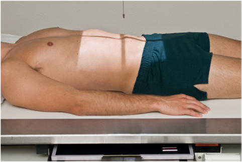
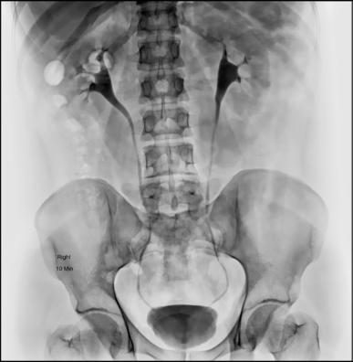
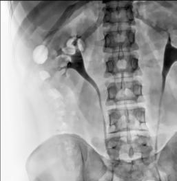
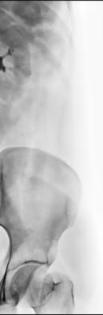
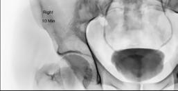

# Rx INTRAVENOUS (EXCRETORY) AP (Antero-Posterior) (SCOUT AND SERIES) (UROGRAPHY)

  📷 Radiografie Convențională (Rx)
  <strong>Actualizat:</strong> 2026-09-15
  <strong>Autor:</strong> Departamentul de Radiologie / Referință Bontrager

---

-   __1. Rezumat Clinic & Indicații__

    ---

    === "Indicații Clinice"

        - Scout evidențiază abnormal calcifications that poate fie urinary Litiază urinară / calculi radio-opaci. After injection, Incidență Antero-Posterioară (AP) poate evidențiază signs de obstruction, hydronephrosis, tumor, sau infection.

    === "Ghid Național IRIS"

        !!! info "Referință Primară: Ghidul Național IRIS (Ordinul MS 1342/2012)"
            - **Capitol Ghid IRIS:** *Ghidul Național IRIS*
            - **Grad de Recomandare:** **De verificat pe indicație; fără grad atribuit automat**
            - **Nivel de Iradiere Estimată:** `De verificat pentru examinarea și populația selectate`

            [:octicons-search-16: Deschide Ghidul IRIS](../../iris.md){ .md-button .md-button--primary } [:material-open-in-new: Aplicația Oficială PWA](https://radiologie-pediatrica.ro/iris/){ .md-button target="_blank" rel="noopener" }
-   __2. Poziționare & Centrare Fascicul__

    ---

    - **Poziție Pacient:** Pacient: Situate pacientul Decubit dorsal, cu pillow pentru capul, brațe la sides, away de la corp, și support under genunchii la relieve back strain.; Regiune anatomică: Align plan mediosagital la centerline de table și la raza centrală. Ensure Absența rotației anatomice: clavicule echidistante față de linia apofizelor spinoase de trunk sau Bazin (bazin (pelvis)). Include simfiza pubiană pe bottom de receptorul de imagine fără cutting off upper rinichi (Fig. 14.71). (second smaller receptorul de imagine pentru bladder area poate fie necessary pe hypersthenic pacienți.)
    - **Punct de Centrare Fascicul:** este perpendicular pe receptorul de imagine. Center raza centrală și receptorul de imagine la level de creasta iliacă (corespunzător L4-L5) și la plan mediosagital. Nephrogram: Center raza centrală midway între apendice xifoid și creasta iliacă (corespunzător L4-L5).
    - **Distanță Focar-Film (DFF / SID):** 100 cm
    - **Comandă Respiratorie:** Apnee pe durata expunerii after expiration și expose.

-   __3. Parametri Tehnici Expunere__

    ---

    | Parametru Tehnic | Valoare Configurare Generator / Tub |
    |:-----------------|:-------------------------------------|
    | **Tensiune Tub (kV)** | 80-85 kV |
    | **Sarcină / Produs Curent-Timp (mAs)** | DE CONFIGURAT PE APARAT |
    | **Distanță Focar-Film (DFF / SID)** | 100 cm |
    | **Grilă Antidifuzoare (Bucky)** | Cu grilă antidifuzoare Bucky |
    | **Dimensiune Focar** | Focar Mic (0.6 mm) |
    | **Camere de Ionizare AEC** | Camerele laterale (sau camera centrală funcție de regiune) |
    | **Colimare Fascicul** | Collimate pe toate four sides la anatomy de interest. |
    | **Filtrare Tub** | Totală ≥ 2.5 mm Al echivalent |

-   __4. Criterii de Calitate & Reușită Imagine__

    ---

    - Entire urinary system este visualized de la upper renal shadows la distal vezică urinară (Figs. 14.72 și 14.73). simfiza pubiană trebuie să fie included pe lower margin de receptorul de imagine.
    - After injection, only portion de urinary system poate fie opacified pe specific radiografie în series. poziție:
    - Absența rotației anatomice: clavicule echidistante față de linia apofizelor spinoase ca evidenced prin symmetry de iliac wings și rib cage
    - corect collimation applied. expunere:
    - fără mișcare due la respirație sau movement.
    - optim receptorul de imagine expunere și contrast cu shortscale contrast evidențiind urinary system. markeri:
    - Minute markeri și R sau L markeri vizibil pe toate series radiografii. Fig. 14.72 IVU (10 minutes). (Case courtesy Dr MT Niknejad, Radiopaedia.org, rID: 85286.) stâng renal Bazin (bazin (pelvis)) Major calyx drept ureter stâng ureter vezică urinară Fig. 14.73 IVU; 10 minutes following injection. (Case courtesy Dr MT Niknejad, Radiopaedia.org, rID: 85286.)

-   __5. Protecție Radiologică (ALARA)__

    ---

    - Ecranare gonadică și a organelor radiosensibile conform procedurilor locale de radioprotecție ALARA.
    - Colimare strictă la aria de interes pentru limitarea radiației difuze.
    - Verificarea posibilității unei sarcini la pacientele de vârstă fertilă înainte de expunere.

!!! note "Observații Clinice & Tehnice"
    Have pacient empty bladder immediately before beginning examination so that contrast medium în bladder este nu diluted. Explain procedure și obtain clinical history before injecting contrast medium. fie prepared pentru possible reaction la contrast medium. Nephrog ram Urografie Intravenoasă (UIV)—IVU ROUTINE AP (scout și series) Nephrogram RPO și LPO (30°) AP—Post-Micțional Ortostatism sau Decubit Fig. 14.71 IVU scout și series.

### 🖼️ Imagini

<figure class="protocol-image-card" markdown>

<figcaption><strong>Fig. 14.71 IVU scout și series.</strong> — Poziționare pacient conform Ghidului Bontrager (Fig. 14.71 IVU scout și series.)</figcaption>

</figure>

<figure class="protocol-image-card" markdown>

<figcaption><strong>Fig. 14.72 IVU (10 minutes). (Case courtesy Dr MT Niknejad,</strong> — Aspect radiografic de referință conform Ghidului Bontrager (Fig. 14.72 IVU (10 minutes). (Case courtesy Dr MT Niknejad,)</figcaption>

</figure>

<figure class="protocol-image-card" markdown>

<figcaption><strong>Fig. 14.73 IVU; 10 minutes following injection. (Case courtesy Dr MT</strong> — Aspect radiografic de referință conform Ghidului Bontrager (Fig. 14.73 IVU; 10 minutes following injection. (Case courtesy Dr MT)</figcaption>

</figure>

<figure class="protocol-image-card" markdown>

<figcaption><strong>Figura 4</strong> — Aspect radiografic de referință conform Ghidului Bontrager (Figura 4)</figcaption>

</figure>

<figure class="protocol-image-card" markdown>

<figcaption><strong>Figura 5</strong> — Aspect radiografic de referință conform Ghidului Bontrager (Figura 5)</figcaption>

</figure>

=== "Ghid Rapid de Execuție"

    1. **Identificarea și verificarea pacientului:** verificare identitate, zonă de examinat, consimțământ conform procedurii și evaluarea posibilității unei sarcini, când este relevantă.
    2. **Pregătire:** îndepărtarea oricăror obiecte radiopace (bijuterii, agrafe, fermoare, proteze, pansamente dense).
    3. **Poziționare precisă:** alinierea receptorului de imagine și a tubului la distanța prescrisă (100 cm).
    4. **Colimare strictă:** adaptarea fasciculului strict la regiunea de diagnostic pentru scăderea iradierii și reducerea radiației difuze.
    5. **Radioprotecție:** verificarea [politicii RX](../radioprotectie.md), cu măsuri distincte pentru pacient, personal și însoțitor.

## Surse de documentare

- [Bontrager's Textbook of Radiographic Positioning (Ed. 9/10), Pagina 580](https://www.elsevier.com/books/textbook-of-radiographic-positioning-and-related-anatomy/lampignano/978-0-323-65367-1)
