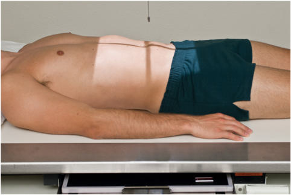
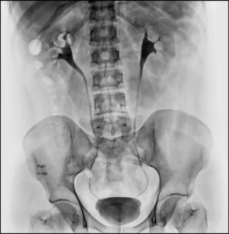
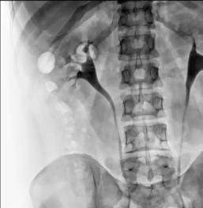
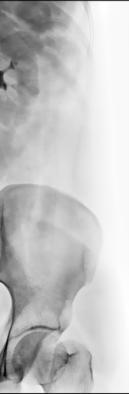
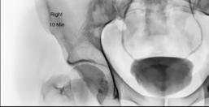

# Rx urografie intravenoasă (excretorie) AP (antero-posterioară) (radiografie preliminară și serie de radiografii)

  📷 Radiografie Convențională (Rx)
  <strong>Actualizat:</strong> 2026-09-15
  <strong>Autor:</strong> Departamentul de Radiologie / Referință Bontrager

---

-   __1. Rezumat Clinic & Indicații__

    ---

    === "Indicații Clinice"

        - Radiografia preliminară evidențiază calcificări anormale care pot reprezenta litiază urinară / calculi radio-opaci. După injectare, incidența antero-posterioară (AP) poate evidenția semne de obstrucție, hidronefroză, tumoră sau infecție.

    === "Ghid Național IRIS"

        !!! info "Referință Primară: Ghidul Național IRIS (Ordinul MS 1342/2012)"
            - **Capitol Ghid IRIS:** *Aparat digestiv & Abdomen*
            - **Grad de Recomandare:** **Grad B**
            - **Nivel de Iradiere Estimată:** `Clasa 2 (Foarte mică ~ 0.7 - 1.2 mSv)`

            [:octicons-search-16: Deschide Ghidul IRIS](../../iris.md){ .md-button .md-button--primary } [:material-open-in-new: Aplicația Oficială PWA](https://radiologie-pediatrica.ro/iris/){ .md-button target="_blank" rel="noopener" }

-   __2. Poziționare & Centrare Fascicul__

    ---

    - **Poziție Pacient:** Pacient: Așezați pacientul în decubit dorsal, cu o pernă sub cap, brațele de-a lungul corpului, depărtate de acesta, și un suport sub genunchi pentru a reduce solicitarea spatelui.; Regiune anatomică: Aliniați planul mediosagital cu linia mediană a mesei și cu raza centrală. Asigurați absența rotației anatomice a trunchiului sau a bazinului: clavicule echidistante față de linia apofizelor spinoase. Includeți simfiza pubiană la marginea inferioară a receptorului de imagine, fără a exclude porțiunea superioară a rinichilor (Fig. 14.71). (La pacienții hiperstenici poate fi necesar un al doilea receptor de imagine, mai mic, pentru regiunea vezicii urinare.)
    - **Punct de Centrare Fascicul:** Este perpendiculară pe receptorul de imagine. Centrați raza centrală și receptorul de imagine la nivelul crestei iliace (corespunzător L4-L5) și pe planul mediosagital. Nefrogramă: Centrați raza centrală la jumătatea distanței dintre apendicele xifoid și creasta iliacă (corespunzător L4-L5).
    - **Distanță Focar-Film (DFF / SID):** 100 cm
    - **Comandă Respiratorie:** Apnee pe durata expunerii, după expir, și efectuați expunerea.

-   __3. Parametri Tehnici Expunere__

    ---

    | Parametru Tehnic | Valoare Configurare Generator / Tub |
    |:-----------------|:-------------------------------------|
    | **Tensiune Tub (kV)** | 80-85 kV |
    | **Sarcină / Produs Curent-Timp (mAs)** | DE CONFIGURAT PE APARAT |
    | **Distanță Focar-Film (DFF / SID)** | 100 cm |
    | **Grilă Antidifuzoare (Bucky)** | Cu grilă antidifuzoare Bucky |
    | **Dimensiune Focar** | Focar Mic (0.6 mm) |
    | **Camere de Ionizare AEC** | Camerele laterale (sau camera centrală, în funcție de regiune) |
    | **Colimare Fascicul** | Colimați pe toate cele patru laturi la regiunea anatomică de interes. |
    | **Filtrare Tub** | Totală ≥ 2.5 mm Al echivalent |

-   __4. Criterii de Calitate & Reușită Imagine__

    ---

    - Întregul aparat urinar este vizualizat, de la porțiunea superioară a umbrelor renale până la porțiunea distală a vezicii urinare (Fig. 14.72 și 14.73). Simfiza pubiană trebuie să fie inclusă la marginea inferioară a receptorului de imagine.
    - După injectare, doar o porțiune a aparatului urinar poate fi opacifiată pe o anumită radiografie din serie. Poziție:
    - Absența rotației anatomice: clavicule echidistante față de linia apofizelor spinoase, evidențiată prin simetria aripilor iliace și a cutiei toracice
    - Colimare corectă. Expunere:
    - Fără mișcare datorată respirației sau deplasării.
    - Expunere optimă a receptorului de imagine și contrast optim, cu o scară scurtă de contrast care evidențiază aparatul urinar. Markeri:
    - Markerii de timp în minute și markerii R sau L sunt vizibili pe toate radiografiile din serie. Fig. 14.72 IVU (10 minute). (Caz oferit prin amabilitatea Dr MT Niknejad, Radiopaedia.org, rID: 85286.) Bazinet renal stâng Calice mare Ureter drept Ureter stâng Vezică urinară Fig. 14.73 IVU; 10 minute după injectare. (Caz oferit prin amabilitatea Dr MT Niknejad, Radiopaedia.org, rID: 85286.)

-   __5. Protecție Radiologică (ALARA)__

    ---

    - Ecranare gonadică și a organelor radiosensibile conform procedurilor locale de radioprotecție ALARA.
    - Colimare strictă la aria de interes pentru limitarea radiației difuze.
    - Verificarea posibilității unei sarcini la pacientele de vârstă fertilă înainte de expunere.

!!! note "Observații Clinice & Tehnice"
    Solicitați pacientului să își golească vezica urinară imediat înainte de începerea examinării, astfel încât substanța de contrast din vezică să nu fie diluată. Explicați procedura și obțineți istoricul clinic înainte de injectarea substanței de contrast. Fiți pregătiți pentru o posibilă reacție la substanța de contrast. Nefrogramă Urografie intravenoasă (UIV)—IVU DE RUTINĂ AP (radiografie preliminară și serie de radiografii) Nefrogramă RPO și LPO (30°) AP—Postmicțional în ortostatism sau decubit Fig. 14.71 IVU: radiografie preliminară și serie de radiografii.

### 🖼️ Imagini

<figure class="protocol-image-card" markdown>

<figcaption><strong>Fig. 14.71 IVU: radiografie preliminară și serie de radiografii.</strong> — Poziționarea pacientului conform Ghidului Bontrager (Fig. 14.71 IVU: radiografie preliminară și serie de radiografii.)</figcaption>

</figure>

<figure class="protocol-image-card" markdown>

<figcaption><strong>Fig. 14.72 IVU (10 minute). (Caz oferit prin amabilitatea Dr MT Niknejad,</strong> — Aspect radiografic de referință conform Ghidului Bontrager (Fig. 14.72 IVU (10 minute). (Caz oferit prin amabilitatea Dr MT Niknejad,)</figcaption>

</figure>

<figure class="protocol-image-card" markdown>

<figcaption><strong>Fig. 14.73 IVU; 10 minute după injectare. (Caz oferit prin amabilitatea Dr MT</strong> — Aspect radiografic de referință conform Ghidului Bontrager (Fig. 14.73 IVU; 10 minute după injectare. (Caz oferit prin amabilitatea Dr MT)</figcaption>

</figure>

<figure class="protocol-image-card" markdown>

<figcaption><strong>Figura 4</strong> — Aspect radiografic de referință conform Ghidului Bontrager (Figura 4)</figcaption>

</figure>

<figure class="protocol-image-card" markdown>

<figcaption><strong>Figura 5</strong> — Aspect radiografic de referință conform Ghidului Bontrager (Figura 5)</figcaption>

</figure>

=== "Ghid Rapid de Execuție"

    1. **Identificarea și verificarea pacientului:** verificare identitate, zonă de examinat, consimțământ conform procedurii și evaluarea posibilității unei sarcini, când este relevantă.
    2. **Pregătire:** îndepărtarea oricăror obiecte radiopace (bijuterii, agrafe, fermoare, proteze, pansamente dense).
    3. **Poziționare precisă:** alinierea receptorului de imagine și a tubului la distanța prescrisă (100 cm).
    4. **Colimare strictă:** adaptarea fasciculului strict la regiunea de diagnostic pentru scăderea iradierii și reducerea radiației difuze.
    5. **Radioprotecție:** verificarea [politicii RX](../radioprotectie.md), cu măsuri distincte pentru pacient, personal și însoțitor.

## Surse de documentare

- [Bontrager's Textbook of Radiographic Positioning (Ed. 9/10), Pagina 580](https://www.elsevier.com/books/textbook-of-radiographic-positioning-and-related-anatomy/lampignano/978-0-323-65367-1)
