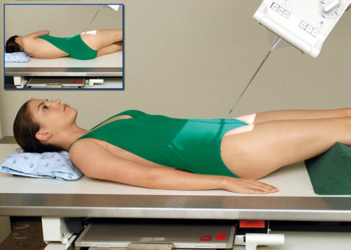
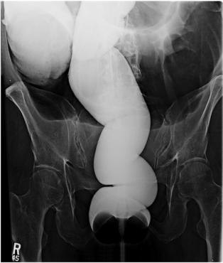
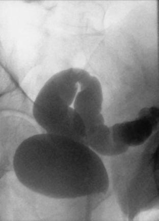

# Rx Irigografie (Clismă Baritată) AP AXIAL OR AP AXIAL OBLIQUE (LPO) Incidență

  📷 Radiografie Convențională (Rx)
  <strong>Actualizat:</strong> 2026-09-15
  <strong>Autor:</strong> Departamentul de Radiologie / Referință Bontrager

---

-   __1. Rezumat Clinic & Indicații__

    ---

    === "Indicații Clinice"

        - Polyps sau other pathologic processes în rectosigmoid aspect de intestin gros (colon)

    === "Ghid Național IRIS"

        !!! info "Referință Primară: Ghidul Național IRIS (Ordinul MS 1342/2012)"
            - **Capitol Ghid IRIS:** *Ghidul Național IRIS*
            - **Grad de Recomandare:** **De verificat pe indicație; fără grad atribuit automat**
            - **Nivel de Iradiere Estimată:** `De verificat pentru examinarea și populația selectate`

            [:octicons-search-16: Deschide Ghidul IRIS](../../iris.md){ .md-button .md-button--primary } [:material-open-in-new: Aplicația Oficială PWA](https://radiologie-pediatrica.ro/iris/){ .md-button target="_blank" rel="noopener" }
-   __2. Poziționare & Centrare Fascicul__

    ---

    - **Poziție Pacient:** Pacient: poziție pacient Decubit dorsal sau partially rotit into poziție oblică posterioară stângă (OPS / LPO), cu support pentru capul (Fig. 13.84).; Regiune anatomică: AP axial poziție pacient Decubit dorsal și align MSP la linia mediană mesei. Extend membre inferioare; place brațe down prin pacient’s side sau up across Torace; ensure Absența rotației anatomice: clavicule echidistante față de linia apofizelor spinoase. LPO Rotate pacient 30° la 40° into LPO (stâng posterior side down). Raise drept braț, cu stâng braț extins și drept Genunchi partially flectat.
    - **Punct de Centrare Fascicul:** Raza centrală se înclină 30°–40° cranial (spre cap). AP Direct raza centrală 2 inches (5 cm) inferior la level de spină iliacă antero-superioară (SIAS) și la MSP. LPO Direct raza centrală 2 inches (5 cm) inferior și 2 inches (5 cm) medial la drept spină iliacă antero-superioară (SIAS). Se centrează receptorul de imagine pe raza centrală.
    - **Distanță Focar-Film (DFF / SID):** 100 cm
    - **Comandă Respiratorie:** Apnee la sfârșitul expirului pe durata expunerii.

-   __3. Parametri Tehnici Expunere__

    ---

    | Parametru Tehnic | Valoare Configurare Generator / Tub |
    |:-----------------|:-------------------------------------|
    | **Tensiune Tub (kV)** | 110-125 kV |
    | **Sarcină / Produs Curent-Timp (mAs)** | DE CONFIGURAT PE APARAT |
    | **Distanță Focar-Film (DFF / SID)** | 100 cm |
    | **Grilă Antidifuzoare (Bucky)** | Cu grilă antidifuzoare Bucky |
    | **Dimensiune Focar** | Focar Mare (1.0 - 1.2 mm) |
    | **Camere de Ionizare AEC** | Camerele laterale (sau camera centrală funcție de regiune) |
    | **Colimare Fascicul** | Colimare strictă pe regiunea anatomică de interes diagnostic anatomic |
    | **Filtrare Tub** | Totală ≥ 2.5 mm Al echivalent |

-   __4. Criterii de Calitate & Reușită Imagine__

    ---

    - Elongated incidențe de rectosigmoid segments trebuie să fie vizibil cu less overlapping de sigmoid loops than cu a 90° Incidență Antero-Posterioară (AP). poziție:
    - AP axial: adecvat raza centrală angulation este evidenced prin elongation de rectosigmoid segments de intestin gros (colon) (Fig. 13.85).
    - LPo axial: adecvat raza centrală angulation și pacient obliquity sunt evidenced prin elongation și less superimposition de rectosigmoid segments de intestin gros (colon) (Fig. 13.86).
    - corect collimation field size este applied. expunere:
    - optim receptorul de imagine expunere și contrast la visualize outlines de toate rectosigmoid segments de intestin gros (colon).
    - net structural margins indicate fără mișcare. Fig. 13.84 AP axial—raza centrală 30° la 40° cranial. Inset, 30° la 40° LPO. Fig. 13.85 AP axial. Sigmoid intestin gros (colon) Rectum R Fig. 13.86 AP axial oblic (LPO).

-   __5. Protecție Radiologică (ALARA)__

    ---

    - Ecranare gonadică și a organelor radiosensibile conform procedurilor locale de radioprotecție ALARA.
    - Colimare strictă la aria de interes pentru limitarea radiației difuze.
    - Verificarea posibilității unei sarcini la pacientele de vârstă fertilă înainte de expunere.

!!! note "Observații Clinice & Tehnice"
    Proceed ca rapidly ca possible. Similar incidențe poate fie obtained cu PA axial și RAO cu a 30° la 40° caudal raza centrală angle (see following page). Irigografie (Clismă Baritată) SPECIAL AP sau LPO axial

### 🖼️ Imagini

<figure class="protocol-image-card" markdown>

<figcaption><strong>Fig. 13.84 AP axial—raza centrală 30° la 40° cranial. Inset, 30° la 40° LPO.</strong> — Poziționare pacient conform Ghidului Bontrager (Fig. 13.84 AP axial—raza centrală 30° la 40° cranial. Inset, 30° la 40° LPO.)</figcaption>

</figure>

<figure class="protocol-image-card" markdown>

<figcaption><strong>Fig. 13.85 AP axial.</strong> — Aspect radiografic de referință conform Ghidului Bontrager (Fig. 13.85 AP axial.)</figcaption>

</figure>

<figure class="protocol-image-card" markdown>

<figcaption><strong>Fig. 13.86 AP axial oblic (LPO).</strong> — Aspect radiografic de referință conform Ghidului Bontrager (Fig. 13.86 AP axial oblic (LPO).)</figcaption>

</figure>

=== "Ghid Rapid de Execuție"

    1. **Identificarea și verificarea pacientului:** verificare identitate, zonă de examinat, consimțământ conform procedurii și evaluarea posibilității unei sarcini, când este relevantă.
    2. **Pregătire:** îndepărtarea oricăror obiecte radiopace (bijuterii, agrafe, fermoare, proteze, pansamente dense).
    3. **Poziționare precisă:** alinierea receptorului de imagine și a tubului la distanța prescrisă (100 cm).
    4. **Colimare strictă:** adaptarea fasciculului strict la regiunea de diagnostic pentru scăderea iradierii și reducerea radiației difuze.
    5. **Radioprotecție:** verificarea [politicii RX](../radioprotectie.md), cu măsuri distincte pentru pacient, personal și însoțitor.

## Surse de documentare

- [Bontrager's Textbook of Radiographic Positioning (Ed. 9/10), Pagina 549](https://www.elsevier.com/books/textbook-of-radiographic-positioning-and-related-anatomy/lampignano/978-0-323-65367-1)
