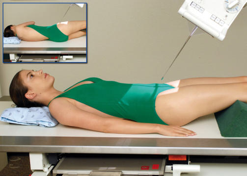
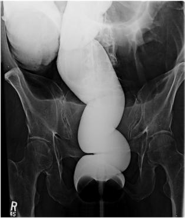
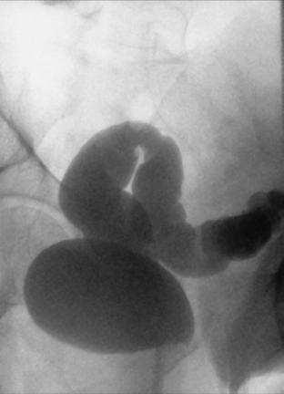

# Rx irigografie (clismă baritată), incidență AP axială sau AP axială oblică (LPO)

  📷 Radiografie Convențională (Rx)
  <strong>Actualizat:</strong> 2026-09-15
  <strong>Autor:</strong> Departamentul de Radiologie / Referință Bontrager

---

-   __1. Rezumat Clinic & Indicații__

    ---

    === "Indicații Clinice"

        - Polipi sau alte procese patologice în regiunea rectosigmoidiană a intestinului gros (colon)

    === "Ghid Național IRIS"

        !!! info "Referință Primară: Ghidul Național IRIS (Ordinul MS 1342/2012)"
            - **Capitol Ghid IRIS:** *Aparat digestiv & Abdomen*
            - **Grad de Recomandare:** **Grad B**
            - **Nivel de Iradiere Estimată:** `Clasa 2 (Foarte mică ~ 0.7 - 1.2 mSv)`

            [:octicons-search-16: Deschide Ghidul IRIS](../../iris.md){ .md-button .md-button--primary } [:material-open-in-new: Aplicația Oficială PWA](https://radiologie-pediatrica.ro/iris/){ .md-button target="_blank" rel="noopener" }

-   __2. Poziționare & Centrare Fascicul__

    ---

    - **Poziție Pacient:** Pacient: Poziționați pacientul în decubit dorsal sau rotit parțial în poziție oblică posterioară stângă (OPS / LPO), cu suport pentru cap (Fig. 13.84).; Regiune anatomică: AP axial: Poziționați pacientul în decubit dorsal și aliniați MSP cu linia mediană a mesei. Întindeți membrele inferioare; așezați brațele în jos, de-a lungul corpului, sau ridicate peste torace; asigurați absența rotației anatomice: clavicule echidistante față de linia apofizelor spinoase. LPO: Rotiți pacientul cu 30° la 40° în LPO (partea posterioară stângă în jos). Ridicați brațul drept, cu brațul stâng întins și genunchiul drept parțial flectat.
    - **Punct de Centrare Fascicul:** Raza centrală se înclină 30°–40° cranial (spre cap). AP: Orientați raza centrală la 2 țoli (5 cm) inferior de nivelul spinei iliace antero-superioare (SIAS) și pe MSP. LPO: Orientați raza centrală la 2 țoli (5 cm) inferior și la 2 țoli (5 cm) medial de spina iliacă antero-superioară (SIAS) dreaptă. Se centrează receptorul de imagine pe raza centrală.
    - **Distanță Focar-Film (DFF / SID):** 100 cm
    - **Comandă Respiratorie:** Apnee la sfârșitul expirului pe durata expunerii.

-   __3. Parametri Tehnici Expunere__

    ---

    | Parametru Tehnic | Valoare Configurare Generator / Tub |
    |:-----------------|:-------------------------------------|
    | **Tensiune Tub (kV)** | 110-125 kV |
    | **Sarcină / Produs Curent-Timp (mAs)** | DE CONFIGURAT PE APARAT |
    | **Distanță Focar-Film (DFF / SID)** | 100 cm |
    | **Grilă Antidifuzoare (Bucky)** | Cu grilă antidifuzoare Bucky |
    | **Dimensiune Focar** | Focar Mare (1.0 - 1.2 mm) |
    | **Camere de Ionizare AEC** | Camerele laterale (sau camera centrală, în funcție de regiune) |
    | **Colimare Fascicul** | Colimare strictă pe regiunea anatomică de interes diagnostic |
    | **Filtrare Tub** | Totală ≥ 2.5 mm Al echivalent |

-   __4. Criterii de Calitate & Reușită Imagine__

    ---

    - Segmentele rectosigmoidiene trebuie să fie vizibile alungite în proiecție, cu o suprapunere mai redusă a anselor sigmoidiene decât într-o incidență antero-posterioară (AP) la 90°. Poziție:
    - AP axial: Angularea adecvată a razei centrale este evidențiată prin alungirea segmentelor rectosigmoidiene ale intestinului gros (colon) (Fig. 13.85).
    - LPo axial: Angularea adecvată a razei centrale și poziția oblică adecvată a pacientului sunt evidențiate prin alungirea și suprapunerea mai redusă a segmentelor rectosigmoidiene ale intestinului gros (colon) (Fig. 13.86).
    - Se aplică o colimare corectă a dimensiunilor câmpului. Expunere:
    - Expunere optimă a receptorului de imagine și contrast optim pentru vizualizarea contururilor tuturor segmentelor rectosigmoidiene ale intestinului gros (colon).
    - Marginile nete ale structurilor indică absența mișcării. Fig. 13.84 AP axial—raza centrală înclinată 30° la 40° cranial. În casetă, LPO la 30° la 40°. Fig. 13.85 AP axial. Colon sigmoid Rect R Fig. 13.86 AP axial oblic (LPO).

-   __5. Protecție Radiologică (ALARA)__

    ---

    - Ecranare gonadică și a organelor radiosensibile conform procedurilor locale de radioprotecție ALARA.
    - Colimare strictă la aria de interes pentru limitarea radiației difuze.
    - Verificarea posibilității unei sarcini la pacientele de vârstă fertilă înainte de expunere.

!!! note "Observații Clinice & Tehnice"
    Procedați cât mai rapid posibil. Incidențe similare pot fi obținute în PA axial și RAO, cu raza centrală înclinată caudal la un unghi de 30° la 40° (vezi pagina următoare). Irigografie (clismă baritată) SPECIALĂ AP sau LPO axial

### 🖼️ Imagini

<figure class="protocol-image-card" markdown>

<figcaption><strong>Fig. 13.84 AP axial—raza centrală înclinată 30° la 40° cranial. În casetă, LPO la 30° la 40°.</strong> — Poziționarea pacientului conform Ghidului Bontrager (Fig. 13.84 AP axial—raza centrală înclinată 30° la 40° cranial. În casetă, LPO la 30° la 40°.)</figcaption>

</figure>

<figure class="protocol-image-card" markdown>

<figcaption><strong>Fig. 13.85 AP axial.</strong> — Aspect radiografic de referință conform Ghidului Bontrager (Fig. 13.85 AP axial.)</figcaption>

</figure>

<figure class="protocol-image-card" markdown>

<figcaption><strong>Fig. 13.86 AP axial oblic (LPO).</strong> — Aspect radiografic de referință conform Ghidului Bontrager (Fig. 13.86 AP axial oblic (LPO).)</figcaption>

</figure>

=== "Ghid Rapid de Execuție"

    1. **Identificarea și verificarea pacientului:** verificare identitate, zonă de examinat, consimțământ conform procedurii și evaluarea posibilității unei sarcini, când este relevantă.
    2. **Pregătire:** îndepărtarea oricăror obiecte radiopace (bijuterii, agrafe, fermoare, proteze, pansamente dense).
    3. **Poziționare precisă:** alinierea receptorului de imagine și a tubului la distanța prescrisă (100 cm).
    4. **Colimare strictă:** adaptarea fasciculului strict la regiunea de diagnostic pentru scăderea iradierii și reducerea radiației difuze.
    5. **Radioprotecție:** verificarea [politicii RX](../radioprotectie.md), cu măsuri distincte pentru pacient, personal și însoțitor.

## Surse de documentare

- [Bontrager's Textbook of Radiographic Positioning (Ed. 9/10), Pagina 549](https://www.elsevier.com/books/textbook-of-radiographic-positioning-and-related-anatomy/lampignano/978-0-323-65367-1)
