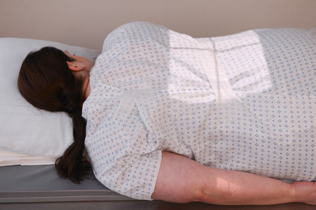
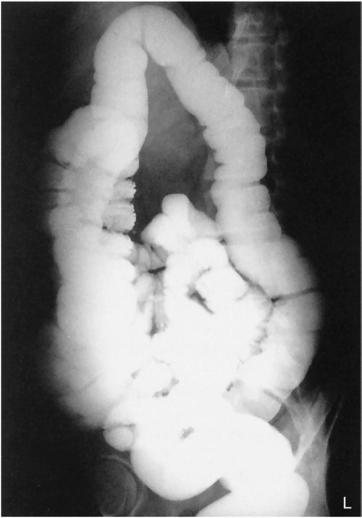
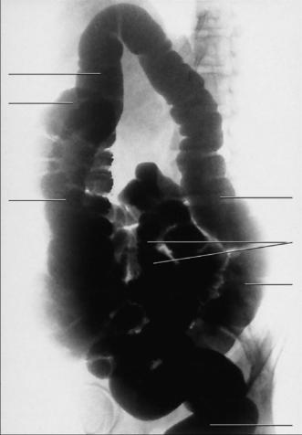

# Rx Irigografie (Clismă Baritată) LAO POSITION

  📷 Radiografie Convențională (Rx)
  <strong>Actualizat:</strong> 2026-09-15
  <strong>Autor:</strong> Departamentul de Radiologie / Referință Bontrager

---

-   __1. Rezumat Clinic & Indicații__

    ---

    === "Indicații Clinice"

        - Obstructions, including ileus dinamic sau mecanic, volvulus, and intussusception
        - Doublecontrast media Irigografie (Clismă Baritată) is ideal for demonstrating diverticulosis, polyps, and mucosal changes.

    === "Ghid Național IRIS"

        !!! info "Referință Primară: Ghidul Național IRIS (Ordinul MS 1342/2012)"
            - **Capitol Ghid IRIS:** *Ghidul Național IRIS*
            - **Grad de Recomandare:** **De verificat pe indicație; fără grad atribuit automat**
            - **Nivel de Iradiere Estimată:** `De verificat pentru examinarea și populația selectate`

            [:octicons-search-16: Deschide Ghidul IRIS](../../iris.md){ .md-button .md-button--primary } [:material-open-in-new: Aplicația Oficială PWA](https://radiologie-pediatrica.ro/iris/){ .md-button target="_blank" rel="noopener" }
-   __2. Poziționare & Centrare Fascicul__

    ---

    - **Poziție Pacient:** Pacient: Patient is semiprone, rotated into a 35° to 45° LAO, with a support for the head (Fig. 13.67).; Regiune anatomică: Align MSP along long axis of table, with right and left abdominal margins equidistant from centerline of table or CR. Place right arm up on pillow, with left arm down behind patient and right Genunchi partially flexed. Check posterior Bazin (Pelvis) and trunk for 35° to 45° rotation.
    - **Punct de Centrare Fascicul:** is perpendicular to IR, directed to a point about 1 inch (2.5 cm) to the right of MSP. Center CR and IR to 1 to 2 inches (2.5 to 5 cm) above creasta iliacă (corespunzător L4-L5) (see NOTE). Center cassette to CR.
    - **Distanță Focar-Film (DFF / SID):** 100 cm
    - **Comandă Respiratorie:** Suspend respiration and expose on expiration.

-   __3. Parametri Tehnici Expunere__

    ---

    | Parametru Tehnic | Valoare Configurare Generator / Tub |
    |:-----------------|:-------------------------------------|
    | **Tensiune Tub (kV)** | 110-125 kV |
    | **Sarcină / Produs Curent-Timp (mAs)** | DE CONFIGURAT PE APARAT |
    | **Distanță Focar-Film (DFF / SID)** | 100 cm |
    | **Grilă Antidifuzoare (Bucky)** | Cu grilă antidifuzoare Bucky |
    | **Dimensiune Focar** | Focar Mare (1.0 - 1.2 mm) |
    | **Camere de Ionizare AEC** | Camerele laterale (sau camera centrală funcție de regiune) |
    | **Colimare Fascicul** | Field Size Collimate on four sides to anatomy of interest. |
    | **Filtrare Tub** | Totală ≥ 2.5 mm Al echivalent |

-   __4. Criterii de Calitate & Reușită Imagine__

    ---

    - The left colic flexure should be seen as “open” without significant superimposition.
    - The descending colon should be well demonstrated.
    - The entire large intestine should be included (see NOTE) (Figs. 13.68 and 13.69). Position:
    - Spine is parallel to the edge of the radiograph (unless scolioză / vicii de postură ale coloanei is present).
    - The ala of the right ilium is elongated (if visible), whereas the left side is foreshortened; the left colic flexure is seen in profile.
    - Proper collimation field size is applied. Exposure:
    - Optimal image receptor exposure and contrast to visualize the contrastfilled large intestine without significant overexposure of any portion.
    - Sharp structural margins indicate no motion. Fig. 13.67 LAO position. Fig. 13.68 LAO (centered high to include L colic flexure). Ascending colon Transverse colon Descending colon Sigmoid colon Rectum L Descending colon Right colic flexure Fig. 13.69 LAO position.

-   __5. Protecție Radiologică (ALARA)__

    ---

    - Ecranare gonadică și a organelor radiosensibile conform procedurilor locale de radioprotecție ALARA.
    - Colimare strictă la aria de interes pentru limitarea radiației difuze.
    - Verificarea posibilității unei sarcini la pacientele de vârstă fertilă înainte de expunere.

!!! note "Observații Clinice & Tehnice"
    Most adult patients require about 2 inches (5 cm) higher centering to include the left colic flexure, which generally cuts off the lower large bowel; a second image centered 2 or 3 inches (5 to 7.5 cm) lower is required to include the rectal area. Irigografie (Clismă Baritată) ROUTINE PA or AP RAO LAO

### 🖼️ Imagini

<figure class="protocol-image-card" markdown>

<figcaption><strong>Fig. 13.67 LAO position.</strong> — Poziționare pacient conform Ghidului Bontrager (Fig. 13.67 LAO position.)</figcaption>

</figure>

<figure class="protocol-image-card" markdown>

<figcaption><strong>Fig. 13.68 LAO (centered high to include L colic flexure).</strong> — Aspect radiografic de referință conform Ghidului Bontrager (Fig. 13.68 LAO (centered high to include L colic flexure).)</figcaption>

</figure>

<figure class="protocol-image-card" markdown>

<figcaption><strong>Fig. 13.69 LAO position.</strong> — Aspect radiografic de referință conform Ghidului Bontrager (Fig. 13.69 LAO position.)</figcaption>

</figure>

=== "Ghid Rapid de Execuție"

    1. **Identificarea și verificarea pacientului:** verificare identitate, zonă de examinat, consimțământ conform procedurii și evaluarea posibilității unei sarcini, când este relevantă.
    2. **Pregătire:** îndepărtarea oricăror obiecte radiopace (bijuterii, agrafe, fermoare, proteze, pansamente dense).
    3. **Poziționare precisă:** alinierea receptorului de imagine și a tubului la distanța prescrisă (100 cm).
    4. **Colimare strictă:** adaptarea fasciculului strict la regiunea de diagnostic pentru scăderea iradierii și reducerea radiației difuze.
    5. **Radioprotecție:** verificarea [politicii RX](../radioprotectie.md), cu măsuri distincte pentru pacient, personal și însoțitor.

## Surse de documentare

- [Bontrager's Textbook of Radiographic Positioning (Ed. 9/10), Pagina 543](https://www.elsevier.com/books/textbook-of-radiographic-positioning-and-related-anatomy/lampignano/978-0-323-65367-1)
