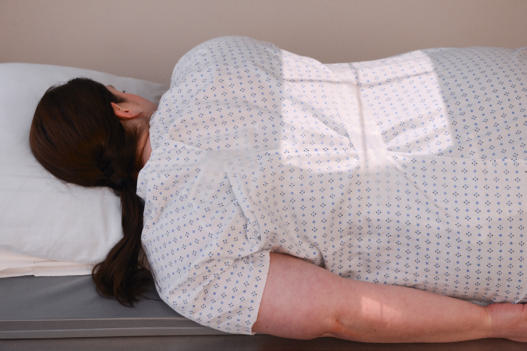
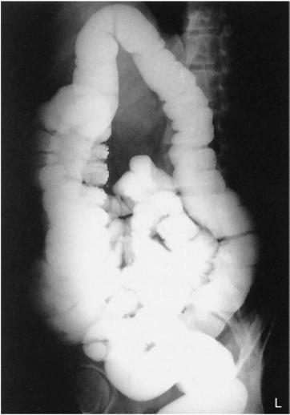
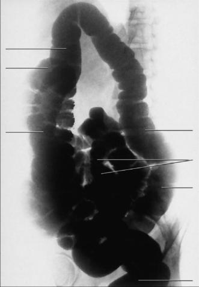

# Rx Irigografie (Clismă Baritată) Oblică Anterioară Stângă (OAS / LAO)

  📷 Radiografie Convențională (Rx)
  <strong>Actualizat:</strong> 2026-09-15
  <strong>Autor:</strong> Departamentul de Radiologie / Referință Bontrager

---

-   __1. Rezumat Clinic & Indicații__

    ---

    === "Indicații Clinice"

        - Obstrucții, inclusiv ileus dinamic sau mecanic, volvulus și invaginație intestinală
        - Irigografia (Clismă Baritată) cu dublu contrast este ideală pentru evidențierea diverticulozei, polipilor și modificărilor mucoasei.

    === "Ghid Național IRIS"

        !!! info "Referință Primară: Ghidul Național IRIS (Ordinul MS 1342/2012)"
            - **Capitol Ghid IRIS:** *Aparat digestiv & Abdomen*
            - **Grad de Recomandare:** **Grad B**
            - **Nivel de Iradiere Estimată:** `Clasa 2 (Foarte mică ~ 0.7 - 1.2 mSv)`

            [:octicons-search-16: Deschide Ghidul IRIS](../../iris.md){ .md-button .md-button--primary } [:material-open-in-new: Aplicația Oficială PWA](https://radiologie-pediatrica.ro/iris/){ .md-button target="_blank" rel="noopener" }

-   __2. Poziționare & Centrare Fascicul__

    ---

    - **Poziție Pacient:** Pacient: pacientul este în poziție semiventrală, rotit la 35° la 45° în LAO, cu sprijin pentru cap (Fig. 13.67).; Regiune anatomică: Aliniați MSP de-a lungul axei longitudinale a mesei, cu marginile abdominale dreaptă și stângă echidistante față de linia mediană a mesei sau de raza centrală. Așezați brațul drept în sus, pe pernă, iar brațul stâng în jos, în spatele pacientului, cu genunchiul drept parțial flectat. Verificați din posterior bazinul (pelvisul) și trunchiul pentru o rotație de 35° la 45°.
    - **Punct de Centrare Fascicul:** Este perpendiculară pe receptorul de imagine, orientată spre un punct situat la aproximativ 1 țol (2.5 cm) la dreapta MSP. Centrați raza centrală și receptorul de imagine la 1 la 2 țoli (2.5 la 5 cm) deasupra crestei iliace (corespunzător L4-L5) (vezi NOTA). Centrați caseta pe raza centrală.
    - **Distanță Focar-Film (DFF / SID):** 100 cm
    - **Comandă Respiratorie:** Apnee la sfârșitul expirului pe durata expunerii.

-   __3. Parametri Tehnici Expunere__

    ---

    | Parametru Tehnic | Valoare Configurare Generator / Tub |
    |:-----------------|:-------------------------------------|
    | **Tensiune Tub (kV)** | 110-125 kV |
    | **Sarcină / Produs Curent-Timp (mAs)** | DE CONFIGURAT PE APARAT |
    | **Distanță Focar-Film (DFF / SID)** | 100 cm |
    | **Grilă Antidifuzoare (Bucky)** | Cu grilă antidifuzoare Bucky |
    | **Dimensiune Focar** | Focar Mare (1.0 - 1.2 mm) |
    | **Camere de Ionizare AEC** | Camerele laterale (sau camera centrală, în funcție de regiune) |
    | **Colimare Fascicul** | Dimensiunea câmpului Colimați pe cele patru laturi la regiunea anatomică de interes. |
    | **Filtrare Tub** | Totală ≥ 2.5 mm Al echivalent |

-   __4. Criterii de Calitate & Reușită Imagine__

    ---

    - Flexura colică stângă trebuie să fie vizibilă ca „deschisă”, fără suprapunere semnificativă.
    - Colonul descendent trebuie să fie bine evidențiat.
    - Întregul intestin gros (colon) trebuie să fie inclus (vezi NOTA) (Fig. 13.68 și 13.69). Poziție:
    - Coloana vertebrală este paralelă cu marginea radiografiei (cu excepția cazului în care sunt prezente scolioza / viciile de postură ale coloanei).
    - Aripa iliacă dreaptă este alungită (dacă este vizibilă), în timp ce partea stângă apare scurtată; flexura colică stângă este vizibilă din profil.
    - Se aplică o colimare corectă a dimensiunilor câmpului. Expunere:
    - Expunere optimă a receptorului de imagine și contrast optim pentru vizualizarea intestinului gros (colon) umplut cu substanță de contrast, fără supraexpunerea semnificativă a vreunei porțiuni.
    - Marginile nete ale structurilor indică absența mișcării. Fig. 13.67 poziție oblică anterioară stângă (OAS / LAO). Fig. 13.68 LAO (centrată sus pentru a include flexura colică stângă). Colon ascendent Colon transvers Colon descendent Colon sigmoid Rect Stânga Colon descendent Flexura colică dreaptă Fig. 13.69 poziție oblică anterioară stângă (OAS / LAO).

-   __5. Protecție Radiologică (ALARA)__

    ---

    - Ecranare gonadică și a organelor radiosensibile conform procedurilor locale de radioprotecție ALARA.
    - Colimare strictă la aria de interes pentru limitarea radiației difuze.
    - Verificarea posibilității unei sarcini la pacientele de vârstă fertilă înainte de expunere.

!!! note "Observații Clinice & Tehnice"
    La majoritatea pacienților adulți este necesară centrarea cu aproximativ 2 țoli (5 cm) mai sus pentru a include flexura colică stângă, ceea ce exclude în general porțiunea inferioară a intestinului gros (colon); este necesară o a doua imagine, centrată cu 2 sau 3 țoli (5 la 7.5 cm) mai jos, pentru a include regiunea rectală. Irigografie (Clismă Baritată) DE RUTINĂ PA sau AP RAO LAO

### 🖼️ Imagini

<figure class="protocol-image-card" markdown>

<figcaption><strong>Fig. 13.67 poziție oblică anterioară stângă (OAS / LAO).</strong> — Poziționare pacient conform Ghidului Bontrager (Fig. 13.67 poziție oblică anterioară stângă (OAS / LAO).)</figcaption>

</figure>

<figure class="protocol-image-card" markdown>

<figcaption><strong>Fig. 13.68 LAO (centrată sus pentru a include flexura colică stângă).</strong> — Aspect radiografic de referință conform Ghidului Bontrager (Fig. 13.68 LAO (centrată sus pentru a include flexura colică stângă).)</figcaption>

</figure>

<figure class="protocol-image-card" markdown>

<figcaption><strong>Fig. 13.69 poziție oblică anterioară stângă (OAS / LAO).</strong> — Aspect radiografic de referință conform Ghidului Bontrager (Fig. 13.69 poziție oblică anterioară stângă (OAS / LAO).)</figcaption>

</figure>

=== "Ghid Rapid de Execuție"

    1. **Identificarea și verificarea pacientului:** verificare identitate, zonă de examinat, consimțământ conform procedurii și evaluarea posibilității unei sarcini, când este relevantă.
    2. **Pregătire:** îndepărtarea oricăror obiecte radiopace (bijuterii, agrafe, fermoare, proteze, pansamente dense).
    3. **Poziționare precisă:** alinierea receptorului de imagine și a tubului la distanța prescrisă (100 cm).
    4. **Colimare strictă:** adaptarea fasciculului strict la regiunea de diagnostic pentru scăderea iradierii și reducerea radiației difuze.
    5. **Radioprotecție:** verificarea [politicii RX](../radioprotectie.md), cu măsuri distincte pentru pacient, personal și însoțitor.

## Surse de documentare

- [Bontrager's Textbook of Radiographic Positioning (Ed. 9/10), Pagina 543](https://www.elsevier.com/books/textbook-of-radiographic-positioning-and-related-anatomy/lampignano/978-0-323-65367-1)
