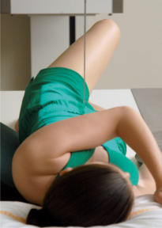
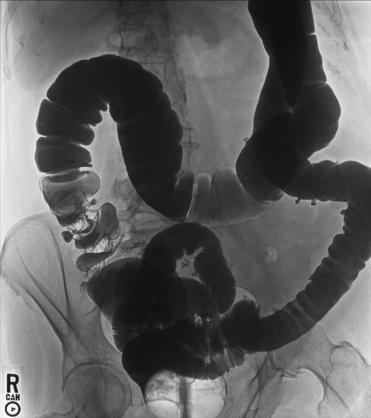
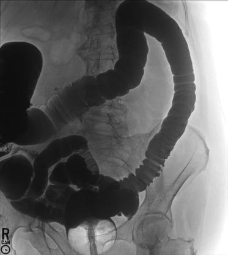

# Rx Irigografie (Clismă Baritată) LPO AND RPO POSITIONS

  📷 Radiografie Convențională (Rx)
  <strong>Actualizat:</strong> 2026-09-15
  <strong>Autor:</strong> Departamentul de Radiologie / Referință Bontrager

---

-   __1. Rezumat Clinic & Indicații__

    ---

    === "Indicații Clinice"

        - Obstructions, including ileus dinamic sau mecanic, volvulus, and intussusception
        - Doublecontrast Irigografie (Clismă Baritată) is ideal for demonstrating diverticulosis, polyps, and mucosal changes.

    === "Ghid Național IRIS"

        !!! info "Referință Primară: Ghidul Național IRIS (Ordinul MS 1342/2012)"
            - **Capitol Ghid IRIS:** *Ghidul Național IRIS*
            - **Grad de Recomandare:** **De verificat pe indicație; fără grad atribuit automat**
            - **Nivel de Iradiere Estimată:** `De verificat pentru examinarea și populația selectate`

            [:octicons-search-16: Deschide Ghidul IRIS](../../iris.md){ .md-button .md-button--primary } [:material-open-in-new: Aplicația Oficială PWA](https://radiologie-pediatrica.ro/iris/){ .md-button target="_blank" rel="noopener" }
-   __2. Poziționare & Centrare Fascicul__

    ---

    - **Poziție Pacient:** Pacient: Patient is semisupine, rotated 35° to 45° into right and left posterior obliques, with a support for the head.; Regiune anatomică: Flex elevatedside Cot and place in front of head; place opposite arm down by patient’s side (Fig. 13.70). Partially flex elevatedside Genunchi to maintain this position. Align MSP along long axis of table, with right and left abdominal margins equidistant from centerline of table.
    - **Punct de Centrare Fascicul:** Direct Raza centrală (RC) perpendiculară pe receptorul de imagine. Angle CR and center of IR to level of creasta iliacă (corespunzător L4-L5)s and about 1 inch (2.5 cm) lateral to elevated side of MSP (see NOTE).
    - **Distanță Focar-Film (DFF / SID):** 100 cm
    - **Comandă Respiratorie:** Expose on expiration.

-   __3. Parametri Tehnici Expunere__

    ---

    | Parametru Tehnic | Valoare Configurare Generator / Tub |
    |:-----------------|:-------------------------------------|
    | **Tensiune Tub (kV)** | 110-125 kV |
    | **Sarcină / Produs Curent-Timp (mAs)** | DE CONFIGURAT PE APARAT |
    | **Distanță Focar-Film (DFF / SID)** | 100 cm |
    | **Grilă Antidifuzoare (Bucky)** | Cu grilă antidifuzoare Bucky |
    | **Dimensiune Focar** | Focar Mare (1.0 - 1.2 mm) |
    | **Camere de Ionizare AEC** | Camerele laterale (sau camera centrală funcție de regiune) |
    | **Colimare Fascicul** | Field Size Collimate on four sides to anatomy of interest. |
    | **Filtrare Tub** | Totală ≥ 2.5 mm Al echivalent |

-   __4. Criterii de Calitate & Reușită Imagine__

    ---

    - LPo: The right colic (hepatic) flexure and the ascending and rectosigmoid portions should appear “open” without significant superimposition (Fig. 13.71).
    - RPo: The left colic (splenic) flexure and the descending portions should appear “open” without significant superimposition (Fig. 13.72). (A second IR centered lower to include the rectal area is required on most adult patients if this area is to be included on these postfluoroscopy radiographs).
    - The rectal ampulla should be included on the lower margins of the radiograph.
    - Entire contrastfilled large intestine, including the rectal ampulla, should be included (see

-   __5. Protecție Radiologică (ALARA)__

    ---

    - Ecranare gonadică și a organelor radiosensibile conform procedurilor locale de radioprotecție ALARA.
    - Colimare strictă la aria de interes pentru limitarea radiației difuze.
    - Verificarea posibilității unei sarcini la pacientele de vârstă fertilă înainte de expunere.

!!! note "Observații Clinice & Tehnice"
    ). Position: LPo: No tilt is evident, and spine is parallel to the edge of the radiograph. The ala of the left ilium is elongated, and the right side is foreshortened. RPo: No tilt is present; spine is parallel to the edge of the radiograph. The ala of the right ilium is elongated, and the left side is foreshortened. Proper collimation field size is applied. Exposure: Optimal image receptor exposure and contrast to visualize the contrastfilled large intestine without significant overexposure of any portion. Sharp structural margins indicate no motion. B A Fig. 13.70 (A) LPO. (B) RPO. Left colic flexure Fig. 13.72 RPO—for left colic flexure. (Image centered to demonstrate left colic flexure.)

### 🖼️ Imagini

<figure class="protocol-image-card" markdown>

<figcaption><strong>Fig. 13.71 LPO—for right colic flexure. (Image centered low to</strong> — Poziționare pacient conform Ghidului Bontrager (Fig. 13.71 LPO—for right colic flexure. (Image centered low to)</figcaption>

</figure>

<figure class="protocol-image-card" markdown>

<figcaption><strong>Fig. 13.70 (A) LPO. (B) RPO.</strong> — Aspect radiografic de referință conform Ghidului Bontrager (Fig. 13.70 (A) LPO. (B) RPO.)</figcaption>

</figure>

<figure class="protocol-image-card" markdown>

<figcaption><strong>Fig. 13.72 RPO—for left colic flexure. (Image centered to demonstrate</strong> — Aspect radiografic de referință conform Ghidului Bontrager (Fig. 13.72 RPO—for left colic flexure. (Image centered to demonstrate)</figcaption>

</figure>

<figure class="protocol-image-card" markdown>

<figcaption><strong>Figura 4</strong> — Aspect radiografic de referință conform Ghidului Bontrager (Figura 4)</figcaption>

</figure>

=== "Ghid Rapid de Execuție"

    1. **Identificarea și verificarea pacientului:** verificare identitate, zonă de examinat, consimțământ conform procedurii și evaluarea posibilității unei sarcini, când este relevantă.
    2. **Pregătire:** îndepărtarea oricăror obiecte radiopace (bijuterii, agrafe, fermoare, proteze, pansamente dense).
    3. **Poziționare precisă:** alinierea receptorului de imagine și a tubului la distanța prescrisă (100 cm).
    4. **Colimare strictă:** adaptarea fasciculului strict la regiunea de diagnostic pentru scăderea iradierii și reducerea radiației difuze.
    5. **Radioprotecție:** verificarea [politicii RX](../radioprotectie.md), cu măsuri distincte pentru pacient, personal și însoțitor.

## Surse de documentare

- [Bontrager's Textbook of Radiographic Positioning (Ed. 9/10), Pagina 544](https://www.elsevier.com/books/textbook-of-radiographic-positioning-and-related-anatomy/lampignano/978-0-323-65367-1)
