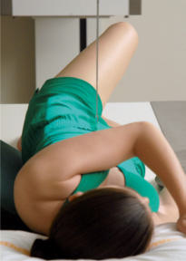
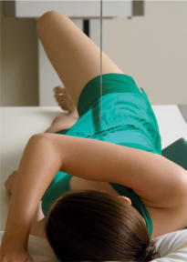
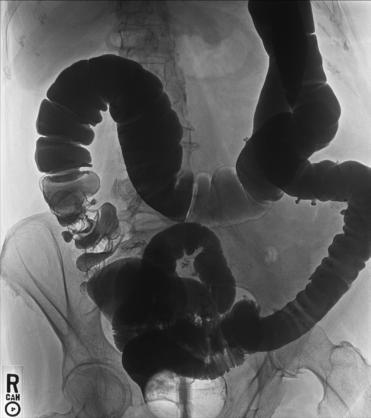
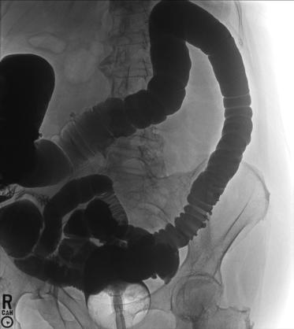

# Rx Irigografie (Clismă Baritată) LPO ȘI Oblică Posterioară Dreaptă (OPD / RPO)

  📷 Radiografie Convențională (Rx)
  <strong>Actualizat:</strong> 2026-09-15
  <strong>Autor:</strong> Departamentul de Radiologie / Referință Bontrager

---

-   __1. Rezumat Clinic & Indicații__

    ---

    === "Indicații Clinice"

        - Obstrucții, inclusiv ileus dinamic sau mecanic, volvulus și invaginație intestinală
        - Irigografia (Clismă Baritată) cu dublu contrast este ideală pentru evidențierea diverticulozei, polipilor și modificărilor mucoasei.

    === "Ghid Național IRIS"

        !!! info "Referință Primară: Ghidul Național IRIS (Ordinul MS 1342/2012)"
            - **Capitol Ghid IRIS:** *Aparat digestiv & Abdomen*
            - **Grad de Recomandare:** **Grad B**
            - **Nivel de Iradiere Estimată:** `Clasa 2 (Foarte mică ~ 0.7 - 1.2 mSv)`

            [:octicons-search-16: Deschide Ghidul IRIS](../../iris.md){ .md-button .md-button--primary } [:material-open-in-new: Aplicația Oficială PWA](https://radiologie-pediatrica.ro/iris/){ .md-button target="_blank" rel="noopener" }

-   __2. Poziționare & Centrare Fascicul__

    ---

    - **Poziție Pacient:** Pacient: pacientul este în poziție semidorsală, rotit cu 35° la 45° în pozițiile oblice posterioare dreaptă și stângă, cu sprijin pentru cap.; Regiune anatomică: Flectați cotul de pe partea ridicată și așezați-l în fața capului; așezați brațul opus în jos, de-a lungul corpului pacientului (Fig. 13.70). Flectați parțial genunchiul de pe partea ridicată pentru a menține această poziție. Aliniați MSP de-a lungul axei longitudinale a mesei, cu marginile abdominale dreaptă și stângă echidistante față de linia mediană a mesei.
    - **Punct de Centrare Fascicul:** Direcționați raza centrală (RC) perpendicular pe receptorul de imagine. Înclinați raza centrală și poziționați centrul receptorului de imagine la nivelul crestei iliace (corespunzător L4-L5) și la aproximativ 1 țol (2.5 cm) lateral de MSP, spre partea ridicată (vezi NOTA).
    - **Distanță Focar-Film (DFF / SID):** 100 cm
    - **Comandă Respiratorie:** Efectuați expunerea în expir.

-   __3. Parametri Tehnici Expunere__

    ---

    | Parametru Tehnic | Valoare Configurare Generator / Tub |
    |:-----------------|:-------------------------------------|
    | **Tensiune Tub (kV)** | 110-125 kV |
    | **Sarcină / Produs Curent-Timp (mAs)** | DE CONFIGURAT PE APARAT |
    | **Distanță Focar-Film (DFF / SID)** | 100 cm |
    | **Grilă Antidifuzoare (Bucky)** | Cu grilă antidifuzoare Bucky |
    | **Dimensiune Focar** | Focar Mare (1.0 - 1.2 mm) |
    | **Camere de Ionizare AEC** | Camerele laterale (sau camera centrală, în funcție de regiune) |
    | **Colimare Fascicul** | Dimensiunea câmpului Colimați pe cele patru laturi la regiunea anatomică de interes. |
    | **Filtrare Tub** | Totală ≥ 2.5 mm Al echivalent |

-   __4. Criterii de Calitate & Reușită Imagine__

    ---

    - LPo: flexura colică dreaptă (hepatică) și porțiunile ascendentă și rectosigmoidiană trebuie să apară „deschise”, fără suprapunere semnificativă (Fig. 13.71).
    - RPo: flexura colică stângă (splenică) și porțiunile descendente trebuie să apară „deschise”, fără suprapunere semnificativă (Fig. 13.72). (La majoritatea pacienților adulți este necesar un al doilea receptor de imagine, centrat mai jos pentru a include regiunea rectală, dacă această regiune trebuie inclusă pe aceste radiografii efectuate după fluoroscopie).
    - Ampula rectală trebuie să fie inclusă la marginile inferioare ale radiografiei.
    - Întregul intestin gros (colon) umplut cu substanță de contrast, inclusiv ampula rectală, trebuie să fie inclus (vezi

-   __5. Protecție Radiologică (ALARA)__

    ---

    - Ecranare gonadică și a organelor radiosensibile conform procedurilor locale de radioprotecție ALARA.
    - Colimare strictă la aria de interes pentru limitarea radiației difuze.
    - Verificarea posibilității unei sarcini la pacientele de vârstă fertilă înainte de expunere.

!!! note "Observații Clinice & Tehnice"
    ). Poziție: LPo: nu se observă înclinare, iar coloana vertebrală este paralelă cu marginea radiografiei. Aripa iliacă stângă este alungită, iar partea dreaptă apare scurtată. RPo: nu există înclinare; coloana vertebrală este paralelă cu marginea radiografiei. Aripa iliacă dreaptă este alungită, iar partea stângă apare scurtată. Se aplică dimensiunea corectă a câmpului de colimare. Expunere: expunere optimă a receptorului de imagine și contrast optim pentru vizualizarea intestinului gros (colon) umplut cu substanță de contrast, fără supraexpunerea semnificativă a vreunei porțiuni. Marginile nete ale structurilor indică absența mișcării. B Fig. 13.70 (A) LPO. (B) RPO. Flexura colică stângă Fig. 13.72 RPO—pentru flexura colică stângă. (Imagine centrată pentru a evidenția flexura colică stângă.)

### 🖼️ Imagini

<figure class="protocol-image-card" markdown>

<figcaption><strong>Fig. 13.71 LPO—pentru flexura colică dreaptă. (Imagine centrată jos pentru a</strong> — Poziționare pacient conform Ghidului Bontrager (Fig. 13.71 LPO—pentru flexura colică dreaptă. (Imagine centrată jos pentru a)</figcaption>

</figure>

<figure class="protocol-image-card" markdown>

<figcaption><strong>Fig. 13.70 (A) LPO. (B) RPO.</strong> — Aspect radiografic de referință conform Ghidului Bontrager (Fig. 13.70 (A) LPO. (B) RPO.)</figcaption>

</figure>

<figure class="protocol-image-card" markdown>

<figcaption><strong>Fig. 13.72 RPO—pentru flexura colică stângă. (Imagine centrată pentru a evidenția</strong> — Aspect radiografic de referință conform Ghidului Bontrager (Fig. 13.72 RPO—pentru flexura colică stângă. (Imagine centrată pentru a evidenția)</figcaption>

</figure>

<figure class="protocol-image-card" markdown>

<figcaption><strong>Figura 4</strong> — Aspect radiografic de referință conform Ghidului Bontrager (Figura 4)</figcaption>

</figure>

=== "Ghid Rapid de Execuție"

    1. **Identificarea și verificarea pacientului:** verificare identitate, zonă de examinat, consimțământ conform procedurii și evaluarea posibilității unei sarcini, când este relevantă.
    2. **Pregătire:** îndepărtarea oricăror obiecte radiopace (bijuterii, agrafe, fermoare, proteze, pansamente dense).
    3. **Poziționare precisă:** alinierea receptorului de imagine și a tubului la distanța prescrisă (100 cm).
    4. **Colimare strictă:** adaptarea fasciculului strict la regiunea de diagnostic pentru scăderea iradierii și reducerea radiației difuze.
    5. **Radioprotecție:** verificarea [politicii RX](../radioprotectie.md), cu măsuri distincte pentru pacient, personal și însoțitor.

## Surse de documentare

- [Bontrager's Textbook of Radiographic Positioning (Ed. 9/10), Pagina 544](https://www.elsevier.com/books/textbook-of-radiographic-positioning-and-related-anatomy/lampignano/978-0-323-65367-1)
