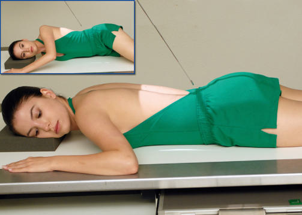
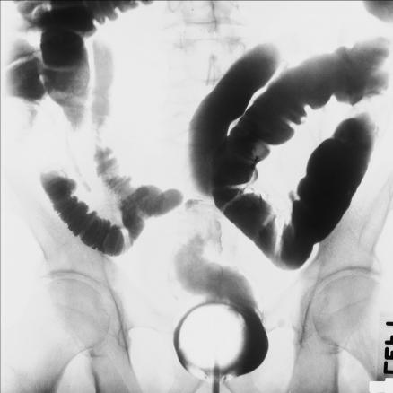
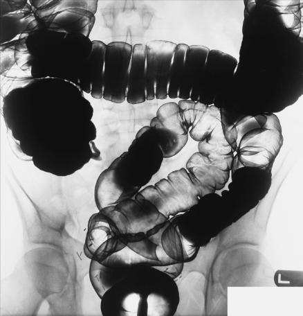

# Rx Irigografie (Clismă Baritată) PA AXIAL OR PA AXIAL OBLIQUE (RAO) PROJECTIONS

  📷 Radiografie Convențională (Rx)
  <strong>Actualizat:</strong> 2026-09-15
  <strong>Autor:</strong> Departamentul de Radiologie / Referință Bontrager

---

-   __1. Rezumat Clinic & Indicații__

    ---

    === "Indicații Clinice"

        - Polyps or other pathologic processes in the rectosigmoid aspect of the large intestine

    === "Ghid Național IRIS"

        !!! info "Referință Primară: Ghidul Național IRIS (Ordinul MS 1342/2012)"
            - **Capitol Ghid IRIS:** *Ghidul Național IRIS*
            - **Grad de Recomandare:** **De verificat pe indicație; fără grad atribuit automat**
            - **Nivel de Iradiere Estimată:** `De verificat pentru examinarea și populația selectate`

            [:octicons-search-16: Deschide Ghidul IRIS](../../iris.md){ .md-button .md-button--primary } [:material-open-in-new: Aplicația Oficială PWA](https://radiologie-pediatrica.ro/iris/){ .md-button target="_blank" rel="noopener" }
-   __2. Poziționare & Centrare Fascicul__

    ---

    - **Poziție Pacient:** Pacient: Position patient Decubit Ventral or partially rotated into an RAO position, with a support for the head (Fig. 13.87).; Regiune anatomică: PA Position patient Decubit Ventral and align MSP to midline of table. Place arms up beside head or down by sides away from body. Ensure Absența rotației anatomice: clavicule echidistante față de linia apofizelor spinoase of Bazin (Pelvis) or trunk. RAO Rotate patient 35° to 45° into RAo (right anterior side down). Place left arm up, with right arm down by side and left Genunchi partially flexed.
    - **Punct de Centrare Fascicul:** Angle CR 30° to 40° caudad. PA Align CR to exit at level of ASIS and MSP. RAO Align CR to exit at level of ASIS and 2 inches (5 cm) to left of lumbar spinous processes. Center IR to CR.
    - **Distanță Focar-Film (DFF / SID):** 100 cm
    - **Comandă Respiratorie:** Suspend respiration and expose on expiration.

-   __3. Parametri Tehnici Expunere__

    ---

    | Parametru Tehnic | Valoare Configurare Generator / Tub |
    |:-----------------|:-------------------------------------|
    | **Tensiune Tub (kV)** | 110-125 kV |
    | **Sarcină / Produs Curent-Timp (mAs)** | DE CONFIGURAT PE APARAT |
    | **Distanță Focar-Film (DFF / SID)** | 100 cm |
    | **Grilă Antidifuzoare (Bucky)** | Cu grilă antidifuzoare Bucky |
    | **Dimensiune Focar** | Focar Mare (1.0 - 1.2 mm) |
    | **Camere de Ionizare AEC** | Camerele laterale (sau camera centrală funcție de regiune) |
    | **Colimare Fascicul** | Field Size Collimate on four sides to anatomy of interest. |
    | **Filtrare Tub** | Totală ≥ 2.5 mm Al echivalent |

-   __4. Criterii de Calitate & Reușită Imagine__

    ---

    - Elongated views of rectosigmoid segments of the large intestine are shown without excessive superimposition (Fig. 13.88).
    - The doublecontrast study best visualizes this region of overlapping loops of bowel (Fig. 13.89). Position:
    - Adequate CR angulation and patient obliquity on the oblique are evidenced by elongation and less superimposition of rectosigmoid segments of large intestine.
    - Proper collimation field size is applied. Exposure:
    - Optimal image receptor exposure and contrast to visualize outlines of all rectosigmoid segments of the large intestine without overpenetrating the airfilled outlines of these segments of large intestine with aircontrast study.
    - Sharp structural margins indicate no motion. Sigmoid colon Rectum Fig. 13.88 PA axial (singlecontrast study). Appendix Sigmoid colon Rectum Transverse colon Cecum Fig. 13.89 PA axial (doublecontrast study).

-   __5. Protecție Radiologică (ALARA)__

    ---

    - Ecranare gonadică și a organelor radiosensibile conform procedurilor locale de radioprotecție ALARA.
    - Colimare strictă la aria de interes pentru limitarea radiației difuze.
    - Verificarea posibilității unei sarcini la pacientele de vârstă fertilă înainte de expunere.

!!! note "Observații Clinice & Tehnice"
    Proceed as rapidly as possible. Similar views of rectosigmoid region—AP and LPO with 30° to 40° cephalad angle—are described on the preceding pages. Fig. 13.87 PA axial—CR 30° to 40° caudad. Inset, RAO axial. Irigografie (Clismă Baritată) SPECIAL AP or LPO axial PA or RAO axial

### 🖼️ Imagini

<figure class="protocol-image-card" markdown>

<figcaption><strong>Fig. 13.87 PA axial—CR 30° to 40° caudad. Inset, RAO axial.</strong> — Poziționare pacient conform Ghidului Bontrager (Fig. 13.87 PA axial—CR 30° to 40° caudad. Inset, RAO axial.)</figcaption>

</figure>

<figure class="protocol-image-card" markdown>

<figcaption><strong>Fig. 13.88 PA axial (single-</strong> — Aspect radiografic de referință conform Ghidului Bontrager (Fig. 13.88 PA axial (single-)</figcaption>

</figure>

<figure class="protocol-image-card" markdown>

<figcaption><strong>Fig. 13.89 PA axial (double-</strong> — Aspect radiografic de referință conform Ghidului Bontrager (Fig. 13.89 PA axial (double-)</figcaption>

</figure>

=== "Ghid Rapid de Execuție"

    1. **Identificarea și verificarea pacientului:** verificare identitate, zonă de examinat, consimțământ conform procedurii și evaluarea posibilității unei sarcini, când este relevantă.
    2. **Pregătire:** îndepărtarea oricăror obiecte radiopace (bijuterii, agrafe, fermoare, proteze, pansamente dense).
    3. **Poziționare precisă:** alinierea receptorului de imagine și a tubului la distanța prescrisă (100 cm).
    4. **Colimare strictă:** adaptarea fasciculului strict la regiunea de diagnostic pentru scăderea iradierii și reducerea radiației difuze.
    5. **Radioprotecție:** verificarea [politicii RX](../radioprotectie.md), cu măsuri distincte pentru pacient, personal și însoțitor.

## Surse de documentare

- [Bontrager's Textbook of Radiographic Positioning (Ed. 9/10), Pagina 550](https://www.elsevier.com/books/textbook-of-radiographic-positioning-and-related-anatomy/lampignano/978-0-323-65367-1)
