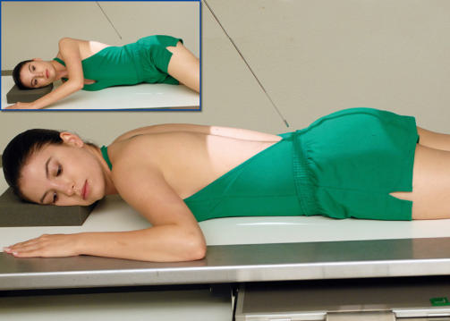
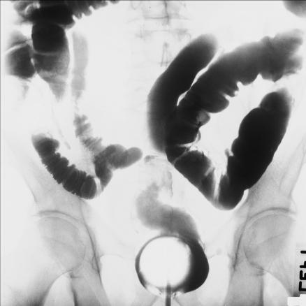
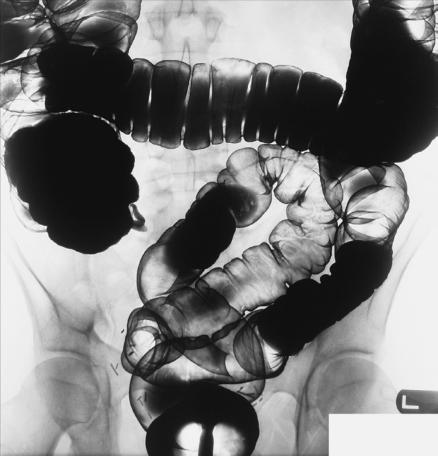

# Rx Irigografie (Clismă Baritată) Incidență PA AXIALĂ SAU PA AXIALĂ OBLICĂ (RAO)

  📷 Radiografie Convențională (Rx)
  <strong>Actualizat:</strong> 2026-09-15
  <strong>Autor:</strong> Departamentul de Radiologie / Referință Bontrager

---

-   __1. Rezumat Clinic & Indicații__

    ---

    === "Indicații Clinice"

        - Polipi sau alte procese patologice în regiunea rectosigmoidiană a intestinului gros (colon)

    === "Ghid Național IRIS"

        !!! info "Referință Primară: Ghidul Național IRIS (Ordinul MS 1342/2012)"
            - **Capitol Ghid IRIS:** *Ghidul Național IRIS*
            - **Grad de Recomandare:** **De verificat pe indicație; fără grad atribuit automat**
            - **Nivel de Iradiere Estimată:** `De verificat pentru examinarea și populația selectate`

            [:octicons-search-16: Deschide Ghidul IRIS](../../iris.md){ .md-button .md-button--primary } [:material-open-in-new: Aplicația Oficială PWA](https://radiologie-pediatrica.ro/iris/){ .md-button target="_blank" rel="noopener" }
-   __2. Poziționare & Centrare Fascicul__

    ---

    - **Poziție Pacient:** Pacient: poziționați pacientul în decubit ventral sau parțial rotit în poziție oblică anterioară dreaptă (OAD / RAO), cu sprijin pentru cap (Fig. 13.87).; Regiune anatomică: PA Poziționați pacientul în decubit ventral și aliniați MSP cu linia mediană a mesei. Așezați brațele în sus, lângă cap, sau în jos, de-a lungul corpului, la distanță de acesta. Asigurați absența rotației anatomice a bazinului (pelvisului) sau a trunchiului: clavicule echidistante față de linia apofizelor spinoase. RAO Rotiți pacientul cu 35° la 45° în RAo (partea anterioară dreaptă în jos). Așezați brațul stâng în sus, iar brațul drept în jos, de-a lungul corpului, cu genunchiul stâng parțial flectat.
    - **Punct de Centrare Fascicul:** Raza centrală se înclină 30°–40° caudal (spre picioare). PA Aliniați raza centrală astfel încât să iasă la nivelul spinei iliace antero-superioare (SIAS) și al MSP. RAO Aliniați raza centrală astfel încât să iasă la nivelul spinei iliace antero-superioare (SIAS) și la 2 țoli (5 cm) la stânga apofizelor spinoase lombare. Se centrează receptorul de imagine pe raza centrală.
    - **Distanță Focar-Film (DFF / SID):** 100 cm
    - **Comandă Respiratorie:** Apnee la sfârșitul expirului pe durata expunerii.

-   __3. Parametri Tehnici Expunere__

    ---

    | Parametru Tehnic | Valoare Configurare Generator / Tub |
    |:-----------------|:-------------------------------------|
    | **Tensiune Tub (kV)** | 110-125 kV |
    | **Sarcină / Produs Curent-Timp (mAs)** | DE CONFIGURAT PE APARAT |
    | **Distanță Focar-Film (DFF / SID)** | 100 cm |
    | **Grilă Antidifuzoare (Bucky)** | Cu grilă antidifuzoare Bucky |
    | **Dimensiune Focar** | Focar Mare (1.0 - 1.2 mm) |
    | **Camere de Ionizare AEC** | Camerele laterale (sau camera centrală, în funcție de regiune) |
    | **Colimare Fascicul** | Dimensiunea câmpului Colimați pe cele patru laturi la regiunea anatomică de interes. |
    | **Filtrare Tub** | Totală ≥ 2.5 mm Al echivalent |

-   __4. Criterii de Calitate & Reușită Imagine__

    ---

    - Segmentele rectosigmoidiene ale intestinului gros (colon) sunt vizualizate alungit, fără suprapunere excesivă (Fig. 13.88).
    - Examinarea cu dublu contrast vizualizează cel mai bine această regiune cu anse intestinale suprapuse (Fig. 13.89). Poziție:
    - Înclinarea adecvată a razei centrale și poziționarea oblică adecvată a pacientului în incidența oblică sunt demonstrate de alungirea și suprapunerea redusă a segmentelor rectosigmoidiene ale intestinului gros (colon).
    - Se aplică o colimare corectă a dimensiunilor câmpului. Expunere:
    - Expunere optimă a receptorului de imagine și contrast optim pentru vizualizarea contururilor tuturor segmentelor rectosigmoidiene ale intestinului gros (colon), fără penetrarea excesivă a contururilor acestor segmente umplute cu aer la examinarea cu contrast aeric.
    - Marginile nete ale structurilor indică absența mișcării. Colon sigmoid Rect Fig. 13.88 PA axială (examinare cu contrast simplu). Apendice Colon sigmoid Rect Colon transvers Cec Fig. 13.89 PA axială (examinare cu dublu contrast).

-   __5. Protecție Radiologică (ALARA)__

    ---

    - Ecranare gonadică și a organelor radiosensibile conform procedurilor locale de radioprotecție ALARA.
    - Colimare strictă la aria de interes pentru limitarea radiației difuze.
    - Verificarea posibilității unei sarcini la pacientele de vârstă fertilă înainte de expunere.

!!! note "Observații Clinice & Tehnice"
    Procedați cât mai rapid posibil. Incidențe similare ale regiunii rectosigmoidiene—AP și LPO cu o înclinare cranială de 30° la 40°—sunt descrise în paginile precedente. Fig. 13.87 PA axială—raza centrală 30° la 40° caudal. În medalion, RAO axială. Irigografie (Clismă Baritată) SPECIALĂ AP sau LPO axială PA sau RAO axială

### 🖼️ Imagini

<figure class="protocol-image-card" markdown>

<figcaption><strong>Fig. 13.87 PA axială—raza centrală 30° la 40° caudal. În medalion, RAO axială.</strong> — Poziționare pacient conform Ghidului Bontrager (Fig. 13.87 PA axială—raza centrală 30° la 40° caudal. În medalion, RAO axială.)</figcaption>

</figure>

<figure class="protocol-image-card" markdown>

<figcaption><strong>Fig. 13.88 PA axială (simplu-</strong> — Aspect radiografic de referință conform Ghidului Bontrager (Fig. 13.88 PA axială (simplu-)</figcaption>

</figure>

<figure class="protocol-image-card" markdown>

<figcaption><strong>Fig. 13.89 PA axială (dublu-</strong> — Aspect radiografic de referință conform Ghidului Bontrager (Fig. 13.89 PA axială (dublu-)</figcaption>

</figure>

=== "Ghid Rapid de Execuție"

    1. **Identificarea și verificarea pacientului:** verificare identitate, zonă de examinat, consimțământ conform procedurii și evaluarea posibilității unei sarcini, când este relevantă.
    2. **Pregătire:** îndepărtarea oricăror obiecte radiopace (bijuterii, agrafe, fermoare, proteze, pansamente dense).
    3. **Poziționare precisă:** alinierea receptorului de imagine și a tubului la distanța prescrisă (100 cm).
    4. **Colimare strictă:** adaptarea fasciculului strict la regiunea de diagnostic pentru scăderea iradierii și reducerea radiației difuze.
    5. **Radioprotecție:** verificarea [politicii RX](../radioprotectie.md), cu măsuri distincte pentru pacient, personal și însoțitor.

## Surse de documentare

- [Bontrager's Textbook of Radiographic Positioning (Ed. 9/10), Pagina 550](https://www.elsevier.com/books/textbook-of-radiographic-positioning-and-related-anatomy/lampignano/978-0-323-65367-1)
