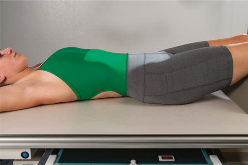
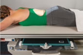
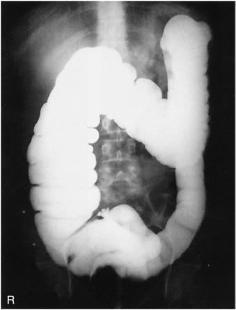

# Rx Irigografie (Clismă Baritată) PA OR AP (Antero-Posterior)

  📷 Radiografie Convențională (Rx)
  <strong>Actualizat:</strong> 2026-09-15
  <strong>Autor:</strong> Departamentul de Radiologie / Referință Bontrager

---

-   __1. Rezumat Clinic & Indicații__

    ---

    === "Indicații Clinice"

        - Obstructions, including ileus dinamic sau mecanic, volvulus, and intussusception Doublecontrast media Irigografie (Clismă Baritată) is ideal for demonstrating diverticulosis, polyps, and mucosal changes.

    === "Ghid Național IRIS"

        !!! info "Referință Primară: Ghidul Național IRIS (Ordinul MS 1342/2012)"
            - **Capitol Ghid IRIS:** *Ghidul Național IRIS*
            - **Grad de Recomandare:** **De verificat pe indicație; fără grad atribuit automat**
            - **Nivel de Iradiere Estimată:** `De verificat pentru examinarea și populația selectate`

            [:octicons-search-16: Deschide Ghidul IRIS](../../iris.md){ .md-button .md-button--primary } [:material-open-in-new: Aplicația Oficială PWA](https://radiologie-pediatrica.ro/iris/){ .md-button target="_blank" rel="noopener" }
-   __2. Poziționare & Centrare Fascicul__

    ---

    - **Poziție Pacient:** Pacient: Patient is Decubit Ventral or Decubit Dorsal, with a support for the head (Fig. 13.61).; Regiune anatomică: Align MSP to midline of table. Ensure that no body rotation occurs.
    - **Punct de Centrare Fascicul:** is perpendicular to IR. Center CR to level of creasta iliacă (corespunzător L4-L5). Center IR to CR.
    - **Distanță Focar-Film (DFF / SID):** 100 cm
    - **Comandă Respiratorie:** Suspend respiration and expose on expiration.

-   __3. Parametri Tehnici Expunere__

    ---

    | Parametru Tehnic | Valoare Configurare Generator / Tub |
    |:-----------------|:-------------------------------------|
    | **Tensiune Tub (kV)** | 110-125 kV |
    | **Sarcină / Produs Curent-Timp (mAs)** | DE CONFIGURAT PE APARAT |
    | **Distanță Focar-Film (DFF / SID)** | 100 cm |
    | **Grilă Antidifuzoare (Bucky)** | Cu grilă antidifuzoare Bucky |
    | **Dimensiune Focar** | Focar Mare (1.0 - 1.2 mm) |
    | **Camere de Ionizare AEC** | Camerele laterale (sau camera centrală funcție de regiune) |
    | **Colimare Fascicul** | Strictă pe regiunea de interes anatomic |
    | **Filtrare Tub** | Totală ≥ 2.5 mm Al echivalent |

-   __4. Criterii de Calitate & Reușită Imagine__

    ---

    - The transverse colon should be primarily barium filled on the PA and air filled on the AP with a doublecontrast study (Fig. 13.62).
    - Entire large intestine, including the left colic flexure, should be visible (see NOTES). Position:
    - Absența rotației anatomice: clavicule echidistante față de linia apofizelor spinoase should occur.
    - The ala of the ilium and the lumbar vertebrae are symmetric.
    - Proper collimation field size is applied. Exposure:
    - Optimal image receptor exposure and contrast to visualize the entire airfilled and bariumfilled large intestine without overexposing the mucosal outlines of the sections of primarily airfilled bowel on a doublecontrast study.
    - Sharp structural margins indicate no motion.

-   __5. Protecție Radiologică (ALARA)__

    ---

    - Ecranare gonadică și a organelor radiosensibile conform procedurilor locale de radioprotecție ALARA.
    - Colimare strictă la aria de interes pentru limitarea radiației difuze.
    - Verificarea posibilității unei sarcini la pacientele de vârstă fertilă înainte de expunere.

!!! note "Observații Clinice & Tehnice"
    S: For most patients, the enema tip can be removed before radiographs are obtained, unless a retentiontype tip is used. This type generally should not be removed until the patient is ready to evacuate. Include rectal ampulla at lower margin of radiograph. Determine department policy regarding inclusion of the left colic flexure on all patients if this area is adequately included in spot images during fluoroscopy. (Most adult patients require two images if this area is to be included.) For hypersthenic patients, use two 14 × 17inch (35 × 43cm) image receptors placed landscape to include the entire large intestine. Irigografie (Clismă Baritată) ROUTINE PA or AP Fig. 13.61 AP or PA (inset) projection. Fig. 13.62 Incidență Postero-Anterioară (PA)—singlecontrast Irigografie (Clismă Baritată).

### 🖼️ Imagini

<figure class="protocol-image-card" markdown>

<figcaption><strong>Fig. 13.61 AP or PA (inset) projection.</strong> — Poziționare pacient conform Ghidului Bontrager (Fig. 13.61 AP or PA (inset) projection.)</figcaption>

</figure>

<figure class="protocol-image-card" markdown>

<figcaption><strong>Fig. 13.62 Incidență Postero-Anterioară (PA)—single-</strong> — Aspect radiografic de referință conform Ghidului Bontrager (Fig. 13.62 PA projection—single-)</figcaption>

</figure>

<figure class="protocol-image-card" markdown>

<figcaption><strong>Figura 3</strong> — Aspect radiografic de referință conform Ghidului Bontrager (Figura 3)</figcaption>

</figure>

=== "Ghid Rapid de Execuție"

    1. **Identificarea și verificarea pacientului:** verificare identitate, zonă de examinat, consimțământ conform procedurii și evaluarea posibilității unei sarcini, când este relevantă.
    2. **Pregătire:** îndepărtarea oricăror obiecte radiopace (bijuterii, agrafe, fermoare, proteze, pansamente dense).
    3. **Poziționare precisă:** alinierea receptorului de imagine și a tubului la distanța prescrisă (100 cm).
    4. **Colimare strictă:** adaptarea fasciculului strict la regiunea de diagnostic pentru scăderea iradierii și reducerea radiației difuze.
    5. **Radioprotecție:** verificarea [politicii RX](../radioprotectie.md), cu măsuri distincte pentru pacient, personal și însoțitor.

## Surse de documentare

- [Bontrager's Textbook of Radiographic Positioning (Ed. 9/10), Pagina 541](https://www.elsevier.com/books/textbook-of-radiographic-positioning-and-related-anatomy/lampignano/978-0-323-65367-1)
