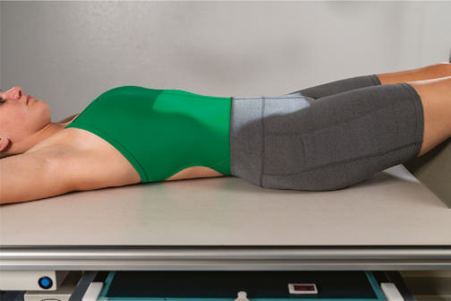
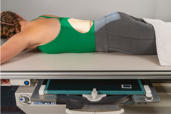
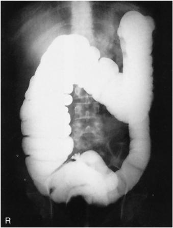

# Rx Irigografie (Clismă Baritată) PA SAU AP (Antero-Posterior)

  📷 Radiografie Convențională (Rx)
  <strong>Actualizat:</strong> 2026-09-15
  <strong>Autor:</strong> Departamentul de Radiologie / Referință Bontrager

---

-   __1. Rezumat Clinic & Indicații__

    ---

    === "Indicații Clinice"

        - Obstrucții, inclusiv ileus dinamic sau mecanic, volvulus și invaginație intestinală. Irigografia (Clismă Baritată) cu dublu contrast este ideală pentru evidențierea diverticulozei, polipilor și modificărilor mucoasei.

    === "Ghid Național IRIS"

        !!! info "Referință Primară: Ghidul Național IRIS (Ordinul MS 1342/2012)"
            - **Capitol Ghid IRIS:** *Aparat digestiv & Abdomen*
            - **Grad de Recomandare:** **Grad B**
            - **Nivel de Iradiere Estimată:** `Clasa 2 (Foarte mică ~ 0.7 - 1.2 mSv)`

            [:octicons-search-16: Deschide Ghidul IRIS](../../iris.md){ .md-button .md-button--primary } [:material-open-in-new: Aplicația Oficială PWA](https://radiologie-pediatrica.ro/iris/){ .md-button target="_blank" rel="noopener" }

-   __2. Poziționare & Centrare Fascicul__

    ---

    - **Poziție Pacient:** Pacient: pacientul este în decubit ventral sau decubit dorsal, cu sprijin pentru cap (Fig. 13.61).; Regiune anatomică: Aliniați MSP cu linia mediană a mesei. Asigurați-vă că nu există rotație a corpului.
    - **Punct de Centrare Fascicul:** Este perpendicular pe receptorul de imagine. Centrați raza centrală la nivelul crestei iliace (corespunzător L4-L5). Se centrează receptorul de imagine pe raza centrală.
    - **Distanță Focar-Film (DFF / SID):** 100 cm
    - **Comandă Respiratorie:** Apnee la sfârșitul expirului pe durata expunerii.

-   __3. Parametri Tehnici Expunere__

    ---

    | Parametru Tehnic | Valoare Configurare Generator / Tub |
    |:-----------------|:-------------------------------------|
    | **Tensiune Tub (kV)** | 110-125 kV |
    | **Sarcină / Produs Curent-Timp (mAs)** | DE CONFIGURAT PE APARAT |
    | **Distanță Focar-Film (DFF / SID)** | 100 cm |
    | **Grilă Antidifuzoare (Bucky)** | Cu grilă antidifuzoare Bucky |
    | **Dimensiune Focar** | Focar Mare (1.0 - 1.2 mm) |
    | **Camere de Ionizare AEC** | Camerele laterale (sau camera centrală, în funcție de regiune) |
    | **Colimare Fascicul** | Colimare strictă pe regiunea anatomică de interes diagnostic |
    | **Filtrare Tub** | Totală ≥ 2.5 mm Al echivalent |

-   __4. Criterii de Calitate & Reușită Imagine__

    ---

    - Colonul transvers trebuie să fie umplut predominant cu bariu în PA și cu aer în AP la examinarea cu dublu contrast (Fig. 13.62).
    - Întregul intestin gros (colon), inclusiv flexura colică stângă, trebuie să fie vizibil (vezi NOTELE). Poziție:
    - Trebuie să existe absența rotației anatomice: clavicule echidistante față de linia apofizelor spinoase.
    - Aripile iliace și coloana lombară sunt simetrice.
    - Se aplică o colimare corectă a dimensiunilor câmpului. Expunere:
    - Expunere optimă a receptorului de imagine și contrast optim pentru vizualizarea întregului intestin gros (colon) umplut cu aer și bariu, fără supraexpunerea contururilor mucoasei porțiunilor intestinale umplute predominant cu aer la examinarea cu dublu contrast.
    - Marginile nete ale structurilor indică absența mișcării.

-   __5. Protecție Radiologică (ALARA)__

    ---

    - Ecranare gonadică și a organelor radiosensibile conform procedurilor locale de radioprotecție ALARA.
    - Colimare strictă la aria de interes pentru limitarea radiației difuze.
    - Verificarea posibilității unei sarcini la pacientele de vârstă fertilă înainte de expunere.

!!! note "Observații Clinice & Tehnice"
    S: La majoritatea pacienților, canula de clismă poate fi îndepărtată înainte de efectuarea radiografiilor, cu excepția cazului în care se utilizează o canulă de retenție. În general, acest tip nu trebuie îndepărtat până când pacientul nu este pregătit să evacueze. Includeți ampula rectală la marginea inferioară a radiografiei. Stabiliți protocolul departamentului privind includerea flexurii colice stângi la toți pacienții dacă această regiune este inclusă adecvat în imaginile țintite obținute în timpul fluoroscopiei. (La majoritatea pacienților adulți sunt necesare două imagini dacă această regiune trebuie inclusă.) La pacienții hiperstenici, utilizați două receptoare de imagine de 14 × 17 țoli (35 × 43 cm), așezate în orientare orizontală, pentru a include întregul intestin gros (colon). Irigografie (Clismă Baritată) DE RUTINĂ PA sau AP Fig. 13.61 Incidență AP sau PA (în medalion). Fig. 13.62 Incidență Postero-Anterioară (PA)—Irigografie (Clismă Baritată) cu contrast simplu.

### 🖼️ Imagini

<figure class="protocol-image-card" markdown>

<figcaption><strong>Fig. 13.61 Incidență AP sau PA (în medalion).</strong> — Poziționare pacient conform Ghidului Bontrager (Fig. 13.61 Incidență AP sau PA (în medalion).)</figcaption>

</figure>

<figure class="protocol-image-card" markdown>

<figcaption><strong>Fig. 13.62 Incidență Postero-Anterioară (PA)—simplu-</strong> — Aspect radiografic de referință conform Ghidului Bontrager (Fig. 13.62 Incidență PA—simplu-)</figcaption>

</figure>

<figure class="protocol-image-card" markdown>

<figcaption><strong>Figura 3</strong> — Aspect radiografic de referință conform Ghidului Bontrager (Figura 3)</figcaption>

</figure>

=== "Ghid Rapid de Execuție"

    1. **Identificarea și verificarea pacientului:** verificare identitate, zonă de examinat, consimțământ conform procedurii și evaluarea posibilității unei sarcini, când este relevantă.
    2. **Pregătire:** îndepărtarea oricăror obiecte radiopace (bijuterii, agrafe, fermoare, proteze, pansamente dense).
    3. **Poziționare precisă:** alinierea receptorului de imagine și a tubului la distanța prescrisă (100 cm).
    4. **Colimare strictă:** adaptarea fasciculului strict la regiunea de diagnostic pentru scăderea iradierii și reducerea radiației difuze.
    5. **Radioprotecție:** verificarea [politicii RX](../radioprotectie.md), cu măsuri distincte pentru pacient, personal și însoțitor.

## Surse de documentare

- [Bontrager's Textbook of Radiographic Positioning (Ed. 9/10), Pagina 541](https://www.elsevier.com/books/textbook-of-radiographic-positioning-and-related-anatomy/lampignano/978-0-323-65367-1)
