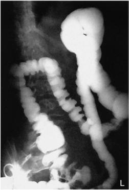
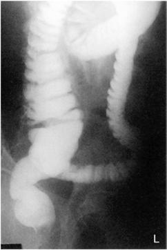
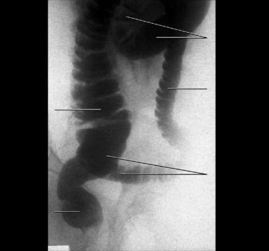

# Rx Irigografie (Clismă Baritată) RAO POSITION

  📷 Radiografie Convențională (Rx)
  <strong>Actualizat:</strong> 2026-09-15
  <strong>Autor:</strong> Departamentul de Radiologie / Referință Bontrager

---

-   __1. Rezumat Clinic & Indicații__

    ---

    === "Indicații Clinice"

        - Obstructions, including ileus dinamic sau mecanic, volvulus, and intussusception
        - Doublecontrast media Irigografie (Clismă Baritată) is ideal for demonstrating diverticulosis, polyps, and mucosal changes.

    === "Ghid Național IRIS"

        !!! info "Referință Primară: Ghidul Național IRIS (Ordinul MS 1342/2012)"
            - **Capitol Ghid IRIS:** *Ghidul Național IRIS*
            - **Grad de Recomandare:** **De verificat pe indicație; fără grad atribuit automat**
            - **Nivel de Iradiere Estimată:** `De verificat pentru examinarea și populația selectate`

            [:octicons-search-16: Deschide Ghidul IRIS](../../iris.md){ .md-button .md-button--primary } [:material-open-in-new: Aplicația Oficială PWA](https://radiologie-pediatrica.ro/iris/){ .md-button target="_blank" rel="noopener" }
-   __2. Poziționare & Centrare Fascicul__

    ---

    - **Poziție Pacient:** Pacient: Patient is semiprone, rotated into a 35° to 45° RAO; a positioning sponge can be used to help align the upper body into the correct position; patient also is offered a support for the head (Fig. 13.63).; Regiune anatomică: Align MSP along long axis of table, with right and left abdominal margins equidistant from centerline of table or CR. Place left arm up on support, with right arm down behind the patient and left Genunchi partially flexed. Check posterior Bazin (Pelvis) and trunk for 35° to 45° rotation.
    - **Punct de Centrare Fascicul:** Direct Raza centrală (RC) perpendiculară pe receptorul de imagine to a point about 1 inch (2.5 cm) to the left of the MSP. Center CR and IR to level of creasta iliacă (corespunzător L4-L5) (see NOTE).
    - **Distanță Focar-Film (DFF / SID):** 100 cm
    - **Comandă Respiratorie:** Suspend respiration and expose on expiration.

-   __3. Parametri Tehnici Expunere__

    ---

    | Parametru Tehnic | Valoare Configurare Generator / Tub |
    |:-----------------|:-------------------------------------|
    | **Tensiune Tub (kV)** | 110-125 kV |
    | **Sarcină / Produs Curent-Timp (mAs)** | DE CONFIGURAT PE APARAT |
    | **Distanță Focar-Film (DFF / SID)** | 100 cm |
    | **Grilă Antidifuzoare (Bucky)** | Cu grilă antidifuzoare Bucky |
    | **Dimensiune Focar** | Focar Mare (1.0 - 1.2 mm) |
    | **Camere de Ionizare AEC** | Camerele laterale (sau camera centrală funcție de regiune) |
    | **Colimare Fascicul** | Field Size Collimate on four sides to anatomy of interest. |
    | **Filtrare Tub** | Totală ≥ 2.5 mm Al echivalent |

-   __4. Criterii de Calitate & Reușită Imagine__

    ---

    - The right colic flexure and the ascending and sigmoid colon are seen “open” without significant superimposition.
    - The entire large intestine is included, with the possible exception of the left colic flexure, which is best demonstrated in LAO position (or may require a second image centered higher).
    - The rectal ampulla should be included on the lower margin of the radiograph. Position:
    - The spine is parallel to the edge of the radiograph (unless scolioză / vicii de postură ale coloanei is present).
    - The ala of the right ilium is foreshortened, and the left side is elongated; the right colic flexure is seen in profile if included.
    - Proper collimation field size is applied. Exposure:
    - Optimal image receptor exposure and contrast to visualize the entire airfilled and bariumfilled large intestine without overexposing the mucosal outlines of the sections of primarily airfilled bowel on a doublecontrast study.
    - Sharp structural margins indicate no motion.

-   __5. Protecție Radiologică (ALARA)__

    ---

    - Ecranare gonadică și a organelor radiosensibile conform procedurilor locale de radioprotecție ALARA.
    - Colimare strictă la aria de interes pentru limitarea radiației difuze.
    - Verificarea posibilității unei sarcini la pacientele de vârstă fertilă înainte de expunere.

!!! note "Observații Clinice & Tehnice"
    Ensure that rectal ampulla is included on lower margin of IR. This action may require centering 1 to 2 inches (2.5 to 5 cm) below the creasta iliacă (corespunzător L4-L5) on larger patients and taking a second image centered 1 to 2 inches (2.5 to 5 cm) above the crest to include the right colic flexure (Figs. 13.64 to 13.66). Irigografie (Clismă Baritată) ROUTINE PA or AP RAO Fig. 13.63 RAO—35° to 45°. Fig. 13.64 RAO (centered high to include R and L colic flexures). Ascending colon Transverse colon Descending colon Sigmoid colon Rectum Fig. 13.66 RAO (to include rectal ampulla).

### 🖼️ Imagini

<figure class="protocol-image-card" markdown>

<figcaption><strong>Fig. 13.65 RAO (centered low</strong> — Poziționare pacient conform Ghidului Bontrager (Fig. 13.65 RAO (centered low)</figcaption>

</figure>

<figure class="protocol-image-card" markdown>

<figcaption><strong>Fig. 13.63 RAO—35° to 45°.</strong> — Aspect radiografic de referință conform Ghidului Bontrager (Fig. 13.63 RAO—35° to 45°.)</figcaption>

</figure>

<figure class="protocol-image-card" markdown>

<figcaption><strong>Fig. 13.64 RAO (centered high to</strong> — Aspect radiografic de referință conform Ghidului Bontrager (Fig. 13.64 RAO (centered high to)</figcaption>

</figure>

<figure class="protocol-image-card" markdown>

<figcaption><strong>Fig. 13.66 RAO (to include rectal ampulla).</strong> — Aspect radiografic de referință conform Ghidului Bontrager (Fig. 13.66 RAO (to include rectal ampulla).)</figcaption>

</figure>

=== "Ghid Rapid de Execuție"

    1. **Identificarea și verificarea pacientului:** verificare identitate, zonă de examinat, consimțământ conform procedurii și evaluarea posibilității unei sarcini, când este relevantă.
    2. **Pregătire:** îndepărtarea oricăror obiecte radiopace (bijuterii, agrafe, fermoare, proteze, pansamente dense).
    3. **Poziționare precisă:** alinierea receptorului de imagine și a tubului la distanța prescrisă (100 cm).
    4. **Colimare strictă:** adaptarea fasciculului strict la regiunea de diagnostic pentru scăderea iradierii și reducerea radiației difuze.
    5. **Radioprotecție:** verificarea [politicii RX](../radioprotectie.md), cu măsuri distincte pentru pacient, personal și însoțitor.

## Surse de documentare

- [Bontrager's Textbook of Radiographic Positioning (Ed. 9/10), Pagina 542](https://www.elsevier.com/books/textbook-of-radiographic-positioning-and-related-anatomy/lampignano/978-0-323-65367-1)
