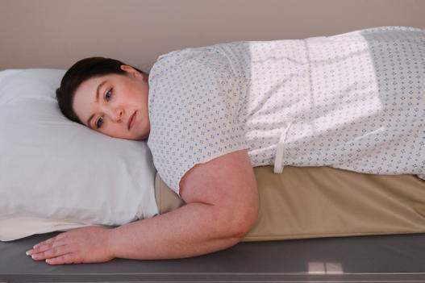
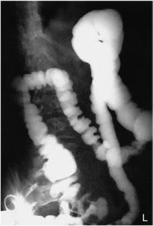
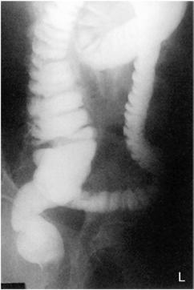
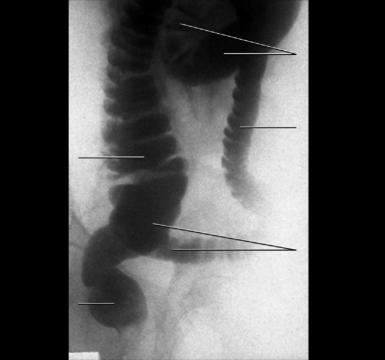

# Rx Irigografie (Clismă Baritată) Oblică Anterioară Dreaptă (OAD / RAO)

  📷 Radiografie Convențională (Rx)
  <strong>Actualizat:</strong> 2026-09-15
  <strong>Autor:</strong> Departamentul de Radiologie / Referință Bontrager

---

-   __1. Rezumat Clinic & Indicații__

    ---

    === "Indicații Clinice"

        - Obstrucții, inclusiv ileus dinamic sau mecanic, volvulus și invaginație intestinală
        - Irigografia (Clismă Baritată) cu dublu contrast este ideală pentru evidențierea diverticulozei, polipilor și modificărilor mucoasei.

    === "Ghid Național IRIS"

        !!! info "Referință Primară: Ghidul Național IRIS (Ordinul MS 1342/2012)"
            - **Capitol Ghid IRIS:** *Aparat digestiv & Abdomen*
            - **Grad de Recomandare:** **Grad B**
            - **Nivel de Iradiere Estimată:** `Clasa 2 (Foarte mică ~ 0.7 - 1.2 mSv)`

            [:octicons-search-16: Deschide Ghidul IRIS](../../iris.md){ .md-button .md-button--primary } [:material-open-in-new: Aplicația Oficială PWA](https://radiologie-pediatrica.ro/iris/){ .md-button target="_blank" rel="noopener" }

-   __2. Poziționare & Centrare Fascicul__

    ---

    - **Poziție Pacient:** Pacient: pacientul este în poziție semiventrală, rotit la 35° la 45° în RAO; se poate utiliza un suport din burete pentru poziționare, care să ajute la alinierea părții superioare a corpului în poziția corectă; pacientului i se oferă și sprijin pentru cap (Fig. 13.63).; Regiune anatomică: Aliniați MSP de-a lungul axei longitudinale a mesei, cu marginile abdominale dreaptă și stângă echidistante față de linia mediană a mesei sau de raza centrală. Așezați brațul stâng în sus, pe suport, iar brațul drept în jos, în spatele pacientului, cu genunchiul stâng parțial flectat. Verificați din posterior bazinul (pelvisul) și trunchiul pentru o rotație de 35° la 45°.
    - **Punct de Centrare Fascicul:** Direcționați raza centrală (RC) perpendicular pe receptorul de imagine, într-un punct situat la aproximativ 1 țol (2.5 cm) la stânga MSP. Centrați raza centrală și receptorul de imagine la nivelul crestei iliace (corespunzător L4-L5) (vezi NOTA).
    - **Distanță Focar-Film (DFF / SID):** 100 cm
    - **Comandă Respiratorie:** Apnee la sfârșitul expirului pe durata expunerii.

-   __3. Parametri Tehnici Expunere__

    ---

    | Parametru Tehnic | Valoare Configurare Generator / Tub |
    |:-----------------|:-------------------------------------|
    | **Tensiune Tub (kV)** | 110-125 kV |
    | **Sarcină / Produs Curent-Timp (mAs)** | DE CONFIGURAT PE APARAT |
    | **Distanță Focar-Film (DFF / SID)** | 100 cm |
    | **Grilă Antidifuzoare (Bucky)** | Cu grilă antidifuzoare Bucky |
    | **Dimensiune Focar** | Focar Mare (1.0 - 1.2 mm) |
    | **Camere de Ionizare AEC** | Camerele laterale (sau camera centrală, în funcție de regiune) |
    | **Colimare Fascicul** | Dimensiunea câmpului Colimați pe cele patru laturi la regiunea anatomică de interes. |
    | **Filtrare Tub** | Totală ≥ 2.5 mm Al echivalent |

-   __4. Criterii de Calitate & Reușită Imagine__

    ---

    - Flexura colică dreaptă, colonul ascendent și colonul sigmoid sunt vizibile ca „deschise”, fără suprapunere semnificativă.
    - Întregul intestin gros (colon) este inclus, cu posibila excepție a flexurii colice stângi, care este cel mai bine evidențiată în poziție oblică anterioară stângă (OAS / LAO) (sau poate necesita o a doua imagine centrată mai sus).
    - Ampula rectală trebuie să fie inclusă la marginea inferioară a radiografiei. Poziție:
    - Coloana vertebrală este paralelă cu marginea radiografiei (cu excepția cazului în care sunt prezente scolioza / viciile de postură ale coloanei).
    - Aripa iliacă dreaptă apare scurtată, iar partea stângă apare alungită; flexura colică dreaptă se vizualizează din profil, dacă este inclusă.
    - Se aplică o colimare corectă a dimensiunilor câmpului. Expunere:
    - Expunere optimă a receptorului de imagine și contrast optim pentru vizualizarea întregului intestin gros (colon) umplut cu aer și bariu, fără supraexpunerea contururilor mucoasei porțiunilor intestinale umplute predominant cu aer la examinarea cu dublu contrast.
    - Marginile nete ale structurilor indică absența mișcării.

-   __5. Protecție Radiologică (ALARA)__

    ---

    - Ecranare gonadică și a organelor radiosensibile conform procedurilor locale de radioprotecție ALARA.
    - Colimare strictă la aria de interes pentru limitarea radiației difuze.
    - Verificarea posibilității unei sarcini la pacientele de vârstă fertilă înainte de expunere.

!!! note "Observații Clinice & Tehnice"
    Asigurați-vă că ampula rectală este inclusă la marginea inferioară a receptorului de imagine. Aceasta poate necesita centrarea cu 1 la 2 țoli (2.5 la 5 cm) sub creasta iliacă (corespunzător L4-L5) la pacienții mai corpolenți și efectuarea unei a doua imagini centrate cu 1 la 2 țoli (2.5 la 5 cm) deasupra crestei pentru a include flexura colică dreaptă (Fig. 13.64 la 13.66). Irigografie (Clismă Baritată) DE RUTINĂ PA sau AP RAO Fig. 13.63 RAO—35° la 45°. Fig. 13.64 RAO (centrată sus pentru a include flexurile colice dreaptă și stângă). Colon ascendent Colon transvers Colon descendent Colon sigmoid Rect Fig. 13.66 RAO (pentru a include ampula rectală).

### 🖼️ Imagini

<figure class="protocol-image-card" markdown>

<figcaption><strong>Fig. 13.65 RAO (centrat inferior</strong> — Poziționarea pacientului conform Ghidului Bontrager (Fig. 13.65 RAO (centrat inferior)</figcaption>

</figure>

<figure class="protocol-image-card" markdown>

<figcaption><strong>Fig. 13.63 RAO—35° la 45°.</strong> — Aspect radiografic de referință conform Ghidului Bontrager (Fig. 13.63 RAO—35° la 45°.)</figcaption>

</figure>

<figure class="protocol-image-card" markdown>

<figcaption><strong>Fig. 13.64 RAO (centrat superior la</strong> — Aspect radiografic de referință conform Ghidului Bontrager (Fig. 13.64 RAO (centrat superior la)</figcaption>

</figure>

<figure class="protocol-image-card" markdown>

<figcaption><strong>Fig. 13.66 RAO (pentru a include ampula rectală).</strong> — Aspect radiografic de referință conform Ghidului Bontrager (Fig. 13.66 RAO (pentru a include ampula rectală).)</figcaption>

</figure>

=== "Ghid Rapid de Execuție"

    1. **Identificarea și verificarea pacientului:** verificare identitate, zonă de examinat, consimțământ conform procedurii și evaluarea posibilității unei sarcini, când este relevantă.
    2. **Pregătire:** îndepărtarea oricăror obiecte radiopace (bijuterii, agrafe, fermoare, proteze, pansamente dense).
    3. **Poziționare precisă:** alinierea receptorului de imagine și a tubului la distanța prescrisă (100 cm).
    4. **Colimare strictă:** adaptarea fasciculului strict la regiunea de diagnostic pentru scăderea iradierii și reducerea radiației difuze.
    5. **Radioprotecție:** verificarea [politicii RX](../radioprotectie.md), cu măsuri distincte pentru pacient, personal și însoțitor.

## Surse de documentare

- [Bontrager's Textbook of Radiographic Positioning (Ed. 9/10), Pagina 542](https://www.elsevier.com/books/textbook-of-radiographic-positioning-and-related-anatomy/lampignano/978-0-323-65367-1)
