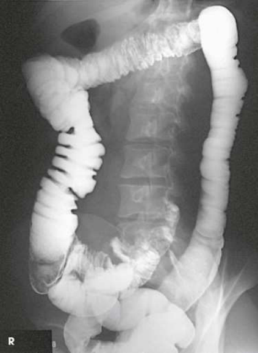
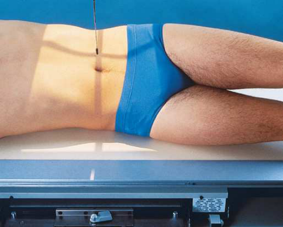
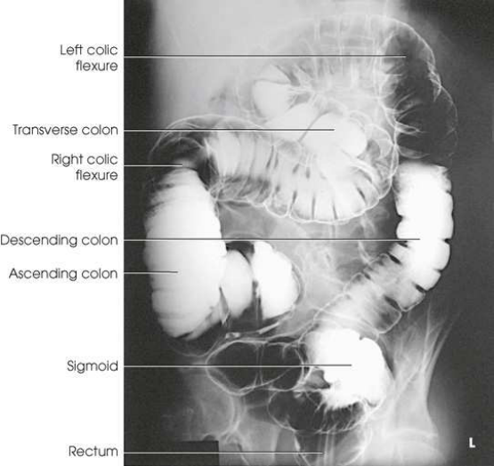

# Rx Intestin gros — Oblică Antero-Posterioară (AP) — Oblică Posterioară Dreaptă (OPD / RPO) (Merrill)

  📷 Radiografie Convențională (Rx)
  <strong>Actualizat:</strong> 2026-09-16
  <strong>Autor:</strong> Referință Merrill

---

-   __1. Rezumat Clinic & Indicații__

    ---

    === "Indicații Clinice"

        - Conform reperelor anatomice standard din tratat

    === "Ghid Național IRIS"

        !!! info "Referință Primară: Ghidul Național IRIS (Ordinul MS 1342/2012)"
            - **Capitol Ghid IRIS:** *Ghidul Național IRIS*
            - **Grad de Recomandare:** **De verificat pe indicație; fără grad atribuit automat**
            - **Nivel de Iradiere Estimată:** `De verificat pentru examinarea și populația selectate`

            [:octicons-search-16: Deschide Ghidul IRIS](../../iris.md){ .md-button .md-button--primary } [:material-open-in-new: Aplicația Oficială PWA](https://radiologie-pediatrica.ro/iris/){ .md-button target="_blank" rel="noopener" }
-   __2. Poziționare & Centrare Fascicul__

    ---

    - **Poziție Pacient:** Se așază pacientul în decubit dorsal. Cu brațul drept al pacientului pe lângă corp și brațul stâng peste partea superioară a toracelui, se instruiește pacientul să se rotească pe șoldul drept pentru a obține o rotație de 35 la 45 de grade față de masa radiologică. Se utilizează un burete de poziționare și se flectează genunchiul drept al pacientului pentru stabilitate, dacă este necesar. Se centrează corpul pacientului pe linia mediană a grilei. Se ajustează centrul receptorului de imagine la nivelul crestelor iliace (Fig. 15.133). Se efectuează ecranarea gonadelor cu șorț plumbat.
    - **Punct de Centrare Fascicul:** Perpendicular pe receptorul de imagine (RI), pentru a pătrunde la aproximativ 1 la 2 țoli (2.5 la 5 cm) lateral de linia mediană a corpului, pe partea ridicată, la nivelul crestelor iliace.
    - **Distanță Focar-Film (DFF / SID):** Nespecificat în fragmentul extras; de verificat în sursă
    - **Comandă Respiratorie:** apnee (oprirea respirației).

-   __3. Parametri Tehnici Expunere__

    ---

    | Parametru Tehnic | Valoare Configurare Generator / Tub |
    |:-----------------|:-------------------------------------|
    | **Tensiune Tub (kV)** | DE CONFIGURAT PE APARAT |
    | **Sarcină / Produs Curent-Timp (mAs)** | DE CONFIGURAT PE APARAT |
    | **Distanță Focar-Film (DFF / SID)** | Nespecificat în fragmentul extras; de verificat în sursă |
    | **Grilă Antidifuzoare (Bucky)** | DE CONFIGURAT PE APARAT |
    | **Dimensiune Focar** | DE CONFIGURAT PE APARAT |
    | **Camere de Ionizare AEC** | DE CONFIGURAT PE APARAT |
    | **Colimare Fascicul** | Se ajustează câmpul de iradiere astfel încât să nu depășească 14 × 17 țoli (35 × 43 cm). Pentru pacienți de talie redusă, se colimează la 2.5 cm de conturul tegumentar al flancurilor abdominale. Se plasează markerul de lateralitate în câmpul colimat. |
    | **Filtrare Tub** | DE CONFIGURAT PE APARAT |

-   __4. Criterii de Calitate & Reușită Imagine__

    ---

    - Criterii radiologice de calitate a imaginii:
    - Colimare adecvată vizibilă și prezența markerului de lateralitate (D/S) plasat în afara structurilor anatomice de interes
    - Întregul intestin gros (colon)
    - Flexura colică stângă și colonul descendent
    - Penetrarea substanței de contrast

-   __5. Protecție Radiologică (ALARA)__

    ---

    - Nespecificat în fragmentul extras; de verificat în sursă

!!! note "Observații Clinice & Tehnice"
    Conform reperelor anatomice standard din tratat

### 🖼️ Imagini

<figure class="protocol-image-card" markdown>

<figcaption><strong>Merrill — pagina 1178, imaginea 1</strong> — Imagine din fragmentul sursă; asocierea necesită revizie.</figcaption>

</figure>

<figure class="protocol-image-card" markdown>

<figcaption><strong>Merrill — pagina 1179, imaginea 2</strong> — Imagine din fragmentul sursă; asocierea necesită revizie.</figcaption>

</figure>

<figure class="protocol-image-card" markdown>

<figcaption><strong>Merrill — pagina 1179, imaginea 3</strong> — Imagine din fragmentul sursă; asocierea necesită revizie.</figcaption>

</figure>

=== "Ghid Rapid de Execuție"

    1. **Identificarea și verificarea pacientului:** verificare identitate, zonă de examinat, consimțământ conform procedurii și evaluarea posibilității unei sarcini, când este relevantă.
    2. **Pregătire:** îndepărtarea oricăror obiecte radiopace (bijuterii, agrafe, fermoare, proteze, pansamente dense).
    3. **Poziționare precisă:** alinierea receptorului de imagine și a tubului la distanța prescrisă (Nespecificat în fragmentul extras; de verificat în sursă).
    4. **Colimare strictă:** adaptarea fasciculului strict la regiunea de diagnostic pentru scăderea iradierii și reducerea radiației difuze.
    5. **Radioprotecție:** verificarea [politicii RX](../radioprotectie.md), cu măsuri distincte pentru pacient, personal și însoțitor.

## Surse de documentare

- [Merrill’s Atlas, 15. Digestive System: Salivary Glands, Alimentary Canal, And Biliary System, pagini 1177–1179](https://books.google.com/books/about/Merrill_s_Atlas_of_Radiographic_Position.html?id=BM0lEQAAQBAJ)

## Fragmente sursă traduse (referință tehnică)

### anatomie

Flexura colică stângă și colonul descendent (Fig. 15.134 și 15.135).

### colimare

• Se ajustează câmpul de iradiere astfel încât să nu depășească 14 × 17 țoli (35 × 43 cm). Pentru pacienți de talie redusă, se colimează la 2.5 cm de conturul tegumentar
al flancurilor abdominale. Se plasează markerul de lateralitate în câmpul colimat.

### raza centrală

• Perpendicular pe receptorul de imagine (RI), pentru a pătrunde la aproximativ 1 la 2 țoli (2.5 la 5 cm) lateral de linia mediană a corpului, pe partea ridicată, la nivelul crestelor iliace.

### criterii

Criterii radiologice de calitate a imaginii:
• Colimare adecvată vizibilă și prezența markerului de lateralitate (D/S) plasat fără a se suprapune peste structurile anatomice de interes
• Întregul intestin gros (colon)
• Flexura colică stângă și colonul descendent
• Penetrarea substanței de contrast

### part_pos

• Cu brațul drept al pacientului pe lângă corp și brațul stâng peste partea superioară a toracelui, se instruiește pacientul să se rotească pe șoldul drept
pentru a obține o rotație de 35 la 45 de grade față de masa radiologică.
• Se utilizează un burete de poziționare și se flectează genunchiul drept al pacientului pentru stabilitate, dacă este necesar.
• Se centrează corpul pacientului pe linia mediană a grilei.
• Se ajustează centrul receptorului de imagine la nivelul crestelor iliace (Fig. 15.133).
• se efectuează ecranarea gonadelor cu șorț plumbat.

### patient_pos

• se așază pacientul în decubit dorsal.

### respirație

apnee (oprirea respirației).

### tehnică

Poziționat conform indicațiilor producătorului sau protocolului departamentului pentru orientarea corectă a afișării structurilor anatomice; raza centrală, placă: 14 × 17 țoli (35 ×
43 cm), longitudinal.

