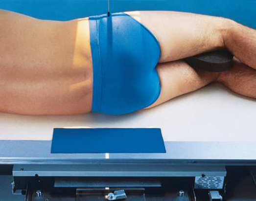
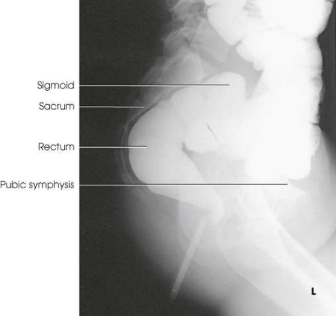
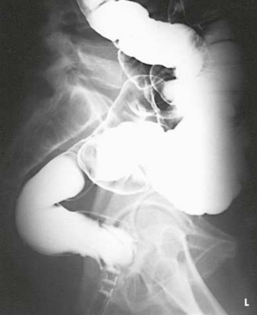

# Rx Large Intestine — Incidență de Profil (Lateral) — Profil (Drept sau Stâng) (Merrill)

  📷 Radiografie Convențională (Rx)
  <strong>Actualizat:</strong> 2026-09-16
  <strong>Autor:</strong> Referință Merrill

---

-   __1. Rezumat Clinic & Indicații__

    ---

    === "Indicații Clinice"

        - Conform reperelor anatomice standard din tratat

    === "Ghid Național IRIS"

        !!! info "Referință Primară: Ghidul Național IRIS (Ordinul MS 1342/2012)"
            - **Capitol Ghid IRIS:** *Ghidul Național IRIS*
            - **Grad de Recomandare:** **De verificat pe indicație; fără grad atribuit automat**
            - **Nivel de Iradiere Estimată:** `De verificat pentru examinarea și populația selectate`

            [:octicons-search-16: Deschide Ghidul IRIS](../../iris.md){ .md-button .md-button--primary } [:material-open-in-new: Aplicația Oficială PWA](https://radiologie-pediatrica.ro/iris/){ .md-button target="_blank" rel="noopener" }
-   __2. Poziționare & Centrare Fascicul__

    ---

    - **Poziție Pacient:** se așază pacientul în lateral Decubit poziție pe stâng sau drept side.; se centrează plan mediocoronal la center de grila. se flectează pacient’s genunchi slightly pentru stability, și place support între genunchi la keep Bazin (bazin (pelvis)) lateral. se ajustează pacient’s umeri și hips la fie perpendicular (Fig. 15.121). se ajustează center de receptorul de imagine la spină iliacă antero-superioară (SIAS). se efectuează ecranarea gonadelor cu șorț plumbat.
    - **Punct de Centrare Fascicul:** perpendicular pe receptorul de imagine (RI) la enter planul mediocoronal la nivelul spină iliacă antero-superioară (SIAS).
    - **Distanță Focar-Film (DFF / SID):** Nespecificat în fragmentul extras; de verificat în sursă
    - **Comandă Respiratorie:** apnee (oprirea respirației).

-   __3. Parametri Tehnici Expunere__

    ---

    | Parametru Tehnic | Valoare Configurare Generator / Tub |
    |:-----------------|:-------------------------------------|
    | **Tensiune Tub (kV)** | DE CONFIGURAT PE APARAT |
    | **Sarcină / Produs Curent-Timp (mAs)** | DE CONFIGURAT PE APARAT |
    | **Distanță Focar-Film (DFF / SID)** | Nespecificat în fragmentul extras; de verificat în sursă |
    | **Grilă Antidifuzoare (Bucky)** | DE CONFIGURAT PE APARAT |
    | **Dimensiune Focar** | DE CONFIGURAT PE APARAT |
    | **Camere de Ionizare AEC** | DE CONFIGURAT PE APARAT |
    | **Colimare Fascicul** | se ajustează câmp de iradiere la fără larger than 10 × 12 inches (24 × 30 cm). Se plasează markerul de lateralitate în câmpul colimat. |
    | **Filtrare Tub** | DE CONFIGURAT PE APARAT |

-   __4. Criterii de Calitate & Reușită Imagine__

    ---

    - Criterii radiologice de calitate imaginii:
    - Colimare adecvată vizibilă și prezența markerului de lateralitate (D/S) plasat clear de anatomy de interest
    - Rectosigmoid area în center de imagine
    - Absența rotației anatomice (simetrie bilaterală perfectă) de pacientul
    - Superimposed hips și femora
    - superior portion de intestin gros (colon) nu included when rectosigmoid region este aria de interes diagnostic
    - Penetration de contrast medium

-   __5. Protecție Radiologică (ALARA)__

    ---

    - Nespecificat în fragmentul extras; de verificat în sursă

!!! note "Observații Clinice & Tehnice"
    Conform reperelor anatomice standard din tratat

### 🖼️ Imagini

<figure class="protocol-image-card" markdown>

<figcaption><strong>Merrill — pagina PDF 1167, imaginea 1</strong> — Imagine din fragmentul sursă; asocierea necesită revizie.</figcaption>

</figure>

<figure class="protocol-image-card" markdown>

<figcaption><strong>Merrill — pagina PDF 1168, imaginea 2</strong> — Imagine din fragmentul sursă; asocierea necesită revizie.</figcaption>

</figure>

<figure class="protocol-image-card" markdown>

<figcaption><strong>Merrill — pagina PDF 1168, imaginea 3</strong> — Imagine din fragmentul sursă; asocierea necesită revizie.</figcaption>

</figure>

=== "Ghid Rapid de Execuție"

    1. **Identificarea și verificarea pacientului:** verificare identitate, zonă de examinat, consimțământ conform procedurii și evaluarea posibilității unei sarcini, când este relevantă.
    2. **Pregătire:** îndepărtarea oricăror obiecte radiopace (bijuterii, agrafe, fermoare, proteze, pansamente dense).
    3. **Poziționare precisă:** alinierea receptorului de imagine și a tubului la distanța prescrisă (Nespecificat în fragmentul extras; de verificat în sursă).
    4. **Colimare strictă:** adaptarea fasciculului strict la regiunea de diagnostic pentru scăderea iradierii și reducerea radiației difuze.
    5. **Radioprotecție:** verificarea [politicii RX](../radioprotectie.md), cu măsuri distincte pentru pacient, personal și însoțitor.

## Surse de documentare

- [Merrill’s Atlas, 15. Digestive System: Salivary Glands, Alimentary Canal, And Biliary System, pagini PDF 1166–1168](../../assets/protocols/sources/a56d45c16829_Merrills_Atlas_of_Radiographic_Positioning__Procedures_3Vol_Set.pdf#page=1166)

## Fragmente sursă traduse (referință tehnică)

### anatomy

rectum și distal sigmoid portion de intestin gros (colon) (Figs. 15.122 și 15.123).

### collimation

• se ajustează câmp de iradiere la fără larger than 10 × 12 inches (24 × 30 cm). Se plasează markerul de lateralitate în câmpul colimat.

### cr

• perpendicular pe receptorul de imagine (RI) la enter planul mediocoronal la nivelul spină iliacă antero-superioară (SIAS).

### criteria

Criterii radiologice de calitate imaginii:
• Colimare adecvată vizibilă și prezența markerului de lateralitate (D/S) plasat clear de anatomy de interest
• Rectosigmoid area în center de imagine
• Absența rotației anatomice (simetrie bilaterală perfectă) de pacientul
• Superimposed hips și femora
• superior portion de intestin gros (colon) nu included when rectosigmoid region este aria de interes diagnostic
• Penetration de contrast medium

### part_pos

• se centrează plan mediocoronal la center de grila.
• se flectează pacient’s genunchi slightly pentru stability, și place support între genunchi la keep bazinul lateral.
• se ajustează pacient’s umeri și hips la fie perpendicular (Fig. 15.121).
• se ajustează center de receptorul de imagine la spină iliacă antero-superioară (SIAS).
• se efectuează ecranarea gonadelor cu șorț plumbat.

### patient_pos

• se așază pacientul în lateral recumbent poziție pe stâng sau drept side.

### respiration

apnee (oprirea respirației).

### tech

poziționat prin manufacturer sau department protocol pentru corect anatomy display orientation; raza centrală plate: 10 × 12 inches (24 ×
30 cm) longitudinal.

