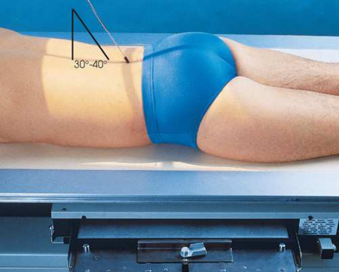
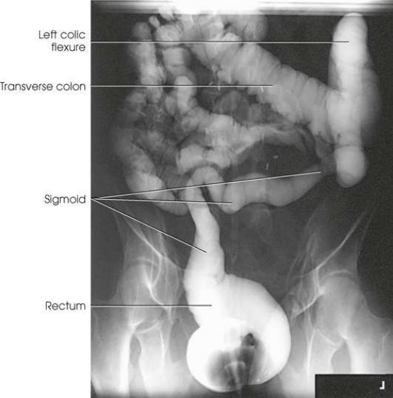
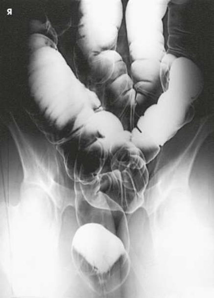

# Rx Large Intestine — Incidență PA Axială (Merrill)

  📷 Radiografie Convențională (Rx)
  <strong>Actualizat:</strong> 2026-09-16
  <strong>Autor:</strong> Referință Merrill

---

-   __1. Rezumat Clinic & Indicații__

    ---

    === "Indicații Clinice"

        - Conform reperelor anatomice standard din tratat

    === "Ghid Național IRIS"

        !!! info "Referință Primară: Ghidul Național IRIS (Ordinul MS 1342/2012)"
            - **Capitol Ghid IRIS:** *Ghidul Național IRIS*
            - **Grad de Recomandare:** **De verificat pe indicație; fără grad atribuit automat**
            - **Nivel de Iradiere Estimată:** `De verificat pentru examinarea și populația selectate`

            [:octicons-search-16: Deschide Ghidul IRIS](../../iris.md){ .md-button .md-button--primary } [:material-open-in-new: Aplicația Oficială PWA](https://radiologie-pediatrica.ro/iris/){ .md-button target="_blank" rel="noopener" }
-   __2. Poziționare & Centrare Fascicul__

    ---

    - **Poziție Pacient:** se așază pacientul în Decubit ventral poziție.; se centrează MSP la grila. se ajustează center de receptorul de imagine la nivelul crestele iliace (Fig. 15.112). se efectuează ecranarea gonadelor cu șorț plumbat.
    - **Punct de Centrare Fascicul:** orientat 30 la 40 grade caudal la enter linia mediană corp la nivelul spină iliacă antero-superioară (SIAS) (spină iliacă antero-superioară (SIAS)).
    - **Distanță Focar-Film (DFF / SID):** Nespecificat în fragmentul extras; de verificat în sursă
    - **Comandă Respiratorie:** apnee (oprirea respirației).

-   __3. Parametri Tehnici Expunere__

    ---

    | Parametru Tehnic | Valoare Configurare Generator / Tub |
    |:-----------------|:-------------------------------------|
    | **Tensiune Tub (kV)** | DE CONFIGURAT PE APARAT |
    | **Sarcină / Produs Curent-Timp (mAs)** | DE CONFIGURAT PE APARAT |
    | **Distanță Focar-Film (DFF / SID)** | Nespecificat în fragmentul extras; de verificat în sursă |
    | **Grilă Antidifuzoare (Bucky)** | DE CONFIGURAT PE APARAT |
    | **Dimensiune Focar** | DE CONFIGURAT PE APARAT |
    | **Camere de Ionizare AEC** | DE CONFIGURAT PE APARAT |
    | **Colimare Fascicul** | se ajustează câmp de iradiere la fără larger than 14 × 17 inches (35 × 43 cm) sau 10 × 12 inches (24 × 30). Se plasează markerul de lateralitate în câmpul colimat. |
    | **Filtrare Tub** | DE CONFIGURAT PE APARAT |

-   __4. Criterii de Calitate & Reușită Imagine__

    ---

    - Criterii radiologice de calitate imaginii:
    - Colimare adecvată vizibilă și prezența markerului de lateralitate (D/S) plasat clear de anatomy de interest
    - Rectosigmoid area centrat pe imagine when a 10- × 12-inch (24- × 30-cm) expunere field/receptorul de imagine este used
    - Rectosigmoid area cu less superimposition than în Incidență Postero-Anterioară (PA) because de angulation de raza centrală
    - Transverse intestin gros (colon) și ambele flexures nu always included
    - Penetration de contrast medium

-   __5. Protecție Radiologică (ALARA)__

    ---

    - Nespecificat în fragmentul extras; de verificat în sursă

!!! note "Observații Clinice & Tehnice"
    This axial incidență este sometimes performed cu pacientul în poziție oblică anterioară dreaptă (OAD / RAO), la further reduce superimposition în rectosigmoid area.

### 🖼️ Imagini

<figure class="protocol-image-card" markdown>

<figcaption><strong>Merrill — pagina PDF 1158, imaginea 1</strong> — Imagine din fragmentul sursă; asocierea necesită revizie.</figcaption>

</figure>

<figure class="protocol-image-card" markdown>

<figcaption><strong>Merrill — pagina PDF 1159, imaginea 2</strong> — Imagine din fragmentul sursă; asocierea necesită revizie.</figcaption>

</figure>

<figure class="protocol-image-card" markdown>

<figcaption><strong>Merrill — pagina PDF 1160, imaginea 3</strong> — Imagine din fragmentul sursă; asocierea necesită revizie.</figcaption>

</figure>

=== "Ghid Rapid de Execuție"

    1. **Identificarea și verificarea pacientului:** verificare identitate, zonă de examinat, consimțământ conform procedurii și evaluarea posibilității unei sarcini, când este relevantă.
    2. **Pregătire:** îndepărtarea oricăror obiecte radiopace (bijuterii, agrafe, fermoare, proteze, pansamente dense).
    3. **Poziționare precisă:** alinierea receptorului de imagine și a tubului la distanța prescrisă (Nespecificat în fragmentul extras; de verificat în sursă).
    4. **Colimare strictă:** adaptarea fasciculului strict la regiunea de diagnostic pentru scăderea iradierii și reducerea radiației difuze.
    5. **Radioprotecție:** verificarea [politicii RX](../radioprotectie.md), cu măsuri distincte pentru pacient, personal și însoțitor.

## Surse de documentare

- [Merrill’s Atlas, 15. Digestive System: Salivary Glands, Alimentary Canal, And Biliary System, pagini PDF 1157–1160](../../assets/protocols/sources/a56d45c16829_Merrills_Atlas_of_Radiographic_Positioning__Procedures_3Vol_Set.pdf#page=1157)

## Fragmente sursă traduse (referință tehnică)

### anatomy

rectosigmoid area de intestin gros (colon) (Figs. 15.113 și 15.114).

### collimation

• se ajustează câmp de iradiere la fără larger than 14 × 17 inches (35 × 43 cm) sau 10 × 12 inches (24 × 30). Place marker de lateralitate (D/S) în collimated
expunere field.

### cr

• orientat 30 la 40 grade caudal la enter linia mediană corp la nivelul spină iliacă antero-superioară (SIAS) (spină iliacă antero-superioară (SIAS)).

### criteria

Criterii radiologice de calitate imaginii:
• Colimare adecvată vizibilă și prezența markerului de lateralitate (D/S) plasat clear de anatomy de interest
• Rectosigmoid area centrat pe imagine when a 10- × 12-inch (24- × 30-cm) expunere field/receptorul de imagine este used
• Rectosigmoid area cu less superimposition than în PA incidență because de angulation de raza centrală
• Transverse intestin gros (colon) și ambele flexures nu always included
• Penetration de contrast medium

### notes

This axial incidență este sometimes performed cu pacientul în poziție oblică anterioară dreaptă (OAD / RAO), la further reduce superimposition în rectosigmoid area.

### part_pos

• se centrează MSP la grila.
• se ajustează center de receptorul de imagine la nivelul crestele iliace (Fig. 15.112).
• se efectuează ecranarea gonadelor cu șorț plumbat.

### patient_pos

• se așază pacientul în decubit ventral.

### respiration

apnee (oprirea respirației).

### tech

poziționat prin manufacturer sau department protocol pentru corect anatomy display orientation; raza centrală plate: 10 × 12 inches (24 ×
30 cm) sau 14 × 17 inches (35 × 43 cm) longitudinal.

