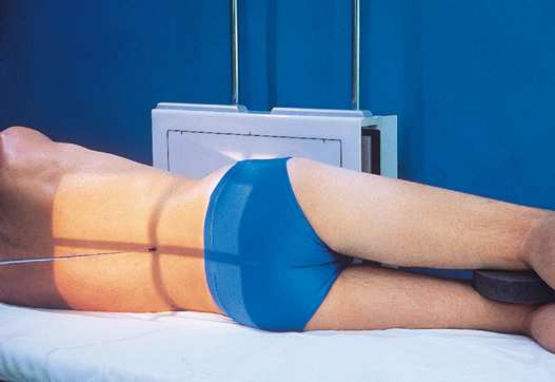
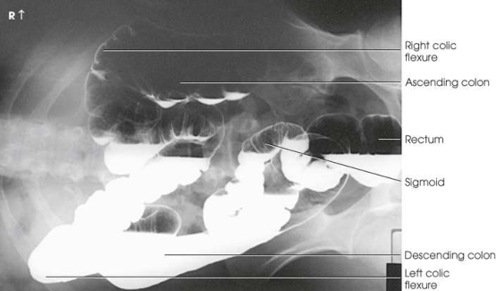
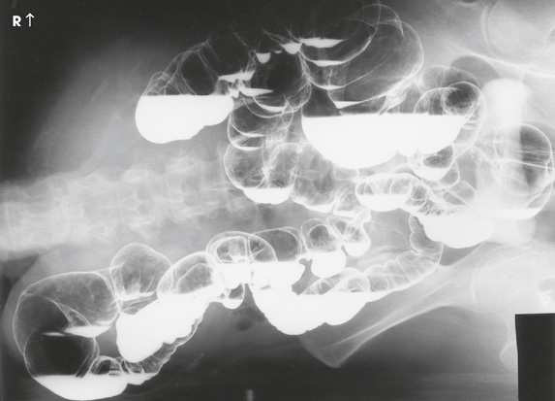

# Rx Intestin gros — PA sau Incidență Antero-Posterioară (AP) — Incidență în Decubit Lateral Stâng (Merrill)

  📷 Radiografie Convențională (Rx)
  <strong>Actualizat:</strong> 2026-09-16
  <strong>Autor:</strong> Referință Merrill

---

-   __1. Rezumat Clinic & Indicații__

    ---

    === "Indicații Clinice"

        - Conform reperelor anatomice standard din tratat

    === "Ghid Național IRIS"

        !!! info "Referință Primară: Ghidul Național IRIS (Ordinul MS 1342/2012)"
            - **Capitol Ghid IRIS:** *Ghidul Național IRIS*
            - **Grad de Recomandare:** **De verificat pe indicație; fără grad atribuit automat**
            - **Nivel de Iradiere Estimată:** `De verificat pentru examinarea și populația selectate`

            [:octicons-search-16: Deschide Ghidul IRIS](../../iris.md){ .md-button .md-button--primary } [:material-open-in-new: Aplicația Oficială PWA](https://radiologie-pediatrica.ro/iris/){ .md-button target="_blank" rel="noopener" }
-   __2. Poziționare & Centrare Fascicul__

    ---

    - **Poziție Pacient:** Se poziționează pacientul pe partea stângă, cu abdomenul sau spatele în contact cu stativul vertical Bucky. Se acordă atenție pentru a se asigura că pacientul nu cade de pe cărucior sau de pe masă; dacă se utilizează un cărucior, se blochează ferm toate roțile în poziție. Cu pacientul culcat pe un suport radiotransparent înălțat, se centrează MSP pe grilă. Se ajustează centrul receptorului de imagine la nivelul crestelor iliace (Fig. 15.139). Se efectuează ecranarea gonadelor cu șorț plumbat.
    - **Punct de Centrare Fascicul:** Orizontal și perpendicular pe receptorul de imagine (RI), pentru a pătrunde pe linia mediană a corpului, la nivelul crestelor iliace.
    - **Distanță Focar-Film (DFF / SID):** Nespecificat în fragmentul extras; de verificat în sursă
    - **Comandă Respiratorie:** apnee (oprirea respirației).

-   __3. Parametri Tehnici Expunere__

    ---

    | Parametru Tehnic | Valoare Configurare Generator / Tub |
    |:-----------------|:-------------------------------------|
    | **Tensiune Tub (kV)** | DE CONFIGURAT PE APARAT |
    | **Sarcină / Produs Curent-Timp (mAs)** | DE CONFIGURAT PE APARAT |
    | **Distanță Focar-Film (DFF / SID)** | Nespecificat în fragmentul extras; de verificat în sursă |
    | **Grilă Antidifuzoare (Bucky)** | DE CONFIGURAT PE APARAT |
    | **Dimensiune Focar** | DE CONFIGURAT PE APARAT |
    | **Camere de Ionizare AEC** | DE CONFIGURAT PE APARAT |
    | **Colimare Fascicul** | Se ajustează câmpul de iradiere astfel încât să nu depășească 14 × 17 țoli (35 × 43 cm). Pentru pacienți de talie redusă, se colimează la 2.5 cm de conturul tegumentar al flancurilor abdominale. Se plasează markerul de lateralitate în câmpul colimat. |
    | **Filtrare Tub** | DE CONFIGURAT PE APARAT |

-   __4. Criterii de Calitate & Reușită Imagine__

    ---

    - Criterii radiologice de calitate a imaginii:
    - Colimare adecvată vizibilă și prezența markerului de lateralitate (D/S) plasat în afara structurilor anatomice de interes
    - Regiunea de la flexura colică stângă până la rect
    - Absența rotației anatomice (simetrie bilaterală perfectă) a pacientului, evidențiată prin simetria coastelor (grilajului costal) și a bazinului (pelvisului)

-   __5. Protecție Radiologică (ALARA)__

    ---

    - Nespecificat în fragmentul extras; de verificat în sursă

!!! note "Observații Clinice & Tehnice"
    Conform reperelor anatomice standard din tratat

### 🖼️ Imagini

<figure class="protocol-image-card" markdown>

<figcaption><strong>Merrill — pagina 1182, imaginea 1</strong> — Imagine din fragmentul sursă; asocierea necesită revizie.</figcaption>

</figure>

<figure class="protocol-image-card" markdown>

<figcaption><strong>Merrill — pagina 1183, imaginea 2</strong> — Imagine din fragmentul sursă; asocierea necesită revizie.</figcaption>

</figure>

<figure class="protocol-image-card" markdown>

<figcaption><strong>Merrill — pagina 1183, imaginea 3</strong> — Imagine din fragmentul sursă; asocierea necesită revizie.</figcaption>

</figure>

=== "Ghid Rapid de Execuție"

    1. **Identificarea și verificarea pacientului:** verificare identitate, zonă de examinat, consimțământ conform procedurii și evaluarea posibilității unei sarcini, când este relevantă.
    2. **Pregătire:** îndepărtarea oricăror obiecte radiopace (bijuterii, agrafe, fermoare, proteze, pansamente dense).
    3. **Poziționare precisă:** alinierea receptorului de imagine și a tubului la distanța prescrisă (Nespecificat în fragmentul extras; de verificat în sursă).
    4. **Colimare strictă:** adaptarea fasciculului strict la regiunea de diagnostic pentru scăderea iradierii și reducerea radiației difuze.
    5. **Radioprotecție:** verificarea [politicii RX](../radioprotectie.md), cu măsuri distincte pentru pacient, personal și însoțitor.

## Surse de documentare

- [Merrill’s Atlas, 15. Digestive System: Salivary Glands, Alimentary Canal, And Biliary System, pagini 1182–1183](https://books.google.com/books/about/Merrill_s_Atlas_of_Radiographic_Position.html?id=BM0lEQAAQBAJ)

## Fragmente sursă traduse (referință tehnică)

### anatomie

Poziția de decubit lateral stâng evidențiază în incidență PA sau AP intestinul gros (colonul) umplut cu substanță de contrast. Această poziție evidențiază cel mai bine partea laterală „de sus” a colonului ascendent și partea medială a colonului descendent atunci când intestinul gros (colonul) este destins cu aer (Fig. 15.140 și 15.141).

### colimare

• Se ajustează câmpul de iradiere astfel încât să nu depășească 14 × 17 țoli (35 × 43 cm). Pentru pacienți de talie redusă, se colimează la 2.5 cm de conturul tegumentar
al flancurilor abdominale. Se plasează markerul de lateralitate în câmpul colimat.

### raza centrală

• Orizontal și perpendicular pe receptorul de imagine (RI), pentru a pătrunde pe linia mediană a corpului, la nivelul crestelor iliace.

### criterii

Criterii radiologice de calitate a imaginii:
• Colimare adecvată vizibilă și prezența markerului de lateralitate (D/S) plasat în afara anatomiei de interes
• Zona de la flexura colică stângă până la rect
• Absența rotației anatomice (simetrie bilaterală perfectă) a pacientului, evidențiată prin simetria coastelor și a bazinului (pelvisului)

### part_pos

• Cu pacientul culcat pe un suport radiotransparent înălțat, se centrează MSP pe grilă.
• Se ajustează centrul receptorului de imagine la nivelul crestelor iliace (Fig. 15.139).
• Se efectuează ecranarea gonadelor cu șorț plumbat.

### patient_pos

• Se poziționează pacientul pe partea stângă, cu abdomenul sau spatele în contact cu stativul vertical Bucky.
• Se acordă atenție pentru a se asigura că pacientul nu cade de pe cărucior sau de pe masă; dacă se utilizează un cărucior, se blochează ferm toate roțile în poziție.

### respirație

apnee (oprirea respirației).

### tehnică

Poziționat conform indicațiilor producătorului sau protocolului departamentului pentru orientarea corectă a afișării structurilor anatomice; raza centrală, placă: 14 × 17 țoli (35 ×
43 cm), longitudinal.

