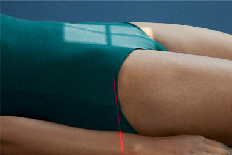
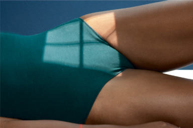
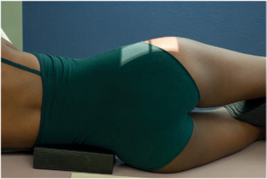

# Rx LPO AND RPO POSITIONS, Incidență de Profil (Lateral) AP (Antero-Posterior) ((OPTIONAL) - CYSTOGRAPHY)

  📷 Radiografie Convențională (Rx)
  <strong>Actualizat:</strong> 2026-09-15
  <strong>Autor:</strong> Departamentul de Radiologie / Referință Bontrager

---

-   __1. Rezumat Clinic & Indicații__

    ---

    === "Indicații Clinice"

        - Signs of cystitis, obstruction, vesicoureteral reflux, and bladder calculi are visualized.
        - Lateral demonstrates possible fistulas between the bladder and uterus or rectum. See p. 563 for detailed procedure descriptions.

    === "Ghid Național IRIS"

        !!! info "Referință Primară: Ghidul Național IRIS (Ordinul MS 1342/2012)"
            - **Capitol Ghid IRIS:** *Ghidul Național IRIS*
            - **Grad de Recomandare:** **De verificat pe indicație; fără grad atribuit automat**
            - **Nivel de Iradiere Estimată:** `De verificat pentru examinarea și populația selectate`

            [:octicons-search-16: Deschide Ghidul IRIS](../../iris.md){ .md-button .md-button--primary } [:material-open-in-new: Aplicația Oficială PWA](https://radiologie-pediatrica.ro/iris/){ .md-button target="_blank" rel="noopener" }
-   __2. Poziționare & Centrare Fascicul__

    ---

    - **Poziție Pacient:** Conform incidenței standard descrise
    - **Punct de Centrare Fascicul:** AP Center 2 inches (5 cm) superior to simfiza pubiană, with 10° to 15° caudad tube angle (to project simfiza pubiană inferior to bladder). To demonstrate urinary reflux, center higher at level of creasta iliacă (corespunzător L4-L5). Cystography ROUTINE AP (10° to 15° caudad) Both oblique positions (45° to 60°) SPECIAL Lateral (optional) Fig. 14.85 AP, 10° to 15° caudad. Fig. 14.86 RPO, 45° to 60°. Fig. 14.87 Left lateral (optional).
    - **Distanță Focar-Film (DFF / SID):** 100 cm
    - **Comandă Respiratorie:** Apnee pe durata expunerii (sau conform cooperării pacientului)

-   __3. Parametri Tehnici Expunere__

    ---

    | Parametru Tehnic | Valoare Configurare Generator / Tub |
    |:-----------------|:-------------------------------------|
    | **Tensiune Tub (kV)** | 80-90 kV |
    | **Sarcină / Produs Curent-Timp (mAs)** | DE CONFIGURAT PE APARAT |
    | **Distanță Focar-Film (DFF / SID)** | 100 cm |
    | **Grilă Antidifuzoare (Bucky)** | Cu grilă antidifuzoare Bucky |
    | **Dimensiune Focar** | Focar Mare (1.0 - 1.2 mm) |
    | **Camere de Ionizare AEC** | Camerele laterale (sau camera centrală funcție de regiune) |
    | **Colimare Fascicul** | Strictă pe regiunea de interes anatomic |
    | **Filtrare Tub** | Totală ≥ 2.5 mm Al echivalent |

-   __4. Criterii de Calitate & Reușită Imagine__

    ---

    - Vizualizarea completă a regiunii anatomice explorate
    - Absența artefactelor de mișcare sau a suprapunerilor neadecvate
    - Contrast și penetrare optime pentru decelarea structurilor osoase și a părților moi

-   __5. Protecție Radiologică (ALARA)__

    ---

    - Ecranare gonadică și a organelor radiosensibile conform procedurilor locale de radioprotecție ALARA.
    - Colimare strictă la aria de interes pentru limitarea radiației difuze.
    - Verificarea posibilității unei sarcini la pacientele de vârstă fertilă înainte de expunere.

!!! note "Observații Clinice & Tehnice"
    Do not flex elevatedside leg more than necessary to prevent superimposition of the leg over the bladder. Lateral This is optional because of the high gonadal radiation dose. Position patient in true lateral (Absența rotației anatomice: clavicule echidistante față de linia apofizelor spinoase) (Fig. 14.87).

### 🖼️ Imagini

<figure class="protocol-image-card" markdown>

<figcaption><strong>Fig. 14.85 AP, 10° to 15° caudad.</strong> — Poziționare pacient conform Ghidului Bontrager (Fig. 14.85 AP, 10° to 15° caudad.)</figcaption>

</figure>

<figure class="protocol-image-card" markdown>

<figcaption><strong>Fig. 14.86 RPO, 45° to 60°.</strong> — Aspect radiografic de referință conform Ghidului Bontrager (Fig. 14.86 RPO, 45° to 60°.)</figcaption>

</figure>

<figure class="protocol-image-card" markdown>

<figcaption><strong>Fig. 14.87 Left lateral (optional).</strong> — Aspect radiografic de referință conform Ghidului Bontrager (Fig. 14.87 Left lateral (optional).)</figcaption>

</figure>

=== "Ghid Rapid de Execuție"

    1. **Identificarea și verificarea pacientului:** verificare identitate, zonă de examinat, consimțământ conform procedurii și evaluarea posibilității unei sarcini, când este relevantă.
    2. **Pregătire:** îndepărtarea oricăror obiecte radiopace (bijuterii, agrafe, fermoare, proteze, pansamente dense).
    3. **Poziționare precisă:** alinierea receptorului de imagine și a tubului la distanța prescrisă (100 cm).
    4. **Colimare strictă:** adaptarea fasciculului strict la regiunea de diagnostic pentru scăderea iradierii și reducerea radiației difuze.
    5. **Radioprotecție:** verificarea [politicii RX](../radioprotectie.md), cu măsuri distincte pentru pacient, personal și însoțitor.

## Surse de documentare

- [Bontrager's Textbook of Radiographic Positioning (Ed. 9/10), Pagina 585](https://www.elsevier.com/books/textbook-of-radiographic-positioning-and-related-anatomy/lampignano/978-0-323-65367-1)
