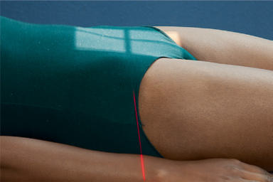
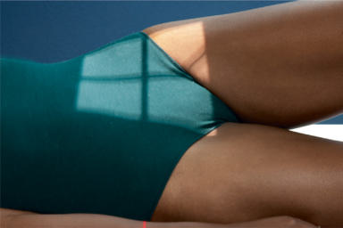
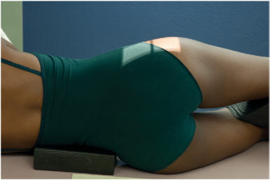

# Rx LPO ȘI Oblică Posterioară Dreaptă (OPD / RPO), Incidență de Profil, AP (Antero-Posterior) ((OPȚIONALĂ) - CISTOGRAFIE)

  📷 Radiografie Convențională (Rx)
  <strong>Actualizat:</strong> 2026-09-15
  <strong>Autor:</strong> Departamentul de Radiologie / Referință Bontrager

---

-   __1. Rezumat Clinic & Indicații__

    ---

    === "Indicații Clinice"

        - Sunt vizualizate semne de cistită, obstrucție, reflux vezicoureteral și litiază urinară / calculi radio-opaci la nivelul vezicii urinare.
        - Incidența de profil evidențiază posibile fistule între vezica urinară și uter sau rect. Consultați p. 563 pentru descrieri detaliate ale procedurii.

    === "Ghid Național IRIS"

        !!! info "Referință Primară: Ghidul Național IRIS (Ordinul MS 1342/2012)"
            - **Capitol Ghid IRIS:** *Aparat digestiv & Abdomen*
            - **Grad de Recomandare:** **Grad B**
            - **Nivel de Iradiere Estimată:** `Clasa 2 (Foarte mică ~ 0.7 - 1.2 mSv)`

            [:octicons-search-16: Deschide Ghidul IRIS](../../iris.md){ .md-button .md-button--primary } [:material-open-in-new: Aplicația Oficială PWA](https://radiologie-pediatrica.ro/iris/){ .md-button target="_blank" rel="noopener" }

-   __2. Poziționare & Centrare Fascicul__

    ---

    - **Poziție Pacient:** Conform incidenței standard descrise
    - **Punct de Centrare Fascicul:** AP: Se centrează la 2 țoli (5 cm) superior de simfiza pubiană, cu tubul înclinat caudal la 10° la 15° (pentru a proiecta simfiza pubiană inferior de vezica urinară). Pentru a evidenția refluxul urinar, se centrează mai sus, la nivelul crestei iliace (corespunzător L4-L5). Cistografie DE RUTINĂ: AP (10° la 15° caudal), ambele poziții oblice (45° la 60°). SPECIALĂ: incidență de profil (opțională). Fig. 14.85 AP, 10° la 15° caudal. Fig. 14.86 RPO, 45° la 60°. Fig. 14.87 profil stâng (opțional).
    - **Distanță Focar-Film (DFF / SID):** 100 cm
    - **Comandă Respiratorie:** Apnee pe durata expunerii (sau conform cooperării pacientului)

-   __3. Parametri Tehnici Expunere__

    ---

    | Parametru Tehnic | Valoare Configurare Generator / Tub |
    |:-----------------|:-------------------------------------|
    | **Tensiune Tub (kV)** | 80-90 kV |
    | **Sarcină / Produs Curent-Timp (mAs)** | DE CONFIGURAT PE APARAT |
    | **Distanță Focar-Film (DFF / SID)** | 100 cm |
    | **Grilă Antidifuzoare (Bucky)** | Cu grilă antidifuzoare Bucky |
    | **Dimensiune Focar** | Focar Mare (1.0 - 1.2 mm) |
    | **Camere de Ionizare AEC** | Camerele laterale (sau camera centrală, în funcție de regiune) |
    | **Colimare Fascicul** | Colimare strictă pe regiunea anatomică de interes diagnostic |
    | **Filtrare Tub** | Totală ≥ 2.5 mm Al echivalent |

-   __4. Criterii de Calitate & Reușită Imagine__

    ---

    - Vizualizarea completă a regiunii anatomice explorate
    - Absența artefactelor de mișcare sau a suprapunerilor neadecvate
    - Contrast și penetrare optime pentru decelarea structurilor osoase și a părților moi

-   __5. Protecție Radiologică (ALARA)__

    ---

    - Ecranare gonadică și a organelor radiosensibile conform procedurilor locale de radioprotecție ALARA.
    - Colimare strictă la aria de interes pentru limitarea radiației difuze.
    - Verificarea posibilității unei sarcini la pacientele de vârstă fertilă înainte de expunere.

!!! note "Observații Clinice & Tehnice"
    Nu flectați membrul inferior de pe partea ridicată mai mult decât este necesar pentru a preveni suprapunerea membrului inferior peste vezica urinară. Incidența de profil: Aceasta este opțională din cauza dozei mari de radiații la nivelul gonadelor. Poziționați pacientul în profil strict (Absența rotației anatomice: clavicule echidistante față de linia apofizelor spinoase) (Fig. 14.87).

### 🖼️ Imagini

<figure class="protocol-image-card" markdown>

<figcaption><strong>Fig. 14.85 AP, 10° la 15° caudal.</strong> — Poziționare pacient conform Ghidului Bontrager (Fig. 14.85 AP, 10° la 15° caudal.)</figcaption>

</figure>

<figure class="protocol-image-card" markdown>

<figcaption><strong>Fig. 14.86 RPO, 45° la 60°.</strong> — Aspect radiografic de referință conform Ghidului Bontrager (Fig. 14.86 RPO, 45° la 60°.)</figcaption>

</figure>

<figure class="protocol-image-card" markdown>

<figcaption><strong>Fig. 14.87 profil stâng (opțional).</strong> — Aspect radiografic de referință conform Ghidului Bontrager (Fig. 14.87 profil stâng (opțional).)</figcaption>

</figure>

=== "Ghid Rapid de Execuție"

    1. **Identificarea și verificarea pacientului:** verificare identitate, zonă de examinat, consimțământ conform procedurii și evaluarea posibilității unei sarcini, când este relevantă.
    2. **Pregătire:** îndepărtarea oricăror obiecte radiopace (bijuterii, agrafe, fermoare, proteze, pansamente dense).
    3. **Poziționare precisă:** alinierea receptorului de imagine și a tubului la distanța prescrisă (100 cm).
    4. **Colimare strictă:** adaptarea fasciculului strict la regiunea de diagnostic pentru scăderea iradierii și reducerea radiației difuze.
    5. **Radioprotecție:** verificarea [politicii RX](../radioprotectie.md), cu măsuri distincte pentru pacient, personal și însoțitor.

## Surse de documentare

- [Bontrager's Textbook of Radiographic Positioning (Ed. 9/10), Pagina 585](https://www.elsevier.com/books/textbook-of-radiographic-positioning-and-related-anatomy/lampignano/978-0-323-65367-1)
