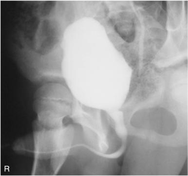
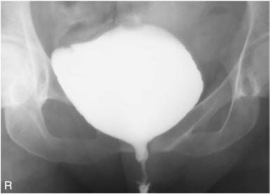

# Rx MALE; Incidență Antero-Posterioară (AP) RPO (30°) Poziționare (FEMALE - VOIDING - Cistouretrografie)

  📷 Radiografie Convențională (Rx)
  <strong>Actualizat:</strong> 2026-09-15
  <strong>Autor:</strong> Departamentul de Radiologie / Referință Bontrager

---

-   __1. Rezumat Clinic & Indicații__

    ---

    === "Indicații Clinice"

        - Possible vesicoureteral reflux functional study de vezică urinară și urethra determines cause de urinary retention.

    === "Ghid Național IRIS"

        !!! info "Referință Primară: Ghidul Național IRIS (Ordinul MS 1342/2012)"
            - **Capitol Ghid IRIS:** *Ghidul Național IRIS*
            - **Grad de Recomandare:** **De verificat pe indicație; fără grad atribuit automat**
            - **Nivel de Iradiere Estimată:** `De verificat pentru examinarea și populația selectate`

            [:octicons-search-16: Deschide Ghidul IRIS](../../iris.md){ .md-button .md-button--primary } [:material-open-in-new: Aplicația Oficială PWA](https://radiologie-pediatrica.ro/iris/){ .md-button target="_blank" rel="noopener" }
-   __2. Poziționare & Centrare Fascicul__

    ---

    - **Poziție Pacient:** Pacient: Take imagine cu pacientul Decubit sau Ortostatism.; Regiune anatomică: Male oblic corp 30° into poziție oblică posterioară dreaptă (OPD / RPO). Superimpose urethra over soft tissues de drept thigh. Female poziție pacient Decubit dorsal sau Ortostatism into AP poziție. Center plan mediosagital la table sau film radiologic holder. Extend și slightly separate membre inferioare.
    - **Punct de Centrare Fascicul:** este perpendicular pe receptorul de imagine. Center raza centrală și receptorul de imagine la simfiza pubiană.
    - **Distanță Focar-Film (DFF / SID):** 100 cm
    - **Comandă Respiratorie:** Apnee pe durata expunerii after expiration și expose.

-   __3. Parametri Tehnici Expunere__

    ---

    | Parametru Tehnic | Valoare Configurare Generator / Tub |
    |:-----------------|:-------------------------------------|
    | **Tensiune Tub (kV)** | 80-85 kV |
    | **Sarcină / Produs Curent-Timp (mAs)** | DE CONFIGURAT PE APARAT |
    | **Distanță Focar-Film (DFF / SID)** | 100 cm |
    | **Grilă Antidifuzoare (Bucky)** | Cu grilă antidifuzoare Bucky |
    | **Dimensiune Focar** | Focar Mic (0.6 mm) |
    | **Camere de Ionizare AEC** | Camerele laterale (sau camera centrală funcție de regiune) |
    | **Colimare Fascicul** | Collimate pe four sides la anatomy de interest. |
    | **Filtrare Tub** | Totală ≥ 2.5 mm Al echivalent |

-   __4. Criterii de Calitate & Reușită Imagine__

    ---

    - Contrastfilled vezică urinară și urethra sunt visualized. poziție:
    - RPO: Male urethra containing contrast medium este superimposed over soft tissues de drept thigh (Fig. 14.90).
    - AP: Female urethra containing contrast medium este evidențiat inferior la simfiza pubiană (Fig. 14.91).
    - corect collimation applied. expunere:
    - optim receptorul de imagine expunere și contrast la visualize vezică urinară fără overexposing male prostate area și contrastfilled urethra de male sau female. Fig. 14.90 RPO, male. Fig. 14.91 AP, female.

-   __5. Protecție Radiologică (ALARA)__

    ---

    - Ecranare gonadică și a organelor radiosensibile conform procedurilor locale de radioprotecție ALARA.
    - Colimare strictă la aria de interes pentru limitarea radiației difuze.
    - Verificarea posibilității unei sarcini la pacientele de vârstă fertilă înainte de expunere.

!!! note "Observații Clinice & Tehnice"
    Fluoroscopy și spot imaging sunt best pentru this procedure. Catheter trebuie să fie removed gently before voiding procedure. radiolucent receptacle sau absorbent padding trebuie să fie provided pentru pacientul. After voiding este complete, Post-Micțional Incidență Antero-Posterioară (AP) poate fie requested. Voiding Cistouretrografie ROUTINE Male—RPO (30°) Female—AP

### 🖼️ Imagini

<figure class="protocol-image-card" markdown>

<figcaption><strong>Fig. 14.90 RPO, male.</strong> — Poziționare pacient conform Ghidului Bontrager (Fig. 14.90 RPO, male.)</figcaption>

</figure>

<figure class="protocol-image-card" markdown>

<figcaption><strong>Fig. 14.91 AP, female.</strong> — Aspect radiografic de referință conform Ghidului Bontrager (Fig. 14.91 AP, female.)</figcaption>

</figure>

=== "Ghid Rapid de Execuție"

    1. **Identificarea și verificarea pacientului:** verificare identitate, zonă de examinat, consimțământ conform procedurii și evaluarea posibilității unei sarcini, când este relevantă.
    2. **Pregătire:** îndepărtarea oricăror obiecte radiopace (bijuterii, agrafe, fermoare, proteze, pansamente dense).
    3. **Poziționare precisă:** alinierea receptorului de imagine și a tubului la distanța prescrisă (100 cm).
    4. **Colimare strictă:** adaptarea fasciculului strict la regiunea de diagnostic pentru scăderea iradierii și reducerea radiației difuze.
    5. **Radioprotecție:** verificarea [politicii RX](../radioprotectie.md), cu măsuri distincte pentru pacient, personal și însoțitor.

## Surse de documentare

- [Bontrager's Textbook of Radiographic Positioning (Ed. 9/10), Pagina 587](https://www.elsevier.com/books/textbook-of-radiographic-positioning-and-related-anatomy/lampignano/978-0-323-65367-1)
