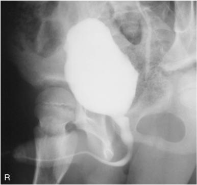
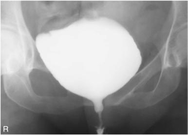

# Rx BĂRBAȚI; Incidență Antero-Posterioară (AP) RPO (30°) Poziționare (FEMEI - MICȚIONALĂ - Cistouretrografie)

  📷 Radiografie Convențională (Rx)
  <strong>Actualizat:</strong> 2026-09-15
  <strong>Autor:</strong> Departamentul de Radiologie / Referință Bontrager

---

-   __1. Rezumat Clinic & Indicații__

    ---

    === "Indicații Clinice"

        - Posibil reflux vezicoureteral. Studiul funcțional al vezicii urinare și al uretrei determină cauza retenției urinare.

    === "Ghid Național IRIS"

        !!! info "Referință Primară: Ghidul Național IRIS (Ordinul MS 1342/2012)"
            - **Capitol Ghid IRIS:** *Aparat digestiv & Abdomen*
            - **Grad de Recomandare:** **Grad B**
            - **Nivel de Iradiere Estimată:** `Clasa 2 (Foarte mică ~ 0.7 - 1.2 mSv)`

            [:octicons-search-16: Deschide Ghidul IRIS](../../iris.md){ .md-button .md-button--primary } [:material-open-in-new: Aplicația Oficială PWA](https://radiologie-pediatrica.ro/iris/){ .md-button target="_blank" rel="noopener" }

-   __2. Poziționare & Centrare Fascicul__

    ---

    - **Poziție Pacient:** Pacient: Realizați imaginea cu pacientul în decubit sau în ortostatism. Regiune anatomică: La bărbați, rotiți corpul cu 30° în poziție oblică posterioară dreaptă (OPD / RPO). Suprapuneți uretra peste țesuturile moi ale coapsei drepte. La femei, poziționați pacienta în decubit dorsal sau în ortostatism, în poziție AP. Centrați planul mediosagital pe masă sau pe suportul pentru filmul radiologic. Extindeți și depărtați ușor membrele inferioare.
    - **Punct de Centrare Fascicul:** Este perpendicular pe receptorul de imagine. Centrați raza centrală și receptorul de imagine la nivelul simfizei pubiene.
    - **Distanță Focar-Film (DFF / SID):** 100 cm
    - **Comandă Respiratorie:** Apnee pe durata expunerii, după expir, și efectuați expunerea.

-   __3. Parametri Tehnici Expunere__

    ---

    | Parametru Tehnic | Valoare Configurare Generator / Tub |
    |:-----------------|:-------------------------------------|
    | **Tensiune Tub (kV)** | 80-85 kV |
    | **Sarcină / Produs Curent-Timp (mAs)** | DE CONFIGURAT PE APARAT |
    | **Distanță Focar-Film (DFF / SID)** | 100 cm |
    | **Grilă Antidifuzoare (Bucky)** | Cu grilă antidifuzoare Bucky |
    | **Dimensiune Focar** | Focar Mic (0.6 mm) |
    | **Camere de Ionizare AEC** | Camerele laterale (sau camera centrală, în funcție de regiune) |
    | **Colimare Fascicul** | Colimați pe cele patru laturi la anatomia de interes. |
    | **Filtrare Tub** | Totală ≥ 2.5 mm Al echivalent |

-   __4. Criterii de Calitate & Reușită Imagine__

    ---

    - Sunt vizualizate vezica urinară și uretra umplute cu substanță de contrast. Poziție:
    - RPO: Uretra masculină care conține substanță de contrast se suprapune peste țesuturile moi ale coapsei drepte (Fig. 14.90).
    - AP: Uretra feminină care conține substanță de contrast este evidențiată inferior de simfiza pubiană (Fig. 14.91).
    - Colimare corectă. Expunere:
    - Expunere optimă a receptorului de imagine și contrast optim pentru vizualizarea vezicii urinare fără supraexpunerea regiunii prostatei la bărbați și a uretrei umplute cu substanță de contrast la bărbați sau femei. Fig. 14.90 RPO, bărbat. Fig. 14.91 AP, femeie.

-   __5. Protecție Radiologică (ALARA)__

    ---

    - Ecranare gonadică și a organelor radiosensibile conform procedurilor locale de radioprotecție ALARA.
    - Colimare strictă la aria de interes pentru limitarea radiației difuze.
    - Verificarea posibilității unei sarcini la pacientele de vârstă fertilă înainte de expunere.

!!! note "Observații Clinice & Tehnice"
    Fluoroscopia și radiografiile țintite sunt cele mai potrivite pentru această procedură. Cateterul trebuie îndepărtat cu blândețe înaintea procedurii micționale. Pacientului trebuie să i se asigure un recipient radiotransparent sau un material absorbant. După încheierea micțiunii, poate fi solicitată o incidență antero-posterioară (AP) postmicțională. Cistouretrografie micțională DE RUTINĂ: Bărbați—RPO (30°) Femei—AP

### 🖼️ Imagini

<figure class="protocol-image-card" markdown>

<figcaption><strong>Fig. 14.90 RPO, bărbat.</strong> — Poziționare pacient conform Ghidului Bontrager (Fig. 14.90 RPO, bărbat.)</figcaption>

</figure>

<figure class="protocol-image-card" markdown>

<figcaption><strong>Fig. 14.91 AP, femeie.</strong> — Aspect radiografic de referință conform Ghidului Bontrager (Fig. 14.91 AP, femeie.)</figcaption>

</figure>

=== "Ghid Rapid de Execuție"

    1. **Identificarea și verificarea pacientului:** verificare identitate, zonă de examinat, consimțământ conform procedurii și evaluarea posibilității unei sarcini, când este relevantă.
    2. **Pregătire:** îndepărtarea oricăror obiecte radiopace (bijuterii, agrafe, fermoare, proteze, pansamente dense).
    3. **Poziționare precisă:** alinierea receptorului de imagine și a tubului la distanța prescrisă (100 cm).
    4. **Colimare strictă:** adaptarea fasciculului strict la regiunea de diagnostic pentru scăderea iradierii și reducerea radiației difuze.
    5. **Radioprotecție:** verificarea [politicii RX](../radioprotectie.md), cu măsuri distincte pentru pacient, personal și însoțitor.

## Surse de documentare

- [Bontrager's Textbook of Radiographic Positioning (Ed. 9/10), Pagina 587](https://www.elsevier.com/books/textbook-of-radiographic-positioning-and-related-anatomy/lampignano/978-0-323-65367-1)
