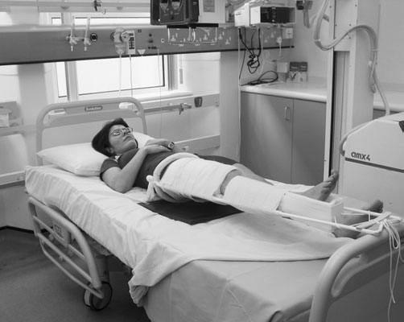
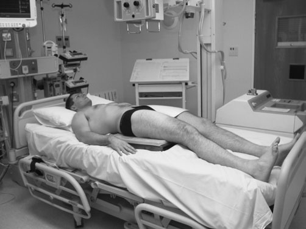
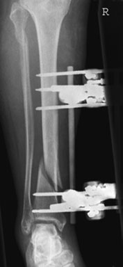
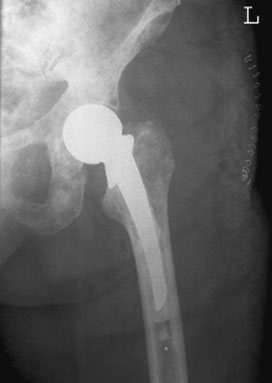

# Rx Membru Inferior și Bazin (Fracturi) Bazin (Pelvis) Antero-Posterior (AP)

  📷 Radiografie Convențională (Rx)
  <strong>Actualizat:</strong> 2026-09-16
  <strong>Autor:</strong> Departamentul de Radiologie / Referință Clark (Ed. 12)

---

-   __1. Rezumat Clinic & Indicații__

    ---

    === "Indicații Clinice"

        - Great care trebuie să fie exercised nu la disturb these appliances, ca they poate disturb poziție de suspiciune de fracturăd bones și add la pacientul’s pain. heavy pacient poate tend la sag into mattress de bed, which complicates matters when positioning pentru incidențe de upper Femur. pacientul poate fie able la lift their bottom off bed using overhead Mână grip so that support pad sau casetă tunnel device poate fie introduced under buttocks. Antero-posterior (AP)

    === "Ghid Național IRIS"

        !!! info "Referință Primară: Ghidul Național IRIS (Ordinul MS 1342/2012)"
            - **Capitol Ghid IRIS:** *Ghidul Național IRIS*
            - **Grad de Recomandare:** **De verificat pe indicație; fără grad atribuit automat**
            - **Nivel de Iradiere Estimată:** `De verificat pentru examinarea și populația selectate`

            [:octicons-search-16: Deschide Ghidul IRIS](../../iris.md){ .md-button .md-button--primary } [:material-open-in-new: Aplicația Oficială PWA](https://radiologie-pediatrica.ro/iris/){ .md-button target="_blank" rel="noopener" }
-   __2. Poziționare & Centrare Fascicul__

    ---

    - **Poziție Pacient:** • mobile set este poziționat carefully relative la orice overhead bed supports, cu adjustment being made cu support de nursing staff.
• suitably sized casetă este selected și carefully poziționat under Femur sau lower membru inferior pentru include articulație nearest suspiciune de fractură și ca much de upper sau membru inferior ca possible la enable bone alignment la fie assessed.
• caseta este sprijinit paralel cu Femur sau membru inferior prin use de non-opaque pads.
• pentru suspiciune de fractură de Col Femural sau Bazin (bazin (pelvis)), casetă tunnel device poate fie used, which needs only one major disturbance la pacientul. Once în poziție, casetă poate fie poziționat fără orice further disruption la pacientul. This also serves în aiding positioning pentru Profil (lateral) incidență when pacientul este raised, allowing adecvat demonstration de Femur.
    - **Punct de Centrare Fascicul:** • se orientează raza centrală centrală la drept-angles la middle de caseta cu raza centrală centrală în unghi drept față de axa longitudinală de bones în question, în accordance cu techniques previously described în chapter pe membru inferior.
    - **Distanță Focar-Film (DFF / SID):** 100 cm
    - **Comandă Respiratorie:** Apnee pe durata expunerii (apnee în inspir pentru torace; expir pentru Abdomen/bazin).

-   __3. Parametri Tehnici Expunere__

    ---

    | Parametru Tehnic | Valoare Configurare Generator / Tub |
    |:-----------------|:-------------------------------------|
    | **Tensiune Tub (kV)** | DE CONFIGURAT PE APARAT |
    | **Sarcină / Produs Curent-Timp (mAs)** | Conform AEC / grosime anatomică |
    | **Distanță Focar-Film (DFF / SID)** | 100 cm |
    | **Grilă Antidifuzoare (Bucky)** | Conform grosimii anatomice (> 10-12 cm cu grilă) |
    | **Dimensiune Focar** | Focar Mic (0.6 mm) |
    | **Camere de Ionizare AEC** | DE CONFIGURAT PE APARAT |
    | **Colimare Fascicul** | Colimare strictă la aria anatomică de interes diagnostic |
    | **Filtrare Tub** | Totală ≥ 2.5 mm Al echivalent (conform Clark: 3.0 mm Al eq.) |

-   __4. Criterii de Calitate & Reușită Imagine__

    ---

    - Vizualizarea clară întregii arii anatomice (Membru inferior și Bazin (Fracturi) Bazin (bazin (pelvis))).
    - Absența artefactelor de mișcare; trabeculație osoasă și contururi nete.
    - Densitate optică și contrast adecvate pentru diferențierea țesuturilor moi de structurile osoase.

-   __5. Protecție Radiologică (ALARA)__

    ---

    - Radiation protection is particularly important, and gonad shields should be used.
    - A mobile radiation protection barrier should be positioned behind the cassette to confine the primary radiation field when undertaking Profil (Lateral) projections. 362 Patient positioned for Antero-Posterior (AP) Femur (Șold down) following the application of a Thomas’s splint Patient resting on a wooden cassette tunnel device for Antero-Posterior (AP) Bazin (Pelvis) Antero-Posterior (AP) image of Gambă (Tibie și Peroneu) showing external fixation device Antero-Posterior (AP) postoperative image of Șold (Articulație Coxofemurală) following arthroplasty
    - Ecranare gonadică cu șorț plumbat dacă gonadele sunt în apropierea fasciculului util (regula ALARA).
    - Colimare precisă la dimensiunea anatomică strict necesară pentru reducerea dozei și a radiației difuze.
    - Verificarea posibilității unei sarcini la pacientele de vârstă fertilă înainte de expunere.

!!! note "Observații Clinice & Tehnice"
    Repeat examinations will fie required over period de time la assess effectiveness de treatment; therefore, careful positioning și expunere selection sunt required la ensure that imagini sunt comparable.

### 🖼️ Imagini

<figure class="protocol-image-card" markdown>

<figcaption><strong>12 Membru inferior și Bazin (Fracturi)</strong> — Poziționare pacient și centrare fascicul conform Clark (Ed. 12)</figcaption>

</figure>

<figure class="protocol-image-card" markdown>

<figcaption><strong>Orthopaedic radiografie poate fie required la fie undertaken pe</strong> — Aspect radiografic / ghid de poziționare conform tratatului Clark (Ed. 12)</figcaption>

</figure>

<figure class="protocol-image-card" markdown>

<figcaption><strong>tion de traction. pentru limbs, two radiografii sunt taken la drept-</strong> — Aspect radiografic / ghid de poziționare conform tratatului Clark (Ed. 12)</figcaption>

</figure>

<figure class="protocol-image-card" markdown>

<figcaption><strong>suspiciune de fracturăd bones. Examination de pacientul will fie made difficult</strong> — Aspect radiografic / ghid de poziționare conform tratatului Clark (Ed. 12)</figcaption>

</figure>

=== "Ghid Rapid de Execuție"

    1. **Identificarea și verificarea pacientului:** verificare identitate, zonă de examinat, consimțământ conform procedurii și evaluarea posibilității unei sarcini, când este relevantă.
    2. **Pregătire:** îndepărtarea oricăror obiecte radiopace (bijuterii, agrafe, fermoare, proteze, pansamente dense).
    3. **Poziționare precisă:** alinierea receptorului de imagine și a tubului la distanța prescrisă (100 cm).
    4. **Colimare strictă:** adaptarea fasciculului strict la regiunea de diagnostic pentru scăderea iradierii și reducerea radiației difuze.
    5. **Radioprotecție:** verificarea [politicii RX](../radioprotectie.md), cu măsuri distincte pentru pacient, personal și însoțitor.

## Surse de documentare

- [Clark's Positioning in Radiography (Ed. 12), Pagina 377](../../assets/protocols/sources/Clark___Positioning_in_Radiography__12th_edition.pdf#page=377)
