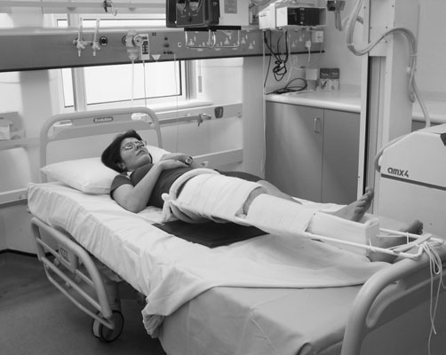
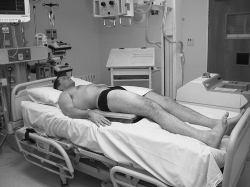
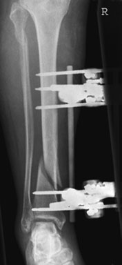
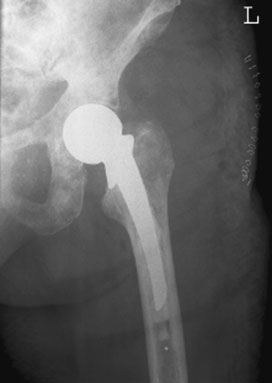

# Rx Membru Inferior și Bazin (Fracturi) Bazin (Pelvis) Antero-Posterior (AP)

  📷 Radiografie Convențională (Rx)
  <strong>Actualizat:</strong> 2026-09-16
  <strong>Autor:</strong> Departamentul de Radiologie / Referință Clark (Ed. 12)

---

-   __1. Rezumat Clinic & Indicații__

    ---

    === "Indicații Clinice"

        - Trebuie acordată o atenție deosebită pentru a nu deplasa aceste dispozitive, deoarece acestea pot modifica poziția oaselor cu suspiciune de fractură și pot accentua durerea pacientului. Un pacient cu greutate mare poate tinde să se afunde în salteaua patului, ceea ce complică poziționarea pentru incidențele porțiunii proximale a femurului. Pacientul poate fi capabil să își ridice fesele de pe pat folosind mânerul de prindere de deasupra capului, astfel încât o pernă de sprijin sau un dispozitiv de tip tunel pentru casetă să poată fi introdus sub fese. Antero-posterior (AP)

    === "Ghid Național IRIS"

        !!! info "Referință Primară: Ghidul Național IRIS (Ordinul MS 1342/2012)"
            - **Capitol Ghid IRIS:** *Ghidul Național IRIS*
            - **Grad de Recomandare:** **De verificat pe indicație; fără grad atribuit automat**
            - **Nivel de Iradiere Estimată:** `De verificat pentru examinarea și populația selectate`

            [:octicons-search-16: Deschide Ghidul IRIS](../../iris.md){ .md-button .md-button--primary } [:material-open-in-new: Aplicația Oficială PWA](https://radiologie-pediatrica.ro/iris/){ .md-button target="_blank" rel="noopener" }
-   __2. Poziționare & Centrare Fascicul__

    ---

    - **Poziție Pacient:** • Aparatul mobil se poziționează cu grijă în raport cu orice suporturi aflate deasupra patului, ajustarea efectuându-se cu ajutorul personalului de îngrijire.
• Se selectează o casetă de dimensiuni adecvate și se poziționează cu grijă sub femur sau gambă, pentru a include articulația cea mai apropiată de zona cu suspiciune de fractură și cât mai mult din porțiunea superioară sau inferioară a membrului, pentru a permite evaluarea alinierii osoase.
• Caseta se sprijină paralel cu femurul sau cu membrul inferior, folosind perne radiotransparente.
• În caz de suspiciune de fractură de col femural sau de bazin (pelvis), poate fi utilizat un dispozitiv de tip tunel pentru casetă, care necesită o singură mobilizare majoră a pacientului. Odată ce dispozitivul este în poziție, caseta poate fi poziționată fără a mai deranja pacientul. Acesta ajută și la poziționarea pentru incidența de profil atunci când pacientul este ridicat, permițând evidențierea adecvată a femurului.
    - **Punct de Centrare Fascicul:** • Se orientează raza centrală perpendicular pe mijlocul casetei, cu raza centrală în unghi drept față de axa longitudinală a oaselor în cauză, în conformitate cu tehnicile descrise anterior în capitolul despre membrul inferior.
    - **Distanță Focar-Film (DFF / SID):** 100 cm
    - **Comandă Respiratorie:** Apnee pe durata expunerii (apnee în inspir pentru torace; expir pentru Abdomen/bazin).

-   __3. Parametri Tehnici Expunere__

    ---

    | Parametru Tehnic | Valoare Configurare Generator / Tub |
    |:-----------------|:-------------------------------------|
    | **Tensiune Tub (kV)** | DE CONFIGURAT PE APARAT |
    | **Sarcină / Produs Curent-Timp (mAs)** | Conform AEC / grosimii anatomice |
    | **Distanță Focar-Film (DFF / SID)** | 100 cm |
    | **Grilă Antidifuzoare (Bucky)** | Conform grosimii anatomice (> 10-12 cm cu grilă) |
    | **Dimensiune Focar** | Focar Mic (0.6 mm) |
    | **Camere de Ionizare AEC** | DE CONFIGURAT PE APARAT |
    | **Colimare Fascicul** | Colimare strictă la aria anatomică de interes diagnostic |
    | **Filtrare Tub** | Totală ≥ 2.5 mm Al echivalent (conform Clark: 3.0 mm Al echivalent) |

-   __4. Criterii de Calitate & Reușită Imagine__

    ---

    - Vizualizarea clară a întregii arii anatomice (Membru inferior și Bazin (Fracturi) Bazin (pelvis)).
    - Absența artefactelor de mișcare; trabeculație osoasă și contururi nete.
    - Densitate optică și contrast adecvate pentru diferențierea țesuturilor moi de structurile osoase.

-   __5. Protecție Radiologică (ALARA)__

    ---

    - Protecția radiologică este deosebit de importantă și trebuie utilizate dispozitive de protecție a gonadelor.
    - Un paravan mobil de protecție radiologică trebuie poziționat în spatele casetei pentru a limita câmpul de radiație primară atunci când se efectuează incidențe de profil. 362 Pacient poziționat pentru radiografia antero-posterioară (AP) a femurului (de la șold în jos) după aplicarea unei atele Thomas. Pacient sprijinit pe un dispozitiv din lemn de tip tunel pentru casetă, pentru radiografia antero-posterioară (AP) a bazinului (pelvisului). Imagine antero-posterioară (AP) a gambei (tibie și peroneu), care evidențiază un dispozitiv de fixare externă. Imagine postoperatorie antero-posterioară (AP) a șoldului (articulației coxofemurale) după artroplastie
    - Ecranare gonadică cu șorț plumbat dacă gonadele sunt în apropierea fasciculului util (regula ALARA).
    - Colimare precisă la dimensiunea anatomică strict necesară pentru reducerea dozei și a radiației difuze.
    - Verificarea posibilității unei sarcini la pacientele de vârstă fertilă înainte de expunere.

!!! note "Observații Clinice & Tehnice"
    Vor fi necesare examinări repetate pe parcursul unei perioade de timp pentru a evalua eficacitatea tratamentului; prin urmare, sunt necesare o poziționare atentă și o alegere atentă a parametrilor de expunere pentru a asigura comparabilitatea imaginilor.

### 🖼️ Imagini

<figure class="protocol-image-card" markdown>

<figcaption><strong>12 Membru inferior și Bazin (Fracturi)</strong> — Poziționarea pacientului și centrarea fasciculului conform Clark (Ed. 12)</figcaption>

</figure>

<figure class="protocol-image-card" markdown>

<figcaption><strong>Poate fi necesară efectuarea radiografiei ortopedice pe</strong> — Aspect radiografic / ghid de poziționare conform tratatului Clark (Ed. 12)</figcaption>

</figure>

<figure class="protocol-image-card" markdown>

<figcaption><strong>de tracțiune. Pentru membre, se efectuează două radiografii la unghi drept-</strong> — Aspect radiografic / ghid de poziționare conform tratatului Clark (Ed. 12)</figcaption>

</figure>

<figure class="protocol-image-card" markdown>

<figcaption><strong>oase cu suspiciune de fractură. Examinarea pacientului va fi îngreunată</strong> — Aspect radiografic / ghid de poziționare conform tratatului Clark (Ed. 12)</figcaption>

</figure>

=== "Ghid Rapid de Execuție"

    1. **Identificarea și verificarea pacientului:** verificare identitate, zonă de examinat, consimțământ conform procedurii și evaluarea posibilității unei sarcini, când este relevantă.
    2. **Pregătire:** îndepărtarea oricăror obiecte radiopace (bijuterii, agrafe, fermoare, proteze, pansamente dense).
    3. **Poziționare precisă:** alinierea receptorului de imagine și a tubului la distanța prescrisă (100 cm).
    4. **Colimare strictă:** adaptarea fasciculului strict la regiunea de diagnostic pentru scăderea iradierii și reducerea radiației difuze.
    5. **Radioprotecție:** verificarea [politicii RX](../radioprotectie.md), cu măsuri distincte pentru pacient, personal și însoțitor.

## Surse de documentare

- [Clark's Positioning in Radiography (Ed. 12), Pagina 377](https://books.google.com/books/about/Clark_s_Positioning_in_Radiography.html?id=Xxu6MwEACAAJ)
