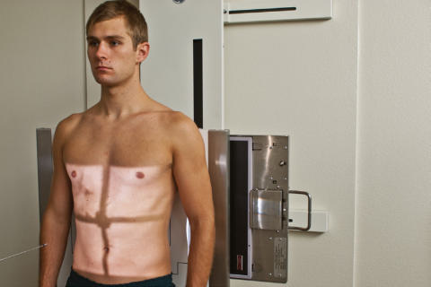
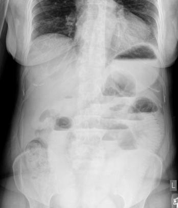
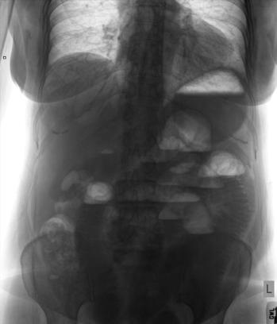

# Rx Ortostatism Poziționare AP (Antero-Posterior) (Abdomen)

  📷 Radiografie Convențională (Rx)
  <strong>Actualizat:</strong> 2026-09-15
  <strong>Autor:</strong> Departamentul de Radiologie / Referință Bontrager

---

-   __1. Rezumat Clinic & Indicații__

    ---

    === "Indicații Clinice"

        - Abnormal masses, airfluid levels, și accumulations de intraperitoneal air under cupole diafragmatice Perform Ortostatism abdominal imagine first if pacientul comes la department ambulatory sau în wheelchair în Ortostatism poziție.

    === "Ghid Național IRIS"

        !!! info "Referință Primară: Ghidul Național IRIS (Ordinul MS 1342/2012)"
            - **Capitol Ghid IRIS:** *Ghidul Național IRIS*
            - **Grad de Recomandare:** **De verificat pe indicație; fără grad atribuit automat**
            - **Nivel de Iradiere Estimată:** `De verificat pentru examinarea și populația selectate`

            [:octicons-search-16: Deschide Ghidul IRIS](../../iris.md){ .md-button .md-button--primary } [:material-open-in-new: Aplicația Oficială PWA](https://radiologie-pediatrica.ro/iris/){ .md-button target="_blank" rel="noopener" }
-   __2. Poziționare & Centrare Fascicul__

    ---

    - **Poziție Pacient:** Pacient: în ortostatism, membre inferioare slightly spread apart, back against table sau grilă device (see NOTE regarding weak sau unsteady pacienți) brațele pe lângă corp away de la corp plan mediosagital de corp centrat pe linia mediană mesei sau Ortostatism bucky; Regiune anatomică: Do nu rotate Bazin (bazin (pelvis)) sau umeri. Adjust height de receptorul de imagine astfel încât center este approximately 2 inches (5 cm) above creasta iliacă (corespunzător L4-L5) (la include cupole diafragmatice), which pentru average pacient places top de receptorul de imagine approximately la nivelul axilla (Fig. 3.39).
    - **Punct de Centrare Fascicul:** perpendicular, la center de receptorul de imagine
    - **Distanță Focar-Film (DFF / SID):** 100 cm
    - **Comandă Respiratorie:** expunere trebuie să fie made la end de expiration.

-   __3. Parametri Tehnici Expunere__

    ---

    | Parametru Tehnic | Valoare Configurare Generator / Tub |
    |:-----------------|:-------------------------------------|
    | **Tensiune Tub (kV)** | 70 kV |
    | **Sarcină / Produs Curent-Timp (mAs)** | DE CONFIGURAT PE APARAT |
    | **Distanță Focar-Film (DFF / SID)** | 100 cm |
    | **Grilă Antidifuzoare (Bucky)** | Cu grilă antidifuzoare Bucky |
    | **Dimensiune Focar** | Focar Mic (0.6 mm) |
    | **Camere de Ionizare AEC** | Camerele laterale (sau camera centrală funcție de regiune) |
    | **Colimare Fascicul** | 14 × 17 inches (35 × 43 cm), field de incidență sau collimate pe four sides la anatomy de interest trebuie să include etajul abdominal superior |
    | **Filtrare Tub** | Totală ≥ 2.5 mm Al echivalent |

-   __4. Criterii de Calitate & Reușită Imagine__

    ---

    - Airfilled stomach și loops de bowel și airfluid levels where present.
    - trebuie să include bilateral cupole diafragmatice și ca much de etajul abdominal inferior ca possible.
    - Small liber, intraperitoneal crescentshaped air bubble, if present, seen under drept hemidiaphragm, away de la gas în stomach (Figs. 3.40 și 3.41). poziție
    - Absența rotației anatomice: clavicule echidistante față de linia apofizelor spinoase; iliac wings appear simetric, și outer rib margins sunt same distance de la coloană vertebrală.
    - fără tilt: coloană vertebrală trebuie să fie straight (unless scolioză / vicii de postură ale coloanei este present), aliniat cu center de receptorul de imagine.
    - Collimation la aria de interes diagnostic. expunere fără mișcare; Coaste (Grilaj Costal) și toate gas bubble margins appear net.
    - expunere este sufficient la visualize coloană vertebrală și Coaste (Grilaj Costal) și părți moi but nu la overexpose possible intraperitoneal air în etajul abdominal superior.

-   __5. Protecție Radiologică (ALARA)__

    ---

    - Ecranare gonadică și a organelor radiosensibile conform procedurilor locale de radioprotecție ALARA.
    - Colimare strictă la aria de interes pentru limitarea radiației difuze.
    - Verificarea posibilității unei sarcini la pacientele de vârstă fertilă înainte de expunere.

!!! note "Observații Clinice & Tehnice"
    pacient trebuie să fie în ortostatism pentru minimum de 5 minutes, but 10 la 20 minutes este desirable, if possible, before expunere pentru visualizing small amounts de intraperitoneal air. If pacient este too Ortostatism Fig. 3.39 Ortostatism AP—la include cupole diafragmatice. Fig. 3.40 Ortostatism AP—la include cupole diafragmatice. ocluzie intestinală (nivele hidroaerice) este present (note airfluid level). Air-nivele hidroaerice Gastric bubble stâng hemidiaphragm stâng creasta iliacă (corespunzător L4-L5) drept hemidiaphragm Air-filled intestine (bowel) T-12 ficat Fig. 3.41 Ortostatism AP. weak la maintain Ortostatism poziție, lateral decubit trebuie să fie performed. pentru hypersthenic pacienți, two landscape IRs poate fie required pentru include entire Abdomen.

### 🖼️ Imagini

<figure class="protocol-image-card" markdown>

<figcaption><strong>Fig. 3.39 Ortostatism AP—la include cupole diafragmatice.</strong> — Poziționare pacient conform Ghidului Bontrager (Fig. 3.39 în ortostatism AP—la include cupole diafragmatice.)</figcaption>

</figure>

<figure class="protocol-image-card" markdown>

<figcaption><strong>Fig. 3.40 Ortostatism AP—la include cupole diafragmatice. ocluzie intestinală (nivele hidroaerice) este</strong> — Aspect radiografic de referință conform Ghidului Bontrager (Fig. 3.40 în ortostatism AP—la include cupole diafragmatice. Bowel obstruction este)</figcaption>

</figure>

<figure class="protocol-image-card" markdown>

<figcaption><strong>Fig. 3.41 Ortostatism AP.</strong> — Aspect radiografic de referință conform Ghidului Bontrager (Fig. 3.41 în ortostatism AP.)</figcaption>

</figure>

=== "Ghid Rapid de Execuție"

    1. **Identificarea și verificarea pacientului:** verificare identitate, zonă de examinat, consimțământ conform procedurii și evaluarea posibilității unei sarcini, când este relevantă.
    2. **Pregătire:** îndepărtarea oricăror obiecte radiopace (bijuterii, agrafe, fermoare, proteze, pansamente dense).
    3. **Poziționare precisă:** alinierea receptorului de imagine și a tubului la distanța prescrisă (100 cm).
    4. **Colimare strictă:** adaptarea fasciculului strict la regiunea de diagnostic pentru scăderea iradierii și reducerea radiației difuze.
    5. **Radioprotecție:** verificarea [politicii RX](../radioprotectie.md), cu măsuri distincte pentru pacient, personal și însoțitor.

## Surse de documentare

- [Bontrager's Textbook of Radiographic Positioning (Ed. 9/10), Pagina 132](https://www.elsevier.com/books/textbook-of-radiographic-positioning-and-related-anatomy/lampignano/978-0-323-65367-1)
