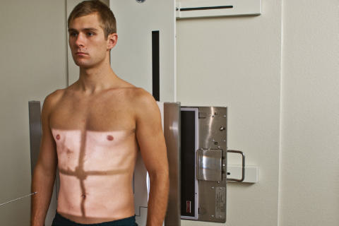
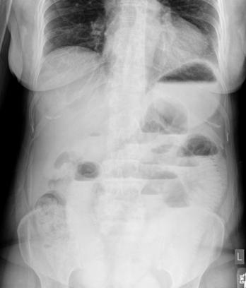
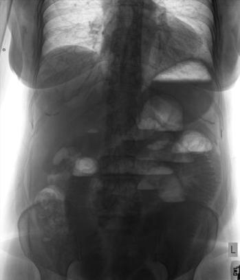

# Rx Ortostatism Poziționare AP (Antero-Posterior) (Abdomen)

  📷 Radiografie Convențională (Rx)
  <strong>Actualizat:</strong> 2026-09-15
  <strong>Autor:</strong> Departamentul de Radiologie / Referință Bontrager

---

-   __1. Rezumat Clinic & Indicații__

    ---

    === "Indicații Clinice"

        - Mase anormale, nivele hidroaerice și acumulări de aer intraperitoneal sub cupolele diafragmatice. Efectuați mai întâi radiografia abdominală în ortostatism dacă pacientul se prezintă la departament mergând sau în scaun cu rotile, în poziție verticală.

    === "Ghid Național IRIS"

        !!! info "Referință Primară: Ghidul Național IRIS (Ordinul MS 1342/2012)"
            - **Capitol Ghid IRIS:** *Aparat digestiv & Abdomen*
            - **Grad de Recomandare:** **Grad B**
            - **Nivel de Iradiere Estimată:** `Clasa 2 (Foarte mică ~ 0.7 - 1.2 mSv)`

            [:octicons-search-16: Deschide Ghidul IRIS](../../iris.md){ .md-button .md-button--primary } [:material-open-in-new: Aplicația Oficială PWA](https://radiologie-pediatrica.ro/iris/){ .md-button target="_blank" rel="noopener" }

-   __2. Poziționare & Centrare Fascicul__

    ---

    - **Poziție Pacient:** Pacient: în ortostatism, cu membrele inferioare ușor depărtate, cu spatele sprijinit de masă sau de dispozitivul cu grilă (vezi NOTA privind pacienții slăbiți sau instabili), cu brațele pe lângă corp, depărtate de acesta, cu planul mediosagital al corpului centrat pe linia mediană a mesei sau a dispozitivului Bucky vertical; Regiune anatomică: Nu rotiți bazinul (pelvisul) sau umerii. Ajustați înălțimea receptorului de imagine astfel încât centrul să fie la aproximativ 2 inci (5 cm) deasupra crestei iliace (corespunzător L4-L5) (pentru a include cupolele diafragmatice), ceea ce, la un pacient de constituție medie, plasează marginea superioară a receptorului de imagine aproximativ la nivelul axilei (Fig. 3.39).
    - **Punct de Centrare Fascicul:** perpendicular, pe centrul receptorului de imagine
    - **Distanță Focar-Film (DFF / SID):** 100 cm
    - **Comandă Respiratorie:** Expunerea trebuie efectuată la sfârșitul expirului.

-   __3. Parametri Tehnici Expunere__

    ---

    | Parametru Tehnic | Valoare Configurare Generator / Tub |
    |:-----------------|:-------------------------------------|
    | **Tensiune Tub (kV)** | 70 kV |
    | **Sarcină / Produs Curent-Timp (mAs)** | DE CONFIGURAT PE APARAT |
    | **Distanță Focar-Film (DFF / SID)** | 100 cm |
    | **Grilă Antidifuzoare (Bucky)** | Cu grilă antidifuzoare Bucky |
    | **Dimensiune Focar** | Focar Mic (0.6 mm) |
    | **Camere de Ionizare AEC** | Camerele laterale (sau camera centrală, în funcție de regiune) |
    | **Colimare Fascicul** | 14 × 17 inci (35 × 43 cm), câmpul de incidență sau colimarea pe cele patru laturi la regiunea anatomică de interes trebuie să includă etajul abdominal superior |
    | **Filtrare Tub** | Totală ≥ 2.5 mm Al echivalent |

-   __4. Criterii de Calitate & Reușită Imagine__

    ---

    - Stomacul și ansele intestinale destinse cu aer și nivelurile hidroaerice, acolo unde sunt prezente.
    - trebuie să includă cupolele diafragmatice bilateral și cât mai mult posibil din etajul abdominal inferior.
    - O mică bulă de aer liber intraperitoneal, în formă de semilună, dacă este prezentă, se vizualizează sub hemidiafragmul drept, la distanță de gazul din stomac (Fig. 3.40 și 3.41). Poziție
    - Absența rotației anatomice: clavicule echidistante față de linia apofizelor spinoase; aripile iliace apar simetrice, iar marginile externe ale coastelor sunt la aceeași distanță de coloana vertebrală.
    - Fără înclinare: coloana vertebrală trebuie să fie dreaptă (cu excepția prezenței scoliozei / viciilor de postură ale coloanei), aliniată cu centrul receptorului de imagine.
    - Colimare la aria de interes diagnostic. Expunere fără mișcare; coastele (grilajul costal) și toate contururile bulelor de gaz apar nete.
    - Expunerea este suficientă pentru a vizualiza coloana vertebrală, coastele (grilajul costal) și părțile moi, fără a supraexpune eventualul aer intraperitoneal din etajul abdominal superior.

-   __5. Protecție Radiologică (ALARA)__

    ---

    - Ecranare gonadică și a organelor radiosensibile conform procedurilor locale de radioprotecție ALARA.
    - Colimare strictă la aria de interes pentru limitarea radiației difuze.
    - Verificarea posibilității unei sarcini la pacientele de vârstă fertilă înainte de expunere.

!!! note "Observații Clinice & Tehnice"
    Pacientul trebuie să stea în ortostatism minimum 5 minute, dar este de dorit să stea 10 până la 20 minute, dacă este posibil, înainte de expunere, pentru vizualizarea unor cantități mici de aer intraperitoneal. Dacă pacientul este prea slăbit pentru a menține poziția în ortostatism, examinarea trebuie efectuată în decubit lateral. Ortostatism. Fig. 3.39 AP în ortostatism—pentru a include cupolele diafragmatice. Fig. 3.40 AP în ortostatism—pentru a include cupolele diafragmatice. Este prezentă ocluzia intestinală (nivele hidroaerice) (observați nivelul hidroaeric). Nivele hidroaerice. Bulă gastrică. Hemidiafragm stâng. Creasta iliacă stângă (corespunzător L4-L5). Hemidiafragm drept. Intestin plin cu aer. T-12. Ficat. Fig. 3.41 AP în ortostatism. Pentru pacienții hiperstenici, pot fi necesare două IR în format orizontal pentru a include întregul abdomen.

### 🖼️ Imagini

<figure class="protocol-image-card" markdown>

<figcaption><strong>Fig. 3.39 AP în ortostatism—pentru a include cupolele diafragmatice.</strong> — Poziționare pacient conform Ghidului Bontrager (Fig. 3.39 AP în ortostatism—pentru a include cupolele diafragmatice.)</figcaption>

</figure>

<figure class="protocol-image-card" markdown>

<figcaption><strong>Fig. 3.40 AP în ortostatism—pentru a include cupolele diafragmatice. Ocluzia intestinală (nivele hidroaerice) este</strong> — Aspect radiografic de referință conform Ghidului Bontrager (Fig. 3.40 AP în ortostatism—pentru a include cupolele diafragmatice. Ocluzia intestinală este)</figcaption>

</figure>

<figure class="protocol-image-card" markdown>

<figcaption><strong>Fig. 3.41 AP în ortostatism.</strong> — Aspect radiografic de referință conform Ghidului Bontrager (Fig. 3.41 AP în ortostatism.)</figcaption>

</figure>

=== "Ghid Rapid de Execuție"

    1. **Identificarea și verificarea pacientului:** verificare identitate, zonă de examinat, consimțământ conform procedurii și evaluarea posibilității unei sarcini, când este relevantă.
    2. **Pregătire:** îndepărtarea oricăror obiecte radiopace (bijuterii, agrafe, fermoare, proteze, pansamente dense).
    3. **Poziționare precisă:** alinierea receptorului de imagine și a tubului la distanța prescrisă (100 cm).
    4. **Colimare strictă:** adaptarea fasciculului strict la regiunea de diagnostic pentru scăderea iradierii și reducerea radiației difuze.
    5. **Radioprotecție:** verificarea [politicii RX](../radioprotectie.md), cu măsuri distincte pentru pacient, personal și însoțitor.

## Surse de documentare

- [Bontrager's Textbook of Radiographic Positioning (Ed. 9/10), Pagina 132](https://www.elsevier.com/books/textbook-of-radiographic-positioning-and-related-anatomy/lampignano/978-0-323-65367-1)
