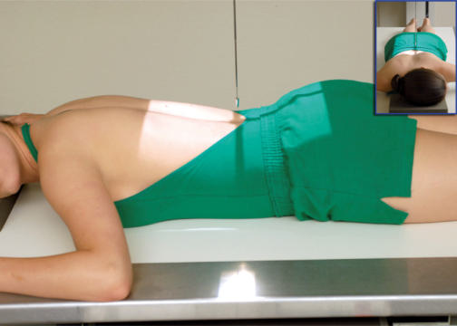
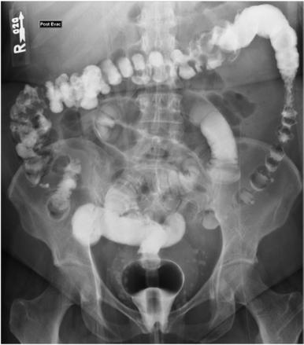

# Rx POSTEVACUATION PA (AP) PROJECTION (Irigografie (Clismă Baritată))

  📷 Radiografie Convențională (Rx)
  <strong>Actualizat:</strong> 2026-09-15
  <strong>Autor:</strong> Departamentul de Radiologie / Referință Bontrager

---

-   __1. Rezumat Clinic & Indicații__

    ---

    === "Indicații Clinice"

        - Demonstrates mucosal pattern of the large intestine with residual contrast media for identifying small polyps and defects This projection is most commonly taken Decubit Ventral as a PA but may be taken with the patient Decubit Dorsal as an AP, if necessary.

    === "Ghid Național IRIS"

        !!! info "Referință Primară: Ghidul Național IRIS (Ordinul MS 1342/2012)"
            - **Capitol Ghid IRIS:** *Ghidul Național IRIS*
            - **Grad de Recomandare:** **De verificat pe indicație; fără grad atribuit automat**
            - **Nivel de Iradiere Estimată:** `De verificat pentru examinarea și populația selectate`

            [:octicons-search-16: Deschide Ghidul IRIS](../../iris.md){ .md-button .md-button--primary } [:material-open-in-new: Aplicația Oficială PWA](https://radiologie-pediatrica.ro/iris/){ .md-button target="_blank" rel="noopener" }
-   __2. Poziționare & Centrare Fascicul__

    ---

    - **Poziție Pacient:** Pacient: Patient is Decubit Ventral or Decubit Dorsal, with a support for the head (Fig. 13.82).; Regiune anatomică: Align MSP to midline of table or CR. Ensure that no body rotation occurs.
    - **Punct de Centrare Fascicul:** is perpendicular to IR. Center CR and center of IR to creasta iliacă (corespunzător L4-L5).
    - **Distanță Focar-Film (DFF / SID):** 100 cm
    - **Comandă Respiratorie:** Suspend respiration and expose on expiration.

-   __3. Parametri Tehnici Expunere__

    ---

    | Parametru Tehnic | Valoare Configurare Generator / Tub |
    |:-----------------|:-------------------------------------|
    | **Tensiune Tub (kV)** | 90-100 kV |
    | **Sarcină / Produs Curent-Timp (mAs)** | DE CONFIGURAT PE APARAT |
    | **Distanță Focar-Film (DFF / SID)** | 100 cm |
    | **Grilă Antidifuzoare (Bucky)** | Cu grilă antidifuzoare Bucky |
    | **Dimensiune Focar** | Focar Mare (1.0 - 1.2 mm) |
    | **Camere de Ionizare AEC** | Camerele laterale (sau camera centrală funcție de regiune) |
    | **Colimare Fascicul** | field size is applied. Exposure: Optimal image receptor exposure and contrast to visualize the outline of entire mucosal pattern of the large intestine without overexposure of any parts. Sharp structural margins indicate no motion. Postevacuation and R or L markers should be visible. |
    | **Filtrare Tub** | Totală ≥ 2.5 mm Al echivalent |

-   __4. Criterii de Calitate & Reușită Imagine__

    ---

    - Entire large intestine should be visualized with only a residual amount of contrast media (Fig. 13.83). Position:
    - Spine is parallel to the edge of the radiograph (unless scolioză / vicii de postură ale coloanei is present).
    - Absența rotației anatomice: clavicule echidistante față de linia apofizelor spinoase occurs; the ala of the ilium and the lumbar vertebrae are symmetric.
    - Proper

-   __5. Protecție Radiologică (ALARA)__

    ---

    - Ecranare gonadică și a organelor radiosensibile conform procedurilor locale de radioprotecție ALARA.
    - Colimare strictă la aria de interes pentru limitarea radiației difuze.
    - Verificarea posibilității unei sarcini la pacientele de vârstă fertilă înainte de expunere.

!!! note "Observații Clinice & Tehnice"
    S: Image should be taken after patient has had sufficient time for adequate evacuation. If radiograph shows insufficient evacuation to visualize the mucosal pattern clearly, a second radiograph should be obtained after further evacuation. Coffee or tea sometimes can be given as a stimulant for this purpose. Include the rectal ampulla on the lower margin of the radiograph. Use lower kVp to prevent overpenetration, with only the residual contrast media remaining in the large intestine. Post-evac Irigografie (Clismă Baritată) ROUTINE PA or AP RAO LAO LPO or RPO Lateral rectum R and L lateral decubitus (doublecontrast study) PA postevacuation Fig. 13.83 PA postevacuation. Fig. 13.82 PA postevacuation.

### 🖼️ Imagini

<figure class="protocol-image-card" markdown>

<figcaption><strong>Fig. 13.83 PA postevacuation.</strong> — Poziționare pacient conform Ghidului Bontrager (Fig. 13.83 PA postevacuation.)</figcaption>

</figure>

<figure class="protocol-image-card" markdown>

<figcaption><strong>Fig. 13.82 PA postevacuation.</strong> — Aspect radiografic de referință conform Ghidului Bontrager (Fig. 13.82 PA postevacuation.)</figcaption>

</figure>

=== "Ghid Rapid de Execuție"

    1. **Identificarea și verificarea pacientului:** verificare identitate, zonă de examinat, consimțământ conform procedurii și evaluarea posibilității unei sarcini, când este relevantă.
    2. **Pregătire:** îndepărtarea oricăror obiecte radiopace (bijuterii, agrafe, fermoare, proteze, pansamente dense).
    3. **Poziționare precisă:** alinierea receptorului de imagine și a tubului la distanța prescrisă (100 cm).
    4. **Colimare strictă:** adaptarea fasciculului strict la regiunea de diagnostic pentru scăderea iradierii și reducerea radiației difuze.
    5. **Radioprotecție:** verificarea [politicii RX](../radioprotectie.md), cu măsuri distincte pentru pacient, personal și însoțitor.

## Surse de documentare

- [Bontrager's Textbook of Radiographic Positioning (Ed. 9/10), Pagina 548](https://www.elsevier.com/books/textbook-of-radiographic-positioning-and-related-anatomy/lampignano/978-0-323-65367-1)
