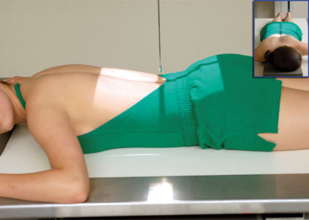
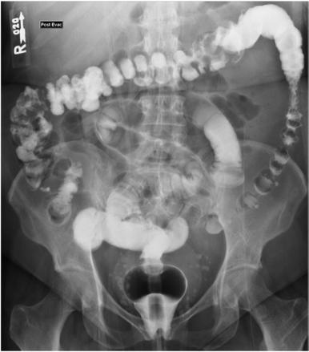

# Rx Incidență PA (AP) după evacuare (Irigografie (Clismă Baritată))

  📷 Radiografie Convențională (Rx)
  <strong>Actualizat:</strong> 2026-09-15
  <strong>Autor:</strong> Departamentul de Radiologie / Referință Bontrager

---

-   __1. Rezumat Clinic & Indicații__

    ---

    === "Indicații Clinice"

        - Evidențiază relieful mucoasei intestinului gros (colonului) cu substanță de contrast reziduală, pentru identificarea polipilor mici și a defectelor. Această incidență se efectuează cel mai frecvent în decubit ventral, ca PA, dar poate fi efectuată cu pacientul în decubit dorsal, ca AP, dacă este necesar.

    === "Ghid Național IRIS"

        !!! info "Referință Primară: Ghidul Național IRIS (Ordinul MS 1342/2012)"
            - **Capitol Ghid IRIS:** *Ghidul Național IRIS*
            - **Grad de Recomandare:** **De verificat pe indicație; fără grad atribuit automat**
            - **Nivel de Iradiere Estimată:** `De verificat pentru examinarea și populația selectate`

            [:octicons-search-16: Deschide Ghidul IRIS](../../iris.md){ .md-button .md-button--primary } [:material-open-in-new: Aplicația Oficială PWA](https://radiologie-pediatrica.ro/iris/){ .md-button target="_blank" rel="noopener" }
-   __2. Poziționare & Centrare Fascicul__

    ---

    - **Poziție Pacient:** Pacient: pacientul este în decubit ventral sau decubit dorsal, cu un suport pentru cap (Fig. 13.82).; Regiune anatomică: Aliniați MSP cu linia mediană a mesei sau cu raza centrală. Asigurați-vă că nu există rotație a corpului.
    - **Punct de Centrare Fascicul:** este perpendicular pe receptorul de imagine. Centrați raza centrală și centrul receptorului de imagine la nivelul crestei iliace (corespunzător L4-L5).
    - **Distanță Focar-Film (DFF / SID):** 100 cm
    - **Comandă Respiratorie:** Apnee la sfârșitul expirului pe durata expunerii.

-   __3. Parametri Tehnici Expunere__

    ---

    | Parametru Tehnic | Valoare Configurare Generator / Tub |
    |:-----------------|:-------------------------------------|
    | **Tensiune Tub (kV)** | 90-100 kV |
    | **Sarcină / Produs Curent-Timp (mAs)** | DE CONFIGURAT PE APARAT |
    | **Distanță Focar-Film (DFF / SID)** | 100 cm |
    | **Grilă Antidifuzoare (Bucky)** | Cu grilă antidifuzoare Bucky |
    | **Dimensiune Focar** | Focar Mare (1.0 - 1.2 mm) |
    | **Camere de Ionizare AEC** | Camerele laterale (sau camera centrală, în funcție de regiune) |
    | **Colimare Fascicul** | Se aplică dimensiunea câmpului. Expunere: expunere optimă a receptorului de imagine și contrast optim pentru vizualizarea conturului întregului relief al mucoasei intestinului gros (colonului), fără supraexpunerea vreunei porțiuni. Contururile structurale nete indică absența mișcării. Markerii pentru examinarea după evacuare și R sau L trebuie să fie vizibili. |
    | **Filtrare Tub** | Totală ≥ 2.5 mm Al echivalent |

-   __4. Criterii de Calitate & Reușită Imagine__

    ---

    - Întregul intestin gros (colon) trebuie vizualizat, cu doar o cantitate reziduală de substanță de contrast (Fig. 13.83). Poziție:
    - Coloana vertebrală este paralelă cu marginea radiografiei (cu excepția cazului în care sunt prezente scolioza / viciile de postură ale coloanei).
    - Absența rotației anatomice: claviculele sunt echidistante față de linia apofizelor spinoase; aripile iliace și coloana lombară sunt simetrice.
    - corect

-   __5. Protecție Radiologică (ALARA)__

    ---

    - Ecranare gonadică și a organelor radiosensibile conform procedurilor locale de radioprotecție ALARA.
    - Colimare strictă la aria de interes pentru limitarea radiației difuze.
    - Verificarea posibilității unei sarcini la pacientele de vârstă fertilă înainte de expunere.

!!! note "Observații Clinice & Tehnice"
    S: Imaginea trebuie obținută după ce pacientul a avut suficient timp pentru o evacuare adecvată. Dacă radiografia arată o evacuare insuficientă pentru vizualizarea clară a reliefului mucoasei, trebuie obținută o a doua radiografie după o evacuare suplimentară. Uneori se poate administra cafea sau ceai ca stimulent în acest scop. Includeți ampula rectală la marginea inferioară a radiografiei. Utilizați un kVp mai mic pentru a preveni penetrarea excesivă, întrucât în intestinul gros (colon) rămâne doar substanță de contrast reziduală. După evacuare. Irigografie (Clismă Baritată). DE RUTINĂ. PA sau AP. RAO. LAO. LPO sau RPO. Rect în incidență de profil. Decubit lateral R și L (examinare cu dublu contrast). PA după evacuare. Fig. 13.83 PA după evacuare. Fig. 13.82 PA după evacuare.

### 🖼️ Imagini

<figure class="protocol-image-card" markdown>

<figcaption><strong>Fig. 13.83 PA după evacuare.</strong> — Poziționare pacient conform Ghidului Bontrager (Fig. 13.83 PA după evacuare.)</figcaption>

</figure>

<figure class="protocol-image-card" markdown>

<figcaption><strong>Fig. 13.82 PA după evacuare.</strong> — Aspect radiografic de referință conform Ghidului Bontrager (Fig. 13.82 PA după evacuare.)</figcaption>

</figure>

=== "Ghid Rapid de Execuție"

    1. **Identificarea și verificarea pacientului:** verificare identitate, zonă de examinat, consimțământ conform procedurii și evaluarea posibilității unei sarcini, când este relevantă.
    2. **Pregătire:** îndepărtarea oricăror obiecte radiopace (bijuterii, agrafe, fermoare, proteze, pansamente dense).
    3. **Poziționare precisă:** alinierea receptorului de imagine și a tubului la distanța prescrisă (100 cm).
    4. **Colimare strictă:** adaptarea fasciculului strict la regiunea de diagnostic pentru scăderea iradierii și reducerea radiației difuze.
    5. **Radioprotecție:** verificarea [politicii RX](../radioprotectie.md), cu măsuri distincte pentru pacient, personal și însoțitor.

## Surse de documentare

- [Bontrager's Textbook of Radiographic Positioning (Ed. 9/10), Pagina 548](https://www.elsevier.com/books/textbook-of-radiographic-positioning-and-related-anatomy/lampignano/978-0-323-65367-1)
