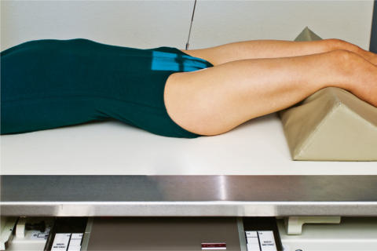
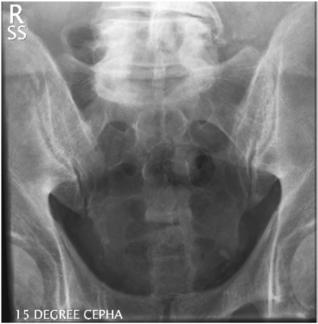
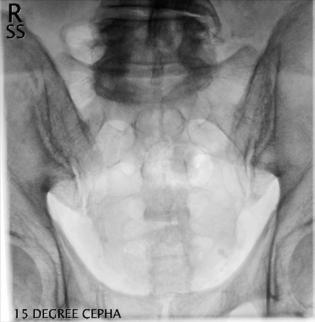

# Rx Sacru AP Axială

  📷 Radiografie Convențională (Rx)
  <strong>Actualizat:</strong> 2026-09-15
  <strong>Autor:</strong> Departamentul de Radiologie / Referință Bontrager

---

-   __1. Rezumat Clinic & Indicații__

    ---

    === "Indicații Clinice"

        - Pathology de Sacru, including suspiciune de fractură

    === "Ghid Național IRIS"

        !!! info "Referință Primară: Ghidul Național IRIS (Ordinul MS 1342/2012)"
            - **Capitol Ghid IRIS:** *Ghidul Național IRIS*
            - **Grad de Recomandare:** **De verificat pe indicație; fără grad atribuit automat**
            - **Nivel de Iradiere Estimată:** `De verificat pentru examinarea și populația selectate`

            [:octicons-search-16: Deschide Ghidul IRIS](../../iris.md){ .md-button .md-button--primary } [:material-open-in-new: Aplicația Oficială PWA](https://radiologie-pediatrica.ro/iris/){ .md-button target="_blank" rel="noopener" }
-   __2. Poziționare & Centrare Fascicul__

    ---

    - **Poziție Pacient:** Pacient: Decubit dorsal poziție pacient Decubit dorsal cu brațe la side, cap pe pillow, și membre inferioare extins cu support under genunchi pentru comfort.; Regiune anatomică: Align plan mediosagital la raza centrală și linia mediană mesei și/sau receptorul de imagine (Fig. 9.64). Se verifică absența rotației: claviculele sunt riguros echidistante față de linia proceselor spinoase Bazin (bazin (pelvis)) exists.
    - **Punct de Centrare Fascicul:** Raza centrală se înclină 15° cranial (spre cap). Direct raza centrală 2 inches (5 cm) superior la simfiză pubiană. Se centrează receptorul de imagine pe raza centrală.
    - **Distanță Focar-Film (DFF / SID):** 100 cm
    - **Comandă Respiratorie:** Apnee pe durata expunerii pentru prevenirea artefactelor de mișcare ale pacientului.

-   __3. Parametri Tehnici Expunere__

    ---

    | Parametru Tehnic | Valoare Configurare Generator / Tub |
    |:-----------------|:-------------------------------------|
    | **Tensiune Tub (kV)** | 75-90 kV |
    | **Sarcină / Produs Curent-Timp (mAs)** | DE CONFIGURAT PE APARAT |
    | **Distanță Focar-Film (DFF / SID)** | 100 cm |
    | **Grilă Antidifuzoare (Bucky)** | Cu grilă antidifuzoare Bucky |
    | **Dimensiune Focar** | Focar Mare (1.0 - 1.2 mm) |
    | **Camere de Ionizare AEC** | Camerele laterale (sau camera centrală funcție de regiune) |
    | **Colimare Fascicul** | Field Size Collimate pe four sides la anatomy de interest. |
    | **Filtrare Tub** | Totală ≥ 2.5 mm Al echivalent |

-   __4. Criterii de Calitate & Reușită Imagine__

    ---

    - Sacru, SI articulații, și L5–S1 intervertebral spații articulare (Figs. 9.65 și 9.66). poziție
    - Absența rotației anatomice: clavicule echidistante față de linia apofizelor spinoase indicated prin alignment de median sagittal creste și Coccis cu simfiza pubiană.
    - Correct alignment de Sacru și raza centrală evidențiază Sacru liber de foreshortening și pubis și sacral foramina sunt nu superimposed.
    - Collimation field size la aria de interes diagnostic. expunere
    - optim receptorul de imagine expunere și contrast. Clear demonstration de bony margins și trabecular markings de Sacru.
    - fără mișcare. 24 30 R superior articular process de Sacru Sacral foramina corp (L5) Ilium stâng sacroiliac articulație Apex de Coccis Fig. 9.66 AP axial Sacru—15° cranial. Fig. 9.65 AP axial—15° cranial. Fig. 9.64 AP axial—15° cranial.

-   __5. Protecție Radiologică (ALARA)__

    ---

    - Ecranare gonadică și a organelor radiosensibile conform procedurilor locale de radioprotecție ALARA.
    - Colimare strictă la aria de interes pentru limitarea radiației difuze.
    - Verificarea posibilității unei sarcini la pacientele de vârstă fertilă înainte de expunere.

!!! note "Observații Clinice & Tehnice"
    S: Technologists poate have la increase raza centrală angle la 20° cranial pentru pacienți cu apparent greater posterior curvature sau tilt de Sacru și Bazin (bazin (pelvis)). Female Sacru este generally shorter și wider than male Sacru (consideration în close foursided collimation field size). This incidență also poate fie performed Decubit ventral (angle 15° caudal) if necessary pentru pacient’s condition. Sacru și Coccis ROUTINE AP axial Sacru AP axial Coccis lateral

### 🖼️ Imagini

<figure class="protocol-image-card" markdown>

<figcaption><strong>Fig. 9.66 AP axial Sacru—15° cranial.</strong> — Poziționare pacient conform Ghidului Bontrager (Fig. 9.66 AP axial sacrum—15° cranial.)</figcaption>

</figure>

<figure class="protocol-image-card" markdown>

<figcaption><strong>Fig. 9.65 AP axial—15° cranial.</strong> — Aspect radiografic de referință conform Ghidului Bontrager (Fig. 9.65 AP axial—15° cranial.)</figcaption>

</figure>

<figure class="protocol-image-card" markdown>

<figcaption><strong>Fig. 9.64 AP axial—15° cranial.</strong> — Aspect radiografic de referință conform Ghidului Bontrager (Fig. 9.64 AP axial—15° cranial.)</figcaption>

</figure>

=== "Ghid Rapid de Execuție"

    1. **Identificarea și verificarea pacientului:** verificare identitate, zonă de examinat, consimțământ conform procedurii și evaluarea posibilității unei sarcini, când este relevantă.
    2. **Pregătire:** îndepărtarea oricăror obiecte radiopace (bijuterii, agrafe, fermoare, proteze, pansamente dense).
    3. **Poziționare precisă:** alinierea receptorului de imagine și a tubului la distanța prescrisă (100 cm).
    4. **Colimare strictă:** adaptarea fasciculului strict la regiunea de diagnostic pentru scăderea iradierii și reducerea radiației difuze.
    5. **Radioprotecție:** verificarea [politicii RX](../radioprotectie.md), cu măsuri distincte pentru pacient, personal și însoțitor.

## Surse de documentare

- [Bontrager's Textbook of Radiographic Positioning (Ed. 9/10), Pagina 372](https://www.elsevier.com/books/textbook-of-radiographic-positioning-and-related-anatomy/lampignano/978-0-323-65367-1)
